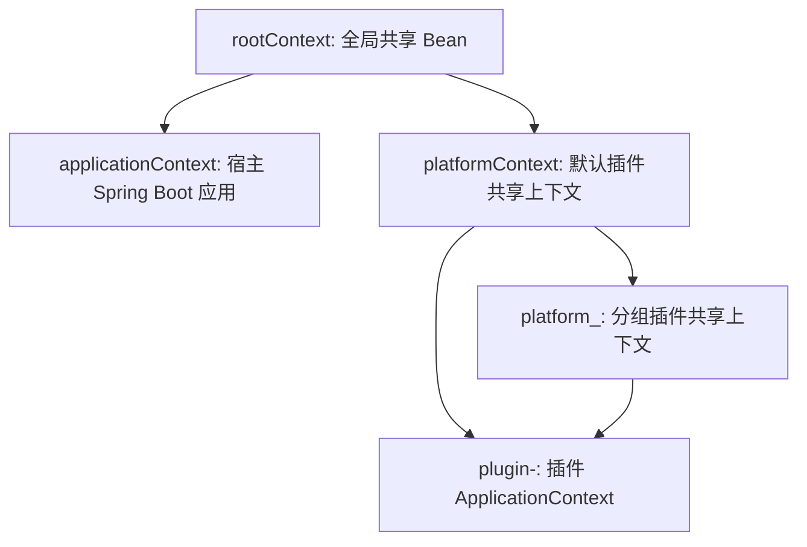

# PF4Boot 架构

## 问题

`pf4boot` 将 PF4J 插件机制集成到 Spring Boot 宿主应用中。设计目标是让插件拥有自己的类和 Spring Bean，同时允许宿主应用和其他插件显式共享选定服务。

## 模块布局

- `pf4boot-api`：公共契约、注解、Spring 上下文辅助类、插件 wrapper、生命周期事件、共享模型和工具接口。
- `pf4boot-core`：PF4J manager 实现、插件仓库和加载器、插件类加载器、生命周期编排、共享 Bean 管理、自动导出管理和定时任务管理。
- `pf4boot-starter`：Spring Boot 自动配置、插件管理器 Bean 创建、管理接口、MVC patch 配置和默认资源。
- `pf4boot-web-support`：插件模块编译期使用的共享 Web 支持 API。
- `pf4boot-web-starter`：动态 Spring MVC controller、interceptor 和资源集成。
- `pf4boot-jpa`：为 Hibernate 管理包提供 JPA provider 支持。
- `pf4boot-jpa-starter`：插件侧 JPA 自动配置。
- `pf4boot-jpa-domain-starter`：共享 JPA domain 能力插件 starter。
- `samples/cross-plugin-jpa`：跨插件 JPA 复杂示例，包含 demo host、model 模块、示例插件和 `app-run` 运行时打包项目。

## 运行时组件

当 `spring.pf4boot.enabled=true` 时，`Pf4bootAutoConfiguration` 创建 `Pf4bootPluginManagerImpl`。插件管理器负责：

- 根据 `Pf4bootProperties` 设置 PF4J 运行模式和插件目录；
- 创建 root 与 platform Spring 上下文；
- 从配置的插件根目录加载插件；
- 在宿主应用启动后自动启动插件，或按管理接口手动启动插件；
- 通过 `Pf4bootPluginSupport` 协调各类集成 hook；
- 通过 `ShareBeanMgr` 注册共享 Bean 和定时任务。

每个插件由 `Pf4bootPluginWrapper` 表示，通常继承 `Pf4bootPlugin`。普通 PF4J `Plugin` 会被 `Pf4bootPluginProxy` 包装，因此管理器逻辑可以统一面向 `Pf4bootPlugin` 抽象。

## 上下文模型

宿主应用上下文会连接到插件管理器创建的 root 上下文。默认 platform 上下文和可选的分组 platform 上下文位于全局服务与插件本地上下文之间。插件启动时，`Pf4bootPlugin.createPluginContext` 创建插件上下文。

实现上主要共享 BeanFactory，而不是依赖完整的父子事件监听链。事件由 `Pf4bootPluginManagerImpl.publishEvent` 显式发布。

## 关键设计选择

- 默认使用 parent-first 类加载，避免同一个 API 类型被多个 classloader 加载后破坏 Spring 按类型注入。
- 插件资源可以优先从插件本地加载，使插件静态资源和 plugin-only 资源能按预期覆盖宿主默认资源。
- 公共扩展点放在 `pf4boot-api`；运行时行为放在 `pf4boot-core`。
- Web 和 JPA 集成是可选的 starter 层，不是每个插件的硬依赖。

## 兼容性

项目面向 Java 8 和 Spring Boot 2.7.x。公共注解、生命周期事件、插件管理器方法、类加载规则和 Gradle 打包作用域的变更都应视为兼容性敏感变更。

## 验证

架构级变更优先运行：

- `.\gradlew.bat :pf4boot-api:compileJava`
- `.\gradlew.bat :pf4boot-core:compileJava`
- `.\gradlew.bat :pf4boot-starter:compileJava`
- 依赖解析允许时运行 `.\gradlew.bat build`

根构建会禁用名称包含 `test` 的任务，因此 `build` 成功不代表测试已执行。
