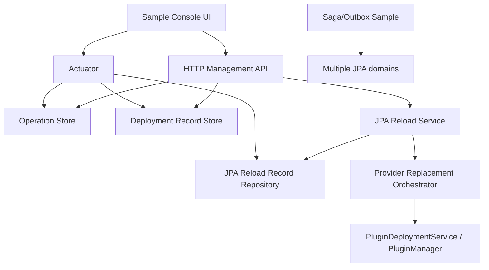

# 插件框架优先级增强设计

## 1. 背景

当前 pf4boot 已完成 HTTP 管理接口、热替换部署、跨插件 JPA 共享事务、JPA domain 重启式刷新、通用 drain SPI、Actuator 只读观测和复杂 sample smoke。剩余缺口不宜继续平铺推进，应按生产收益和依赖关系排序：

1. 持久化管理/JPA reload 记录；
2. `providerReplacementPath`；
3. Saga/Outbox sample；
4. 管理控制台 UI。

本文把这四项串成一条可实施路线，避免后续实现模型把 UI、跨数据源事务或 provider 包替换提前塞进核心路径。

## 2. 目标

1. 让管理操作、部署记录和 JPA reload 记录在进程重启后可查询、可恢复、可审计。
2. 让 JPA reload 能在受控维护窗口内使用 staged provider 包完成“替换 provider + 重建 JPA domain + 恢复 consumer”。
3. 提供一个业务层 Saga/Outbox sample，演示跨数据源最终一致性，同时继续禁止框架层跨数据源原子事务。
4. 提供独立 sample UI 的设计边界，只消费 HTTP 管理 API 和 Actuator，不进入 core/starter。

## 3. 非目标

1. 不把 XA/JTA、跨数据源原子事务引入核心框架。
2. 不实现 Hibernate metamodel 在线修改。
3. 不把管理控制台 UI 打包进 `pf4boot-core`、`pf4boot-starter`、`pf4boot-management-starter`。
4. 不要求所有宿主默认启用持久化；默认仍保持兼容的内存模式。
5. 不在 provider replacement 首版支持跨多个 JPA domain 的原子替换。

## 4. 现状锚点

| 能力 | 当前状态 | 主要代码/文档 |
| --- | --- | --- |
| 管理操作记录 | 已有 `PluginOperationStore`，含内存和文件实现 | `PluginOperationStore`、`FilePluginOperationStore` |
| 部署记录 | 已有 `PluginDeploymentRecordStore`，含内存和文件实现 | `PluginDeploymentRecordStore`、`FilePluginDeploymentRecordStore` |
| JPA reload 记录 | 已有 `JpaDomainReloadRecordRepository`，当前自动配置使用内存实现 | `InMemoryJpaDomainReloadRecordRepository` |
| provider 替换字段 | `JpaDomainReloadRequest.providerReplacementPath` 已接入 `PluginDeploymentService`，支持 staged provider 包替换 | `plugin-framework-priority-roadmap-plan.md` |
| Saga/Outbox | 决策文档推荐业务层模式，但未落 sample | `cross-datasource-transaction-decision.md` |
| 管理 UI | 决策文档明确不进框架模块，可做独立 sample UI | `plugin-management-console-boundary.md` |

## 5. 核心约束

- Java 8 兼容，不使用 record、sealed class、`var`、`Path.of` 等高版本能力。
- core 不能依赖 JPA、management、前端框架或数据库持久化实现。
- 持久化格式必须避免保存 token、完整异常堆栈和敏感绝对路径。
- 文件持久化必须使用原子写入策略：临时文件写入、flush、rename/replace。
- 所有写接口仍必须走现有鉴权、幂等和审计路径。
- Saga/Outbox sample 必须明确是业务模式，不提供框架级原子提交保证。

## 6. 总体架构



设计原则：

- P1 先把记录变成可持久化事实来源；
- P2 才允许 JPA reload 接入 provider 包替换，因为失败恢复依赖可靠记录；
- P3 独立演示跨数据源最终一致性，不改变事务核心；
- P4 UI 只展示和调用已经稳定的 API，不引入新的后端语义。

## 7. P1 持久化管理/JPA Reload 记录

### 7.1 目标行为

P1 不是从零实现管理记录持久化，而是复验并加固已有 file store，同时补齐 JPA reload record 的持久化能力和统一观测。

必须覆盖三类记录：

| 类型 | 当前接口 | P1 目标 |
| --- | --- | --- |
| 管理操作 | `PluginOperationStore` | 文件实现可恢复、可扫描 in-progress、幂等键重启后仍有效 |
| 部署记录 | `PluginDeploymentRecordStore` | 文件实现可查询 recent/findById，保留 rollback 摘要 |
| JPA reload | `JpaDomainReloadRecordRepository` | 新增文件实现，支持 reloadId、idempotencyKey、latest、recent |

### 7.2 存储布局

建议目录：

```text
work/pf4boot/records/
  operations/
    op-{operationId}.json
    idempotency/
      {sha256-key}.json
  deployments/
    dep-{deploymentId}.json
  jpa-reloads/
    reload-{reloadId}.json
    idempotency/
      {sha256-key}.json
    latest.json
```

现有 `spring.pf4boot.management.http.operation-store.directory` 可以作为管理记录根目录。JPA reload 可以新增：

```yaml
pf4boot:
  plugin:
    jpa:
      domain-reload:
        record-store:
          type: memory # memory, file
          directory: work/pf4boot/records/jpa-reloads
          fail-closed: true
```

### 7.3 序列化要求

- 使用当前工程已有 JSON 依赖，优先复用 Gson。
- 每个文件包含 `schemaVersion`，首版为 `1`。
- 枚举按 name 保存。
- 时间戳保存毫秒 long。
- 路径只保存相对路径、文件名、摘要或脱敏摘要。
- idempotency key 不直接作为文件名，使用 SHA-256 或安全编码。

### 7.4 恢复语义

启动时不自动重放危险操作，只做状态修正和诊断：

| 重启前状态 | 恢复后建议 |
| --- | --- |
| operation `RUNNING` | 标记 `UNKNOWN_INTERRUPTED` 或保留 recoverable 查询 |
| deployment 执行中 | Actuator 标记存在 interrupted deployment，管理接口允许查询 |
| JPA reload 执行中 | 标记 `MANUAL_INTERVENTION_REQUIRED`，不自动 stop/start |
| 已完成记录 | 原样可查询 |

### 7.5 接口调整

建议给 `JpaDomainReloadRecordRepository` 增加默认方法：

```java
List<JpaDomainReloadRecord> recent(int limit);

List<JpaDomainReloadRecord> scanRecoverableRecords();
```

若为了二进制兼容，接口可提供 default 空实现；文件实现覆盖。

## 8. P2 `providerReplacementPath`

### 8.1 目标行为

当请求携带 `providerReplacementPath` 时，JPA reload 不再返回 `UNSUPPORTED_REPLACEMENT_PATH`，而是在同一个维护动作中完成：

1. 校验 staged provider 包；
2. 生成 reload plan；
3. drain consumer/provider 影响链；
4. 停止 consumers；
5. 停止 provider；
6. 替换或加载 staged provider 包；
7. 启动 provider 并等待新 descriptor ready；
8. 启动 consumers；
9. 健康检查；
10. 失败时尽量恢复旧 provider 和 consumers。

### 8.2 与热替换部署的关系

P2 不应复制热替换全部逻辑。优先复用已有 `PluginDeploymentService` 的 staged 包预检、包校验、回滚快照和启停能力；JPA reload 负责 JPA domain 的 consumer 识别、descriptor 校验和 JPA record。

如果现有 `PluginDeploymentService` 没有“只替换 provider 包但由 JPA reload 控制 consumer 顺序”的细粒度方法，优先新增通用小接口，不能让 core 依赖 JPA 类型。

### 8.3 请求与计划

`JpaDomainReloadRequest.providerReplacementPath` 规则：

| 场景 | 行为 |
| --- | --- |
| 为空 | 保持当前 provider 重启式刷新 |
| 非空且 mode 非执行模式 | plan 中展示 replacement 摘要，不执行 |
| 非空且 provider pluginId 不匹配 | plan blocker `PROVIDER_REPLACEMENT_MISMATCH` |
| 包校验失败 | blocker `PROVIDER_REPLACEMENT_VERIFY_FAILED` |
| replacement provider 不导出同一 domain | 执行失败并回滚 |

建议新增 failure/blocker code：

- `PROVIDER_REPLACEMENT_MISMATCH`
- `PROVIDER_REPLACEMENT_VERIFY_FAILED`
- `PROVIDER_REPLACEMENT_ACTIVATION_FAILED`
- `PROVIDER_REPLACEMENT_ROLLBACK_FAILED`

### 8.4 回滚策略

- 执行前必须记录旧 provider 包路径或 rollback snapshot。
- staged provider 启动失败时尝试恢复旧 provider。
- 旧 provider 恢复成功后再启动 consumers。
- 旧 provider 恢复失败进入 `MANUAL_INTERVENTION_REQUIRED`。
- unrelated 插件不得被停止。

## 9. P3 Saga/Outbox Sample

### 9.1 目标行为

新增独立 sample，演示一个业务操作跨两个 JPA domain 最终一致，而不是框架原子事务：

```text
order domain:    order + outbox_event
billing domain:  billing_account + inbox_event
```

推荐 sample 形态：

```text
samples/saga-outbox/
  demo-host
  app-run
  model-order
  model-billing
  plugin-order-domain
  plugin-billing-domain
  plugin-order-service
  plugin-billing-service
  plugin-outbox-dispatcher
```

### 9.2 业务流程

1. `plugin-order-service` 在 order domain 本地事务中创建订单并写 outbox。
2. `plugin-outbox-dispatcher` 读取未发送 outbox，调用 billing service 或本地模拟消息入口。
3. `plugin-billing-service` 在 billing domain 本地事务中使用 inbox 幂等表消费事件。
4. 重复投递不重复扣款。
5. billing 失败时 outbox 保持待重试或进入 dead-letter。

### 9.3 明确不做

- 不新增框架级 Saga coordinator。
- 不提供跨数据源 `@Transactional` 原子提交。
- 不引入消息中间件强依赖；首版使用内存调度或 HTTP/local service 模拟投递。

### 9.4 验证点

- 成功路径：订单创建、outbox 发布、billing 消费完成。
- 重复投递：inbox 幂等，billing 不重复扣款。
- 失败重试：billing 临时失败后 outbox 可重试。
- 框架诊断：多 datasource 原子事务仍明确不支持。

## 10. P4 管理控制台 UI

### 10.1 目标行为

在 API 稳定后新增独立 sample UI，不进入发布模块：

```text
samples/plugin-management-console/
  console-app
  README.md
```

UI 只调用：

- `/pf4boot/admin/**`
- `/actuator/pf4bootplugins`
- `/actuator/pf4bootgovernance`
- `/actuator/pf4bootjpareload`
- `/actuator/metrics/pf4boot.*`

### 10.2 第一版视图

| 视图 | 能力 |
| --- | --- |
| 插件列表 | 状态、版本、启停按钮、最近错误 |
| 部署记录 | plan/replace/rollback/confirm 状态 |
| JPA reload | domain、最近 reload、drain 摘要、执行入口 |
| 治理概览 | package trust、capability、record store、metrics 摘要 |

### 10.3 安全边界

- UI 不保存 token 到代码仓库。
- 写操作必须携带 token/授权 header 和 `X-Idempotency-Key`。
- UI 不能绕过预检直接执行 replace。
- UI 必须展示 risk/blocker/warning。
- sample UI 默认只面向本地演示。

## 11. 配置总览

```yaml
spring:
  pf4boot:
    management:
      http:
        operation-store:
          type: file
          directory: work/pf4boot/records/operations
          fail-closed: true
pf4boot:
  plugin:
    jpa:
      domain-reload:
        record-store:
          type: file
          directory: work/pf4boot/records/jpa-reloads
          fail-closed: true
```

UI sample 不新增框架配置，只在 sample 自己的配置文件中声明 API base URL。

## 12. 测试方案

| 阶段 | 最小验证 |
| --- | --- |
| P1 | file store 单测、重启后 find/recent/idempotency、JPA reload record 持久化、Actuator 摘要 |
| P2 | provider replacement plan blocker、成功替换、失败回滚、unrelated 插件不受影响、runtime smoke |
| P3 | Saga/Outbox sample 成功、重复投递、失败重试、报告输出 |
| P4 | UI API mock/contract 测试、本地 smoke、鉴权失败和幂等冲突展示 |

## 13. 风险点

| 风险 | 缓解 |
| --- | --- |
| 文件记录损坏导致无法启动 | `fail-closed` 控制；默认生产建议 fail closed，开发可 fail open 并报警 |
| provider replacement 与热替换部署状态重复 | 只复用部署 service 的包治理能力，JPA reload record 记录 domain 语义 |
| Saga sample 被误解为框架事务能力 | README、接口名、验收文档反复声明最终一致性 |
| UI 引入安全错觉 | sample 默认本地；生产 UI 必须外部化鉴权，不进入 starter |

## 14. 实施顺序

1. P1：持久化管理/JPA reload 记录。
2. P2：`providerReplacementPath`。
3. P3：Saga/Outbox sample。
4. P4：管理控制台 UI sample。

每一阶段完成后都要更新中文设计、英文翻译、实施规划、验收记录和 sample README；代码阶段必须提交独立 commit。
