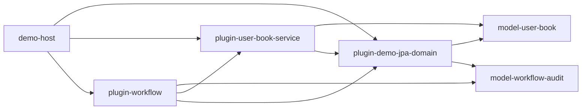

# 跨插件 JPA 复杂示例拆分方案

## 1. 背景

现有 demo 已能展示 `pf4boot-jpa-domain-starter` 提供共享 `DataSource / EntityManagerFactory / TransactionManager`，业务插件通过 `pf4boot-jpa-starter` 的 `SHARED` 模式复用同一事务环境。

但原有根级示例仍偏简单，继续把复杂业务塞进旧的根级 demo 插件会带来两个问题：

- 数据源能力插件容易混入实体和业务概念，职责不单一。
- 示例复杂度上升后，根工程 demo 会变成业务样例集合，影响框架主工程的可读性和维护成本。

因此，复杂示例应从“能跑的最小 demo”升级为“职责清晰、可复制到真实项目的多模块样例”。

## 2. 目标

- 数据源能力插件保持简单职责，只负责创建并导出指定 `domain-id` 的 `DataSource / EntityManagerFactory / TransactionManager`。
- JPA 实体从数据源能力插件中移出，放入独立 `domain-model` 模块。
- 业务 Repository 和业务服务放在消费方业务插件中，按包显式绑定共享 EMF/TM。
- 工作流/编排插件只通过导出的服务接口组合业务，不直接访问其它插件内部 Repository。
- 复杂示例放在独立多模块 sample 中，不继续扩大根工程的业务复杂度。

## 3. 非目标

- 不把跨数据源原子事务纳入本示例。
- 不引入 JTA/XA。
- 不要求业务插件在运行时向已启动的共享 EMF 动态追加 entity。
- 不把复杂 sample 的所有模块都发布为框架正式产物。
- 不改变现有最小 demo 的基本可运行路径，除非后续实施阶段明确迁移。

## 4. 核心约束

- Java 仍保持 `jdkVersion=1.8` 兼容。
- 数据源能力插件不定义 `@Entity`、Repository、Controller 或业务服务。
- 共享 EMF 创建前必须能通过 provider 插件类加载器看到全部 entity class。
- Consumer 插件可以定义 Repository，但 Repository 引用的 entity 必须来自 provider 可见的 model 模块。
- 插件之间的业务协作走导出的 service bean，不跨插件直接注入对方内部 Repository。
- `REQUIRES_NEW` 等事务语义必须经过 Spring 代理调用，不能依赖同类自调用。
- 多 domain 并存时，一个 Repository 包只能绑定一个明确的 EMF/TM。

## 5. 推荐模块结构

复杂示例建议放入独立目录，作为 sample 聚合工程接入根构建或单独构建：

```text
samples/cross-plugin-jpa/
  demo-host
  model-user-book
  model-workflow-audit
  plugin-demo-jpa-domain
  plugin-user-book-service
  plugin-workflow
```

模块职责如下：

| 模块 | 类型 | 职责 | 不允许做的事 |
| --- | --- | --- | --- |
| `demo-host` | Spring Boot host | 启动 pf4boot，加载 sample 插件，提供运行配置 | 放业务实体或插件业务 |
| `model-user-book` | Java library | 定义 `User`、`Book` 等 JPA entity | 定义 datasource、Repository、service |
| `model-workflow-audit` | Java library | 定义 `WorkflowAudit` 等审计 entity | 定义 datasource、Repository、service |
| `plugin-demo-jpa-domain` | JPA domain provider plugin | 依赖 model 模块，配置 entity packages，导出 `domain.demo.*` | 定义 entity、Repository、Controller |
| `plugin-user-book-service` | business plugin | 定义 `UserRepository`、`BookRepository`、`UserBookService` | 创建本地 EMF/TM |
| `plugin-workflow` | workflow plugin | 调用 `UserBookService`，定义自己的 audit Repository 和 workflow service/controller | 直接注入其它插件 Repository |

## 6. 依赖关系

建议依赖图如下：



Gradle 作用域建议：

| 关系 | 推荐作用域 |
| --- | --- |
| provider 插件依赖 model | `compileOnlyApi` 或普通 library 依赖，打包策略按 sample 运行方式确定 |
| service 插件依赖 model | `compileOnlyApi` |
| workflow 插件依赖 audit model | `compileOnlyApi` |
| service/workflow 依赖 provider 插件 | `plugin project(":plugin-demo-jpa-domain")` |
| workflow 依赖 service 插件 API | `compileOnlyApi project(":plugin-user-book-service")` + `plugin project(":plugin-user-book-service")` |
| JPA starter | consumer 插件 `bundle project(":pf4boot-jpa-starter")` |
| JPA domain starter | provider 插件 `bundle project(":pf4boot-jpa-domain-starter")` |

## 7. 配置示例

provider 插件只声明数据源和实体扫描包：

```yaml
pf4boot:
  plugin:
    jpa:
      domain:
        id: demo
        entity-packages:
          - net.xdob.sample.model.userbook
          - net.xdob.sample.model.audit
        datasource:
          url: jdbc:h2:file:~/h2/pf4boot_sample_demo;AUTO_SERVER=TRUE;DB_CLOSE_DELAY=-1
          username: sa
          password:
          driver-class-name: org.h2.Driver
        ddl-auto: update
```

业务插件使用共享 domain：

```yaml
pf4boot:
  plugin:
    jpa:
      enabled: true
      mode: SHARED
      domain-id: demo
```

Repository 按业务包显式绑定：

```java
@Configuration
@EnableJpaRepositories(
    basePackages = "net.xdob.sample.userbook.repository",
    entityManagerFactoryRef = "domain.demo.entityManagerFactory",
    transactionManagerRef = "domain.demo.transactionManager"
)
public class UserBookJpaConfig {
}
```

## 8. 工作流演示场景

建议至少覆盖以下演示：

| 场景 | 目标 |
| --- | --- |
| 正常创建用户和图书 | 展示一个业务插件内多个 Repository 使用同一 TM |
| workflow 调用 user-book service 并写 audit | 展示跨插件服务组合在同一 domain 下协作 |
| workflow 强制失败 | 展示主事务回滚 |
| audit 使用独立 writer bean + `REQUIRES_NEW` | 展示事务代理边界和独立提交语义 |
| provider 缺失或启动失败 | 展示依赖它的插件失败，不依赖它的插件不受影响 |
| 多 Repository 包绑定 | 展示实体、Repository 按包分组，不混放 |

## 9. 与当前实现的关系

根级旧示例项目已删除，共享 JPA domain 的可运行证明统一由 `samples/cross-plugin-jpa` 承担。

复杂示例应作为独立 sample 维护，不建议继续把更多实体和业务塞进根级 demo。若后续出现过渡性复杂示例代码，实施时应按本方案迁移：

- 将 provider 插件中的业务 entity 移到 `model-*` 模块。
- provider 只依赖 model 并扫描 model 包。
- consumer 插件保留 Repository 和 service。
- workflow 插件只依赖导出的 service 和自己的 Repository。

## 10. 验证策略

最小验证命令建议：

```powershell
.\gradlew.bat :samples:cross-plugin-jpa:plugin-demo-jpa-domain:compileJava `
  :samples:cross-plugin-jpa:plugin-user-book-service:compileJava `
  :samples:cross-plugin-jpa:plugin-workflow:compileJava
```

插件包验证建议：

```powershell
.\gradlew.bat :samples:cross-plugin-jpa:plugin-demo-jpa-domain:pf4boot `
  :samples:cross-plugin-jpa:plugin-user-book-service:pf4boot `
  :samples:cross-plugin-jpa:plugin-workflow:pf4boot
```

运行时 smoke 应覆盖：

- provider 正常启动后，consumer 插件共享 `domain.demo.*`。
- `WorkflowAudit` 等 entity 在 provider 创建 EMF 时已经可见。
- `plugin-workflow` 不直接注入 `plugin-user-book-service` 内部 Repository。
- 强制异常时主事务回滚；`REQUIRES_NEW` 场景按预期独立提交或按设计关闭。

## 11. 开放问题

- sample 是否接入根 `settings.gradle`，还是保持独立 Gradle 多模块工程。
- model 模块是否应被 plugin zip 打包，还是由 host 统一提供到 platform classpath。
- 是否引入专门的 sample README 和运行脚本。
- 是否保留当前根 demo 的 JPA 复杂示例代码，还是在 sample 落地后回退为最小示例。结论：删除根级旧示例项目，统一使用 `samples/cross-plugin-jpa`。
