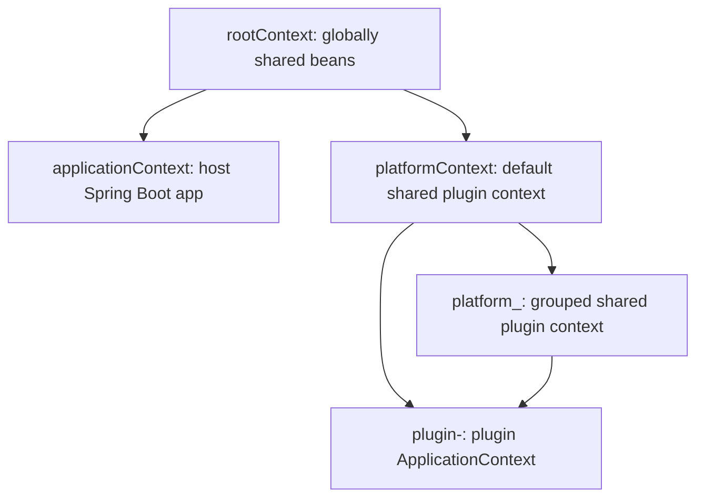

# PF4Boot Architecture

## Problem

`pf4boot` integrates PF4J plugins with a Spring Boot host application. The design must let plugins own their classes and Spring beans while still sharing selected services with the host and with other plugins.

## Module Layout

- `pf4boot-api`: public contracts, annotations, Spring context helpers, plugin wrapper, lifecycle events, sharing models, and utility interfaces.
- `pf4boot-core`: PF4J manager implementation, plugin repositories/loaders, plugin class loader, lifecycle orchestration, shared bean manager, auto-export manager, and scheduled task manager.
- `pf4boot-starter`: Spring Boot auto-configuration, plugin manager bean creation, admin controller, MVC patch configuration, and default resources.
- `pf4boot-web-support`: shared compile-time web support surface for plugin modules.
- `pf4boot-web-starter`: dynamic Spring MVC controller, interceptor, and resource integration.
- `pf4boot-jpa`: JPA provider support for managed packages.
- `pf4boot-jpa-starter`: plugin-side JPA auto-configuration.
- `demo-app`, `demo-lib`, `plugin1`, `plugin2`: runnable examples and sample plugin dependency behavior.
- `app-run`: runtime distribution and Linux package assembly.

## Runtime Components

`Pf4bootAutoConfiguration` creates `Pf4bootPluginManagerImpl` when `spring.pf4boot.enabled=true`. The manager:

- sets PF4J runtime mode and plugins directory from `Pf4bootProperties`;
- creates root and platform Spring contexts;
- loads plugins from configured roots;
- starts plugins manually or automatically after the host `ApplicationStartedEvent`;
- coordinates plugin support hooks through `Pf4bootPluginSupport`;
- delegates shared bean and scheduled task registration to `ShareBeanMgr`.

Each plugin is represented by `Pf4bootPluginWrapper` and usually extends `Pf4bootPlugin`. A plain PF4J `Plugin` is wrapped by `Pf4bootPluginProxy`, so manager logic can work against the `Pf4bootPlugin` abstraction.

## Context Model

The host application context is connected to a root context created by the plugin manager. A default platform context and optional group-specific platform contexts sit between host/global services and plugin-local contexts. A plugin context is created on start by `Pf4bootPlugin.createPluginContext`.

The implementation primarily shares bean factories, not a full event-listener chain. Events are explicitly published by `Pf4bootPluginManagerImpl.publishEvent`.

## Key Design Choices

- Parent-first class loading is used by default to avoid the same API type being loaded by multiple class loaders and breaking Spring autowiring.
- Plugin resources can be loaded locally first so plugin static resources and plugin-only resources can override host defaults where intended.
- Public extension points live in `pf4boot-api`; runtime behavior stays in `pf4boot-core`.
- Web and JPA integrations are optional starter-style layers rather than hard requirements for every plugin.

## Compatibility

The project targets Java 8 and Spring Boot 2.7.x. Any public annotation, lifecycle event, plugin manager method, class loading rule, or Gradle packaging scope change should be treated as compatibility-sensitive.

## Verification

For architecture-level changes, prefer:

- `.\gradlew.bat :pf4boot-api:compileJava`
- `.\gradlew.bat :pf4boot-core:compileJava`
- `.\gradlew.bat :pf4boot-starter:compileJava`
- `.\gradlew.bat build` when dependency resolution allows it

The root build disables tasks whose names contain `test`, so successful `build` does not prove test execution.
