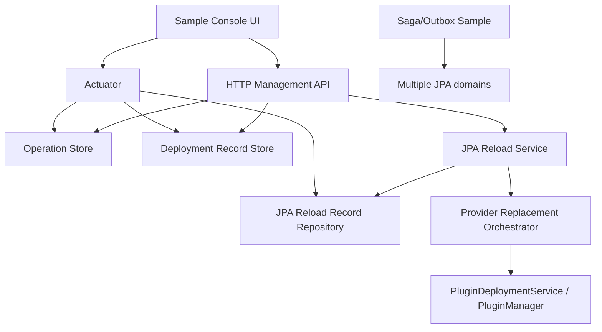

# Plugin Framework Priority Roadmap Design

## 1. Background

pf4boot now has HTTP management APIs, hot replacement deployment, cross-plugin shared JPA transactions, restart-based JPA domain refresh, the common drain SPI, read-only Actuator visibility, and complex sample smoke tests. The remaining gaps should be implemented in priority order:

1. persistent management and JPA reload records;
2. `providerReplacementPath`;
3. Saga/Outbox sample;
4. management console UI.

This document ties these topics into one implementation line so future work does not accidentally move UI, cross-datasource transactions, or provider package replacement into the wrong module boundary.

## 2. Goals

1. Make management operations, deployment records, and JPA reload records queryable, recoverable, and auditable after process restart.
2. Allow JPA reload to use a staged provider package during a controlled maintenance action.
3. Provide a business-level Saga/Outbox sample for cross-datasource eventual consistency while keeping framework-level cross-datasource atomic transactions forbidden.
4. Define an independent sample UI boundary that consumes only HTTP management APIs and Actuator.

## 3. Non-Goals

1. Do not add XA/JTA or cross-datasource atomic transactions to the core framework.
2. Do not mutate Hibernate metamodels online.
3. Do not bundle a management console UI into `pf4boot-core`, `pf4boot-starter`, or `pf4boot-management-starter`.
4. Do not require persistent stores by default; memory mode remains the compatibility default.
5. Do not support atomic replacement across multiple JPA domains in the first provider replacement version.

## 4. Current Anchors

| Capability | Current State | Code/Doc |
| --- | --- | --- |
| Management operations | `PluginOperationStore` has memory and file implementations | `PluginOperationStore`, `FilePluginOperationStore` |
| Deployment records | `PluginDeploymentRecordStore` has memory and file implementations | `PluginDeploymentRecordStore`, `FilePluginDeploymentRecordStore` |
| JPA reload records | `JpaDomainReloadRecordRepository` exists; auto-config currently uses memory | `InMemoryJpaDomainReloadRecordRepository` |
| Provider replacement field | `JpaDomainReloadRequest.providerReplacementPath` now integrates with `PluginDeploymentService` for staged provider package replacement | `plugin-framework-priority-roadmap-plan.md` |
| Saga/Outbox | Decision recommends business-layer patterns, but there is no sample | `cross-datasource-transaction-decision.md` |
| Management UI | Decision keeps UI out of framework modules; an independent sample UI is allowed | `plugin-management-console-boundary.md` |

## 5. Core Constraints

- Keep Java 8 compatibility.
- Core must not depend on JPA, management, frontend frameworks, or database persistence implementations.
- Persistent records must not store tokens, full exception stacks, or sensitive absolute paths.
- File persistence must use atomic write semantics: temp file, flush, rename/replace.
- All write operations still go through authentication, idempotency, and audit.
- Saga/Outbox sample must clearly state eventual consistency and must not imply framework-level atomic commits.

## 6. Overall Architecture



Principles:

- P1 creates the durable facts needed for recovery and audit.
- P2 depends on P1 because provider replacement recovery needs reliable records.
- P3 demonstrates business-level eventual consistency without changing core transactions.
- P4 only visualizes and calls stable APIs.

## 7. P1 Persistent Management And JPA Reload Records

P1 is not a from-scratch management persistence task. It should verify and harden the existing management file stores, then add persistent JPA reload records and unified visibility.

| Record Type | Current Interface | P1 Target |
| --- | --- | --- |
| Management operation | `PluginOperationStore` | recoverable file records; idempotency survives restart |
| Deployment record | `PluginDeploymentRecordStore` | file `findById/recent`; rollback summary preserved |
| JPA reload | `JpaDomainReloadRecordRepository` | file implementation with reloadId, idempotencyKey, latest, and recent |

Suggested layout:

```text
work/pf4boot/records/
  operations/
  deployments/
  jpa-reloads/
    reload-{reloadId}.json
    idempotency/
      {sha256-key}.json
    latest.json
```

Suggested JPA reload config:

```yaml
pf4boot:
  plugin:
    jpa:
      domain-reload:
        record-store:
          type: memory # memory, file
          directory: work/pf4boot/records/jpa-reloads
          fail-closed: true
```

Startup must not replay dangerous actions automatically. Interrupted operation/deployment/reload records should be queryable and marked recoverable or manual-intervention as appropriate.

## 8. P2 `providerReplacementPath`

When `providerReplacementPath` is present, JPA reload should execute provider package replacement as part of the same maintenance action:

1. verify staged provider package;
2. build reload plan;
3. drain the impact chain;
4. stop consumers;
5. stop provider;
6. activate staged provider;
7. wait for the new descriptor;
8. start consumers;
9. run health checks;
10. recover old provider and consumers on failure when possible.

P2 should reuse `PluginDeploymentService` for package verification, rollback snapshot, and staged package handling. JPA reload owns domain planning, descriptor checks, and JPA reload records. If a finer-grained deployment adapter is missing, add a generic core method without JPA types.

Suggested new codes:

- `PROVIDER_REPLACEMENT_MISMATCH`
- `PROVIDER_REPLACEMENT_VERIFY_FAILED`
- `PROVIDER_REPLACEMENT_ACTIVATION_FAILED`
- `PROVIDER_REPLACEMENT_ROLLBACK_FAILED`

## 9. P3 Saga/Outbox Sample

Add an independent sample that demonstrates eventual consistency across two JPA domains:

```text
samples/saga-outbox/
  demo-host
  app-run
  model-order
  model-billing
  plugin-order-domain
  plugin-billing-domain
  plugin-order-service
  plugin-billing-service
  plugin-outbox-dispatcher
```

Flow:

1. order service writes order and outbox in the order domain;
2. dispatcher reads outbox and calls billing;
3. billing service uses inbox idempotency in the billing domain;
4. duplicate delivery does not charge twice;
5. temporary billing failure stays retryable or moves to dead-letter.

The sample must not introduce a framework-level Saga coordinator, cross-datasource `@Transactional` atomicity, or a messaging middleware dependency.

## 10. P4 Management Console UI

Add only an independent sample UI after APIs are stable:

```text
samples/plugin-management-console/
  console-app
  README.md
```

Allowed calls:

- `/pf4boot/admin/**`
- `/actuator/pf4bootplugins`
- `/actuator/pf4bootgovernance`
- `/actuator/pf4bootjpareload`
- `/actuator/metrics/pf4boot.*`

First views:

| View | Capability |
| --- | --- |
| Plugin list | state, version, start/stop, last error |
| Deployment records | plan/replace/rollback/confirm states |
| JPA reload | domain, latest reload, drain summary, execute entry |
| Governance | trust, capability, record store, metrics summaries |

The UI must not store tokens in the repository, bypass plan/precheck, or call Java beans directly.

## 11. Configuration Summary

```yaml
spring:
  pf4boot:
    management:
      http:
        operation-store:
          type: file
          directory: work/pf4boot/records/operations
          fail-closed: true
pf4boot:
  plugin:
    jpa:
      domain-reload:
        record-store:
          type: file
          directory: work/pf4boot/records/jpa-reloads
          fail-closed: true
```

The UI sample has its own API base URL config and does not add framework properties.

## 12. Test Strategy

| Phase | Minimum Verification |
| --- | --- |
| P1 | file store unit tests; restart find/recent/idempotency; JPA reload record persistence; Actuator summary |
| P2 | provider replacement blockers; successful replacement; rollback on failure; unrelated plugin isolation; runtime smoke |
| P3 | Saga/Outbox sample success, duplicate delivery, retry, report output |
| P4 | UI API contract tests; local smoke; auth failure and idempotency conflict display |

## 13. Risks

| Risk | Mitigation |
| --- | --- |
| Corrupt files block startup | `fail-closed` controls behavior; production should fail closed, development may fail open with warning |
| Provider replacement duplicates deployment state | Reuse deployment service for package governance; keep JPA reload record for domain semantics |
| Saga sample is misunderstood as framework transaction support | State eventual consistency repeatedly in README and acceptance |
| UI creates security confusion | Keep sample local by default; production UI must be external and separately authenticated |

## 14. Implementation Order

1. P1 persistent management/JPA reload records.
2. P2 `providerReplacementPath`.
3. P3 Saga/Outbox sample.
4. P4 management console UI sample.

Each phase must update Chinese docs, English translations, implementation plan, acceptance evidence, and sample README. Code phases require independent commits.
