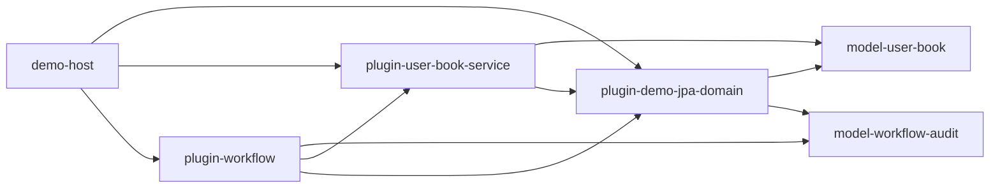

# Complex Cross-Plugin JPA Sample Split

## 1. Background

The current demo can show that `pf4boot-jpa-domain-starter` provides a shared `DataSource / EntityManagerFactory / TransactionManager`, and business plugins can reuse the transaction environment through `pf4boot-jpa-starter` in `SHARED` mode.

However, the old root-level sample was still too small. Continuing to place complex business cases inside root-level demo plugins creates two problems:

- The datasource capability plugin starts to mix entity and business concepts.
- The root demo becomes a business sample collection, which hurts readability and maintainability of the framework project.

The complex sample should therefore move from a "minimal runnable demo" to a "multi-module sample that can be copied into real projects".

## 2. Goals

- Keep the datasource capability plugin focused on creating and exporting `DataSource / EntityManagerFactory / TransactionManager` for a `domain-id`.
- Move JPA entities out of the datasource capability plugin into standalone `domain-model` modules.
- Keep business repositories and services in consumer business plugins, with explicit EMF/TM binding by package.
- Let workflow plugins compose exported services instead of directly accessing repositories owned by other plugins.
- Put the complex sample in a standalone multi-module sample instead of growing the root project.

## 3. Non-Goals

- Cross-datasource atomic transactions.
- JTA/XA.
- Runtime contribution of new entities into an already-started shared EMF.
- Publishing every complex sample module as an official framework artifact.
- Changing the existing minimal demo path unless a later implementation phase explicitly decides to migrate it.

## 4. Core Constraints

- Keep Java compatible with `jdkVersion=1.8`.
- The datasource capability plugin must not define `@Entity`, repositories, controllers, or business services.
- The provider plugin class loader must see all entity classes before the shared EMF is created.
- Consumer plugins may define repositories, but referenced entities must come from model modules visible to the provider.
- Cross-plugin business collaboration must go through exported service beans, not direct repository injection.
- Transaction semantics such as `REQUIRES_NEW` must go through Spring proxies and must not rely on self-invocation.
- When multiple domains exist, each repository package must bind to one explicit EMF/TM.

## 5. Recommended Module Layout

Use a standalone sample directory:

```text
samples/cross-plugin-jpa/
  demo-host
  model-user-book
  model-workflow-audit
  plugin-demo-jpa-domain
  plugin-user-book-service
  plugin-workflow
```

| Module | Type | Responsibility | Must Not Do |
| --- | --- | --- | --- |
| `demo-host` | Spring Boot host | Start pf4boot, load sample plugins, provide runtime config | Own business entities or plugin business |
| `model-user-book` | Java library | Define `User`, `Book`, and related JPA entities | Define datasource, repositories, or services |
| `model-workflow-audit` | Java library | Define `WorkflowAudit` and audit entities | Define datasource, repositories, or services |
| `plugin-demo-jpa-domain` | JPA domain provider plugin | Depend on model modules, configure entity packages, export `domain.demo.*` | Define entities, repositories, or controllers |
| `plugin-user-book-service` | Business plugin | Define repositories and `UserBookService` | Create local EMF/TM |
| `plugin-workflow` | Workflow plugin | Call `UserBookService`, define audit repository and workflow service/controller | Directly inject repositories from other plugins |

## 6. Dependency Relationship



| Relationship | Recommended Scope |
| --- | --- |
| provider plugin depends on model | `compileOnlyApi` or regular library dependency, depending on sample runtime packaging |
| service plugin depends on model | `compileOnlyApi` |
| workflow plugin depends on audit model | `compileOnlyApi` |
| service/workflow depends on provider plugin | `plugin project(":plugin-demo-jpa-domain")` |
| workflow depends on service plugin API | `compileOnlyApi project(":plugin-user-book-service")` + `plugin project(":plugin-user-book-service")` |
| JPA starter | consumer plugins `bundle project(":pf4boot-jpa-starter")` |
| JPA domain starter | provider plugin `bundle project(":pf4boot-jpa-domain-starter")` |

## 7. Configuration Example

The provider plugin only declares datasource and entity scan packages:

```yaml
pf4boot:
  plugin:
    jpa:
      domain:
        id: demo
        entity-packages:
          - net.xdob.sample.model.userbook
          - net.xdob.sample.model.audit
        datasource:
          url: jdbc:h2:file:~/h2/pf4boot_sample_demo;AUTO_SERVER=TRUE;DB_CLOSE_DELAY=-1
          username: sa
          password:
          driver-class-name: org.h2.Driver
        ddl-auto: update
```

Business plugins use the shared domain:

```yaml
pf4boot:
  plugin:
    jpa:
      enabled: true
      mode: SHARED
      domain-id: demo
```

Repositories are explicitly bound by package:

```java
@Configuration
@EnableJpaRepositories(
    basePackages = "net.xdob.sample.userbook.repository",
    entityManagerFactoryRef = "domain.demo.entityManagerFactory",
    transactionManagerRef = "domain.demo.transactionManager"
)
public class UserBookJpaConfig {
}
```

## 8. Workflow Demo Scenarios

| Scenario | Goal |
| --- | --- |
| Create user and book normally | Show multiple repositories in one business plugin using the same TM |
| Workflow calls user-book service and writes audit | Show cross-plugin service composition in one domain |
| Workflow forced failure | Show main transaction rollback |
| Audit uses separate writer bean + `REQUIRES_NEW` | Show transaction proxy boundaries and independent commit semantics |
| Provider missing or failed | Show dependent plugins fail while unrelated plugins continue |
| Multiple repository package bindings | Show entities and repositories grouped by package |

## 9. Relationship to Current Implementation

The old root-level sample project has been removed. `samples/cross-plugin-jpa` now owns the runnable shared JPA domain proof.

The complex sample should be maintained as a standalone sample. Do not continue adding more business entities or services into root-level demo modules. If temporary complex sample code appears later, migrate it as follows:

- Move business entities from the provider plugin into `model-*` modules.
- Let the provider depend on model modules and scan model packages.
- Keep repositories and services in consumer plugins.
- Let workflow plugins depend on exported services and their own repositories.

## 10. Verification Strategy

Minimal compile verification:

```powershell
.\gradlew.bat :samples:cross-plugin-jpa:plugin-demo-jpa-domain:compileJava `
  :samples:cross-plugin-jpa:plugin-user-book-service:compileJava `
  :samples:cross-plugin-jpa:plugin-workflow:compileJava
```

Plugin package verification:

```powershell
.\gradlew.bat :samples:cross-plugin-jpa:plugin-demo-jpa-domain:pf4boot `
  :samples:cross-plugin-jpa:plugin-user-book-service:pf4boot `
  :samples:cross-plugin-jpa:plugin-workflow:pf4boot
```

Runtime smoke should cover:

- Consumers bind shared `domain.demo.*` after provider starts.
- Entity classes such as `WorkflowAudit` are visible when the provider creates EMF.
- `plugin-workflow` does not directly inject repositories owned by `plugin-user-book-service`.
- Forced failure rolls back the main transaction; `REQUIRES_NEW` behavior follows the design.

## 11. Open Questions

- Should the sample be included in root `settings.gradle`, or stay as an independent Gradle multi-module project?
- Should model modules be packaged into plugin zips, or provided by the host platform classpath?
- Should we add a dedicated sample README and run scripts?
- Should the current root demo complex JPA code be kept, or reduced back to a minimal sample after the standalone sample lands? Decision: remove the old root-level sample project and use `samples/cross-plugin-jpa`.
