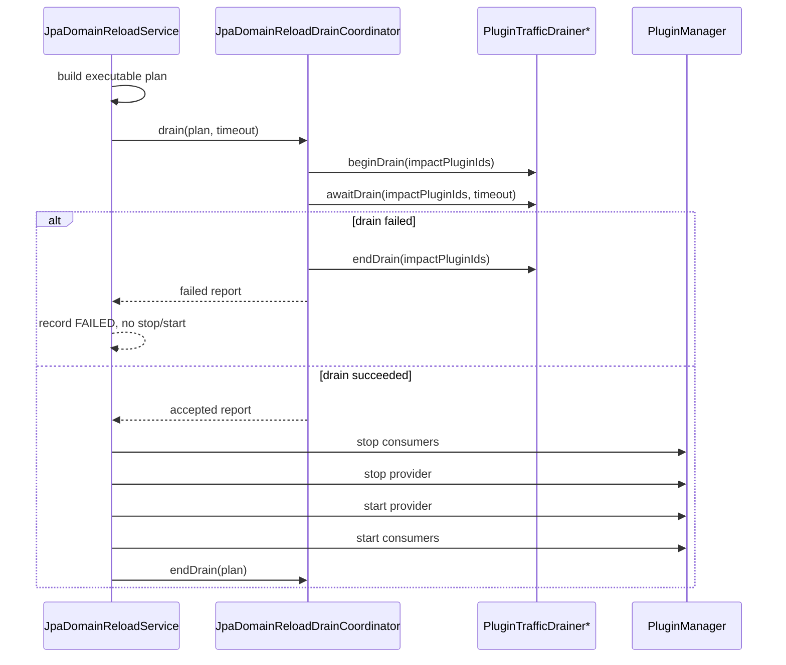

# JPA Runtime Refresh Drain SPI Design

## 1. Background

JPA runtime refresh V1 now has `PLAN_ONLY`, exact consumer detection, restart-based execution, management APIs, and runtime smoke acceptance. The largest remaining gap is that the `DRAINING` phase records state but does not yet execute an extensible drain mechanism.

The repository already has a common hot-replacement drain extension point, `PluginTrafficDrainer`:

```java
void beginDrain(Collection<String> pluginIds);
boolean awaitDrain(Collection<String> pluginIds, long timeoutMillis) throws InterruptedException;
void endDrain(Collection<String> pluginIds);
```

Web, scheduled tasks, shared bean management, and hot replacement already use this semantic model: reject new entrypoints, wait for in-flight work to reach zero, then clear the draining marker. JPA refresh should reuse this model instead of creating a second drain protocol for the same plugin lifecycle actions.

## 2. Goals

1. JPA refresh execute mode really drains before stopping consumers or the provider.
2. Drain failure stops the refresh before any plugin stop operation and writes a `FAILED` reload record.
3. The same `PluginTrafficDrainer` serves both hot replacement deployment and JPA refresh.
4. JPA refresh records drain result, duration, failed drainer, and failure reason.
5. If no drainer bean exists, compatibility is preserved: execution may continue, but a clear warning is recorded.
6. Future business-level drain can plug in later, such as transaction counters, background jobs, or message consumer pause.

## 3. Non-Goals

1. Do not forcibly abort JDBC transactions, threads, or requests.
2. Do not promise zero-downtime production refresh.
3. Do not add breaking methods to `PluginTrafficDrainer`.
4. Do not implement cross-domain, cross-datasource, or cross-JVM drain.
5. Do not include schema migration in drain; schema remains owned by an external migration process.

## 4. Affected Modules

| Module | Responsibility |
| --- | --- |
| `pf4boot-api` | Keep `PluginTrafficDrainer` compatible; JPA-specific reports belong in `pf4boot-jpa` |
| `pf4boot-jpa` | Extend `JpaDomainDrainReport` for JPA refresh drain summaries |
| `pf4boot-jpa-starter` | Add a drain coordinator and call it from `DefaultJpaDomainReloadService` during `DRAINING` |
| `pf4boot-web-starter` | Continue rejecting new Web requests and waiting for in-flight requests through the existing drainer |
| `pf4boot-core` | Continue pausing scheduled tasks and waiting for running tasks through `DefaultShareBeanMgr` / `DefaultScheduledMgr` |
| `samples/cross-plugin-jpa` | Add runtime smoke for drain success and timeout/no-mutation behavior |
| `docs/design` | Update JPA refresh, Web, hot replacement, and developer guide docs |

## 5. Proposed Design

### 5.1 Reuse The Common Drainer

JPA refresh does not introduce a parallel interface. It injects all `PluginTrafficDrainer` beans:

```java
class JpaDomainReloadDrainCoordinator {
  JpaDomainDrainReport drain(JpaDomainReloadPlan plan, long timeoutMillis);
  void endDrain(JpaDomainReloadPlan plan);
}
```

The coordinator is an internal runtime component in `pf4boot-jpa-starter`, not a public API. The public surface only exposes the drain result model.

### 5.2 Impact Scope

The drain target list is:

1. all exact consumers in `plan.stopOrder`;
2. `plan.providerPluginId`;
3. de-duplicated in `plan.stopOrder + provider` order.

Rationale:

- consumers are the primary business entrypoints and must reject new requests/tasks first;
- providers should stay narrowly focused, but may still contain scheduled jobs or internal management entrypoints;
- unrelated plugins must not be drained;
- inferred consumers are non-executable, so they cannot enter execute drain.

### 5.3 Execution Sequence



Constraints:

- `endDrain` must be called from `finally` after `beginDrain`.
- drain failure must not enter `STOPPING_CONSUMERS`.
- after successful drain, draining markers remain until the provider and consumers are started again.
- if execution enters manual intervention, the framework still attempts `endDrain` so plugins are not left permanently draining.

### 5.4 Multiple Drainers

Multiple drainers run in Spring injection order. Future `@Order` support is recommended but not required for V1.1.

Rules:

1. Call `beginDrain` on each drainer in order.
2. If any `beginDrain` throws, call `endDrain` in reverse order for already-begun drainers and return `DRAIN_REJECTED`.
3. Call `awaitDrain` in order using the remaining total timeout budget.
4. If any `awaitDrain` returns false, return `DRAIN_TIMEOUT`.
5. If any `awaitDrain` throws, return `DRAIN_REJECTED`.
6. Call `endDrain` in reverse order for begun drainers. `endDrain` failures become warnings and do not override the main result.

### 5.5 Timeout Budget

Effective timeout:

1. use `JpaDomainReloadRequest.drainTimeoutMillis` when it is greater than 0;
2. otherwise use `pf4boot.plugin.jpa.domain-reload.default-drain-timeout`;
3. if still less than or equal to 0, do not wait; only perform a begin/await check.

All drainers share the same total budget. A configured `30s` means the whole drain phase gets at most 30 seconds.

### 5.6 Drain Report

Extend `JpaDomainDrainReport` into an immutable model:

| Field | Description |
| --- | --- |
| `accepted` | whether drain succeeded |
| `failureCode` | `DRAIN_TIMEOUT`, `DRAIN_REJECTED`, or null |
| `message` | summary |
| `pluginIds` | impacted plugins |
| `drainerResults` | per-drainer results |
| `startedAt` / `finishedAt` | timestamps |
| `durationMillis` | total duration |
| `warnings` | non-blocking warnings such as `endDrain` failures or missing drainers |

Add `JpaDomainDrainerResult`:

| Field | Description |
| --- | --- |
| `drainerName` | bean name or class name |
| `phase` | `BEGIN`, `AWAIT`, or `END` |
| `accepted` | whether the phase succeeded |
| `durationMillis` | phase duration |
| `message` | safe summary without stack traces or sensitive values |

Add `drainReport` to `JpaDomainReloadRecord`. If constructor compatibility is a concern, keep the old constructor and add an overloaded one.

#### 5.6.1 Fields And Constructors

Keep the current `JpaDomainDrainReport` constructor and add a full constructor:

```java
public JpaDomainDrainReport(boolean accepted, String message)

public JpaDomainDrainReport(
    boolean accepted,
    JpaDomainReloadFailureCode failureCode,
    String message,
    List<String> pluginIds,
    List<JpaDomainDrainerResult> drainerResults,
    long startedAt,
    long finishedAt,
    List<String> warnings)
```

Field rules:

| Field | Type | Default / Validation | Description |
| --- | --- | --- | --- |
| `accepted` | `boolean` | required | only true may proceed to stop/start |
| `failureCode` | `JpaDomainReloadFailureCode` | null on success | only `DRAIN_TIMEOUT`, `DRAIN_REJECTED`, or null |
| `message` | `String` | nullable, max 512 chars | public summary, no stack trace |
| `pluginIds` | `List<String>` | null becomes immutable empty list | stable drain impact order |
| `drainerResults` | `List<JpaDomainDrainerResult>` | null becomes immutable empty list | per-drainer phase results |
| `startedAt` | `long` | millis timestamp | drain start |
| `finishedAt` | `long` | millis timestamp | drain finish; may be 0 if not finished |
| `durationMillis` | derived getter | `max(0, finishedAt - startedAt)` | not stored separately |
| `warnings` | `List<String>` | null becomes immutable empty list | non-blocking issues |

Add `JpaDomainDrainerPhase`:

```java
public enum JpaDomainDrainerPhase {
  BEGIN,
  AWAIT,
  END
}
```

Add `JpaDomainDrainerResult`:

```java
public class JpaDomainDrainerResult {
  public JpaDomainDrainerResult(
      String drainerName,
      JpaDomainDrainerPhase phase,
      boolean accepted,
      long startedAt,
      long finishedAt,
      String message)
}
```

Field rules:

| Field | Type | Default / Validation | Description |
| --- | --- | --- | --- |
| `drainerName` | `String` | required; empty uses class name or `unknown` | bean name first, class name fallback |
| `phase` | `JpaDomainDrainerPhase` | required | current phase |
| `accepted` | `boolean` | required | phase result |
| `startedAt` / `finishedAt` | `long` | millis timestamp | duration source |
| `durationMillis` | derived getter | `max(0, finishedAt - startedAt)` | not stored separately |
| `message` | `String` | nullable, max 512 chars | success/failure summary |

Add a field to `JpaDomainReloadRecord`:

```java
private final JpaDomainDrainReport drainReport;

public JpaDomainReloadRecord(
    ...,
    String rollbackSummary) {
  this(..., rollbackSummary, null);
}

public JpaDomainReloadRecord(
    ...,
    String rollbackSummary,
    JpaDomainDrainReport drainReport)
```

Compatibility rules:

- keep the current constructor signature;
- add `getDrainReport()`;
- JSON output adds a backward-compatible field;
- null `drainReport` means an old record or a record that never entered drain.

#### 5.6.2 Public JSON Example

```json
{
  "reloadId": "jpa-reload-1",
  "state": "FAILED",
  "failureCode": "DRAIN_TIMEOUT",
  "drainReport": {
    "accepted": false,
    "failureCode": "DRAIN_TIMEOUT",
    "message": "drainer timed out: pluginRequestMappingHandlerMapping",
    "pluginIds": ["sample-workflow", "sample-user-book-service", "sample-demo-jpa-domain"],
    "durationMillis": 30001,
    "warnings": [],
    "drainerResults": [
      {
        "drainerName": "pluginRequestMappingHandlerMapping",
        "phase": "AWAIT",
        "accepted": false,
        "durationMillis": 30000,
        "message": "in-flight requests not drained"
      }
    ]
  }
}
```

#### 5.6.3 Coordinator Pseudocode

```java
JpaDomainDrainReport drain(JpaDomainReloadPlan plan, long timeoutMillis) {
  List<String> pluginIds = impactPluginIds(plan);
  List<NamedDrainer> drainers = orderedDrainers();
  long startedAt = now();
  List<JpaDomainDrainerResult> results = new ArrayList<>();
  List<String> warnings = new ArrayList<>();
  List<NamedDrainer> begun = new ArrayList<>();

  if (drainers.isEmpty()) {
    if (properties.getDomainReload().isRequireDrainer()) {
      return rejected("no PluginTrafficDrainer found", pluginIds, startedAt, results, warnings);
    }
    warnings.add("no PluginTrafficDrainer found");
    return accepted("no drainer, continue for compatibility", pluginIds, startedAt, results, warnings);
  }

  try {
    for (NamedDrainer drainer : drainers) {
      long phaseStarted = now();
      try {
        drainer.beginDrain(pluginIds);
        begun.add(drainer);
        results.add(success(drainer, BEGIN, phaseStarted));
      } catch (RuntimeException e) {
        results.add(failed(drainer, BEGIN, phaseStarted, sanitize(e)));
        endBegunDrainers(begun, pluginIds, results, warnings);
        return rejected("drainer begin rejected", pluginIds, startedAt, results, warnings);
      }
    }

    long deadline = timeoutMillis <= 0 ? now() : now() + timeoutMillis;
    for (NamedDrainer drainer : drainers) {
      long remaining = timeoutMillis <= 0 ? 0 : Math.max(0, deadline - now());
      long phaseStarted = now();
      try {
        boolean drained = drainer.awaitDrain(pluginIds, remaining);
        results.add(result(drainer, AWAIT, drained, phaseStarted, drained ? "drained" : "timeout"));
        if (!drained) {
          endBegunDrainers(begun, pluginIds, results, warnings);
          return timeout("drainer await timed out", pluginIds, startedAt, results, warnings);
        }
      } catch (InterruptedException e) {
        Thread.currentThread().interrupt();
        results.add(failed(drainer, AWAIT, phaseStarted, "interrupted"));
        endBegunDrainers(begun, pluginIds, results, warnings);
        return rejected("drainer interrupted", pluginIds, startedAt, results, warnings);
      } catch (RuntimeException e) {
        results.add(failed(drainer, AWAIT, phaseStarted, sanitize(e)));
        endBegunDrainers(begun, pluginIds, results, warnings);
        return rejected("drainer await rejected", pluginIds, startedAt, results, warnings);
      }
    }
    return accepted("drained", pluginIds, startedAt, results, warnings);
  } catch (RuntimeException e) {
    endBegunDrainers(begun, pluginIds, results, warnings);
    return rejected("drainer failed", pluginIds, startedAt, results, warnings);
  }
}

void endDrain(JpaDomainReloadPlan plan) {
  endBegunDrainers(currentBegunDrainersFor(plan), impactPluginIds(plan), results, warnings);
}
```

Implementation requirements:

- `NamedDrainer` stores beanName, delegate, and begin state.
- without beanName, `drainerName` uses `delegate.getClass().getName()`.
- `sanitize(e)` keeps only exception message, max 512 chars, no stack trace.
- `endBegunDrainers` must call in reverse order.
- `endDrain` failure only appends a warning and does not change the main `failureCode`.
- begun drainer state for a reload must not live in singleton fields; keep it in the execution stack or report context to avoid cross-reload contamination.

#### 5.6.4 Auto-Configuration Boundary

Adjust `JpaDomainReloadAutoConfiguration`:

```java
@Bean
@ConditionalOnMissingBean
public JpaDomainReloadDrainCoordinator jpaDomainReloadDrainCoordinator(
    ObjectProvider<PluginTrafficDrainer> trafficDrainers,
    Pf4bootJpaProperties properties) {
  return new JpaDomainReloadDrainCoordinator(trafficDrainers, properties);
}

@Bean
@ConditionalOnMissingBean
public JpaDomainReloadService jpaDomainReloadService(
    ObjectProvider<Pf4bootPluginManager> pluginManager,
    DefaultJpaDomainReloadPlanService planService,
    JpaDomainReloadRecordRepository recordRepository,
    JpaDomainReloadDrainCoordinator drainCoordinator,
    Pf4bootJpaProperties properties) {
  return new DefaultJpaDomainReloadService(
      pluginManager.getIfAvailable(),
      planService,
      recordRepository,
      drainCoordinator,
      properties);
}
```

Add to `Pf4bootJpaProperties.DomainReload`:

```java
private boolean requireDrainer = false;
private boolean drainEndOnFailure = true;
```

Setters should remain lenient for Spring Boot binding. Timeout normalization keeps the existing behavior.

### 5.7 Web Drain

`PluginRequestMappingHandlerMapping` already implements `PluginTrafficDrainer`:

- after `beginDrain`, plugin routes enter draining state;
- new requests return 503;
- `awaitDrain` returns true after in-flight request counts reach zero.

After JPA refresh uses the common drainer, consumer Web controllers naturally enter a maintenance window. Runtime smoke should add a concurrent check: start a long request, trigger JPA reload, and verify reload waits or fails by timeout.

### 5.8 Scheduled Task Drain

`DefaultShareBeanMgr` delegates to `DefaultScheduledMgr`:

- new target-plugin scheduled executions do not start after drain begins;
- already-running tasks finish before `awaitDrain` returns true;
- timeout returns false.

JPA refresh does not need to understand scheduled task internals.

### 5.9 Transaction Drain

The first implementation should not instrument Spring transaction interceptors or count every JDBC connection. Reasons:

- `@Transactional` can live in business plugins, shared services, or host services;
- forcing transaction-manager proxies can be compatibility-sensitive;
- Web/task entrypoint drain already prevents most new transactions from entering.

If precise transaction drain is needed later, add an optional JPA-specific drainer:

```java
public interface JpaDomainTransactionDrainer {
  JpaDomainDrainerResult begin(String domainId, Collection<String> pluginIds);
  JpaDomainDrainerResult await(String domainId, Collection<String> pluginIds, long timeoutMillis);
  void end(String domainId, Collection<String> pluginIds);
}
```

Do not introduce it until transaction counting and proxy boundaries have a separate design.

## 6. Configuration

Reuse the existing timeout:

```yaml
pf4boot:
  plugin:
    jpa:
      domain-reload:
        default-drain-timeout: 30s
```

Recommended additions:

```yaml
pf4boot:
  plugin:
    jpa:
      domain-reload:
        require-drainer: false
        drain-end-on-failure: true
```

| Property | Default | Description |
| --- | --- | --- |
| `require-drainer` | `false` | fail execute when no `PluginTrafficDrainer` exists |
| `drain-end-on-failure` | `true` | force `endDrain` after drain or execution failure |

`require-drainer=false` keeps compatibility. Production hosts should consider `true`.

## 7. Error Codes And States

Reuse existing failure codes:

- `DRAIN_TIMEOUT`: at least one drainer timed out or returned false.
- `DRAIN_REJECTED`: drainer begin/await threw, or config requires a drainer but none exists.

State flow:

```text
PLANNED -> DRAINING -> STOPPING_CONSUMERS ...
PLANNED -> DRAINING -> FAILED
```

A drain-failed record must have:

- `state=FAILED`;
- `failureCode=DRAIN_TIMEOUT` or `DRAIN_REJECTED`;
- transitions including at least `PLANNED`, `DRAINING`, `FAILED`;
- no plugin stop/start operation.

## 8. Management And Actuator

Management reload responses should include the drain report summary. Actuator `pf4bootjpareload` should include the latest drain summary:

- whether the latest drain succeeded;
- latest drain duration;
- latest failure code;
- latest impacted plugin count;
- latest warning count.

Do not output full stack traces, absolute paths, tokens, or raw request parameters.

## 9. Tests And Acceptance

### 9.1 Unit Tests

`pf4boot-jpa-starter`:

1. no drainer with `require-drainer=false`: execution continues and report has a warning;
2. no drainer with `require-drainer=true`: `DRAIN_REJECTED`, no stop;
3. begin throws: `DRAIN_REJECTED`, already-begun drainers are ended;
4. await returns false: `DRAIN_TIMEOUT`, no stop;
5. multiple drainers share one timeout budget;
6. successful drain keeps existing stop/start order and calls `endDrain`;
7. stop/start failure still calls `endDrain`;
8. `endDrain` failure records warning but does not override the main result.

### 9.2 Web/Task Integration Tests

1. reload waits for an in-flight Web request to finish;
2. a long Web request exceeding timeout returns `DRAIN_TIMEOUT` and plugins remain started;
3. reload waits for a running scheduled task;
4. scheduled task timeout fails reload without stopping plugins.

### 9.3 Runtime Smoke

Add to `samples/cross-plugin-jpa`:

- `jpaReloadDrainSuccess`;
- `jpaReloadDrainTimeoutNoMutation`;
- `actuatorJpaReloadDrainSummary`.

### 9.4 Acceptance

| Acceptance | Standard |
| --- | --- |
| AC-01 | JPA reload execute calls all available `PluginTrafficDrainer` beans |
| AC-02 | drain failure does not stop consumers or provider |
| AC-03 | successful drain preserves stop/start order |
| AC-04 | every path calls `endDrain` or records a warning when it cannot |
| AC-05 | reload record exposes drain report |
| AC-06 | runtime smoke covers drain success and timeout/no-mutation |
| AC-07 | default compatibility: no drainer does not break existing execute |
| AC-08 | strict production mode: `require-drainer=true` blocks when no drainer exists |

## 10. Implementation Order

1. Extend `JpaDomainDrainReport` and add drainer result models.
2. Add `JpaDomainReloadDrainCoordinator` in `pf4boot-jpa-starter`.
3. Inject `ObjectProvider<PluginTrafficDrainer>` in `JpaDomainReloadAutoConfiguration`.
4. Call the coordinator from `DefaultJpaDomainReloadService` during `DRAINING`.
5. Add `drainReport` to `JpaDomainReloadRecord`.
6. Include drain summaries in management APIs and Actuator.
7. Add unit tests.
8. Add sample runtime smoke checks.
9. Update acceptance docs.

## 11. Compatibility

- `PluginTrafficDrainer` remains unchanged.
- JPA reload remains disabled by default; drain affects only explicit execute.
- no-drainer default continues execution and records a warning.
- if `JpaDomainReloadRecord` adds a field, keep the old constructor or provide an overload.
- management response additions are backward-compatible.

## 12. Open Questions And Recommendations

| Question | Recommendation |
| --- | --- |
| Add transaction-level drainer now? | Not yet. First integrate the common drainer and validate Web/task benefits |
| Should no drainer fail by default? | No. Keep default compatible and add `require-drainer=true` for strict production mode |
| Expose drainer bean names? | Prefer bean name; fall back to class name; never expose paths |
| How to split timeout across drainers? | Share one total budget |
| Should `endDrain` failure override the main result? | No. Record a warning |
