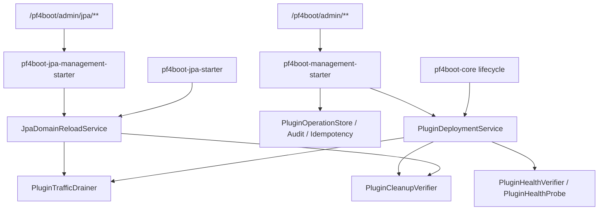
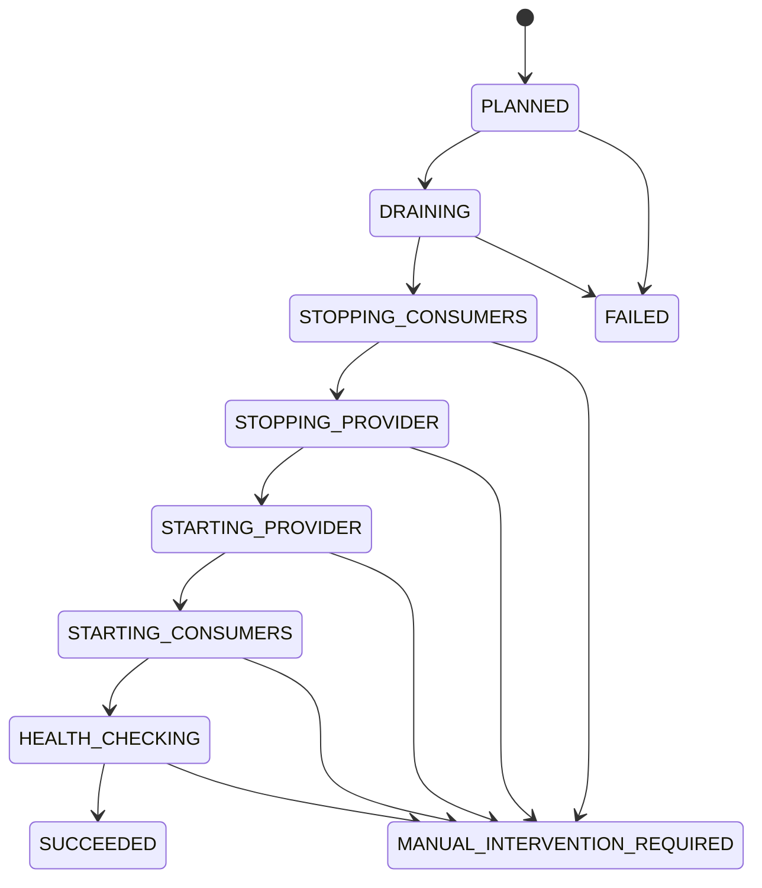

# Next-Version Production Implementation Design

## Background

[next-version-production-goals.md](next-version-production-goals.md) narrows the next version to five goals: JPA runtime refresh, hot replacement deployment transactions, management API governance, resource leak diagnostics, and testing/acceptance. The current codebase is not starting from zero: `pf4boot-api` already contains deployment, management, and diagnostic models; `pf4boot-core` already has `DefaultPluginDeploymentService`; `pf4boot-management-starter` already has HTTP management, authentication, idempotency, audit, and deployment record stores; `pf4boot-jpa*` already has reload models, plan and execute services, a JPA management starter, and runtime smoke.

This design converges the existing capabilities into the next-version implementation plan, clarifying which interfaces should be frozen, which gaps remain, and which tests are release gates.

## Goals

1. Provide a phased design that another model can implement directly.
2. Use existing types and package names as the baseline.
3. Define shared foundations across the five goals: management requests, idempotency, deployment records, drain, cleanup, health checks, and acceptance reports.
4. Preserve Java 8 compatibility, module boundaries, and current plugin lifecycle semantics.
5. Keep open questions small and non-blocking.

## Non-Goals

- No management console UI.
- No multi-node deployment consistency.
- No cross-datasource strong transactions.
- No JPA reload endpoints in the base management starter.
- No broad package or class renaming just for design uniformity.

## Current Anchors

| Area | Current Code Anchor | Design Decision |
| --- | --- | --- |
| Deployment transaction | `net.xdob.pf4boot.deployment.*`, `DefaultPluginDeploymentService` | Keep current models; add rollback/query SPI and persistence recovery boundaries |
| Management API | `PluginManagementController`, `PluginManagementOperation`, `PluginOperationStore` | Freeze `/pf4boot/admin/**`; add contract tests and JPA reload permissions |
| JPA reload | `net.xdob.pf4boot.jpa.reload.*`, `DefaultJpaDomainReloadService` | Keep restart-style provider refresh; harden provider replacement and record persistence |
| Resource diagnostics | `PluginCleanupVerifier`, `PluginHealthVerifier`, `PluginLifecycleDiagnostic` | Standardize cleanup summaries and attach them to deployment and JPA reload records |
| Testing | Existing JUnit4 tests and sample smoke | Make test commands and machine-readable smoke outputs release gates |

## Core Constraints

- `pf4boot-core` must not depend on `pf4boot-jpa*`.
- `pf4boot-management-starter` must not depend on `pf4boot-jpa*`.
- `pf4boot-jpa-management-starter` may depend on `pf4boot-management-starter` and `pf4boot-jpa`.
- New public API types go to `pf4boot-api`; JPA-specific API types go to `pf4boot-jpa`.
- If a new interface method affects existing implementations, use a Java 8 default method first.
- Management responses expose only stable error codes and safe summaries, never full exceptions, tokens, or sensitive absolute paths.

## Overall Architecture



## G1 JPA Runtime Refresh Design

### Module Boundaries

| Module | Responsibility |
| --- | --- |
| `pf4boot-jpa` | Reload models, states, failure codes, request, plan, record, service interfaces |
| `pf4boot-jpa-starter` | Binding registry, plan service, execute service, drain coordinator, record repository |
| `pf4boot-jpa-domain-starter` | Provider export and cleanup verification, descriptor readiness verification |
| `pf4boot-jpa-management-starter` | JPA reload HTTP management entrypoints and read-only actuator summary |
| `pf4boot-core` | Lifecycle, deployment service, drain/cleanup/health SPI only; no JPA types |

### Interface Freeze

Keep the current interfaces:

```java
public interface JpaDomainReloadPlanService {
  JpaDomainReloadPlan plan(JpaDomainReloadRequest request);
}

public interface JpaDomainReloadService {
  JpaDomainReloadPlan plan(JpaDomainReloadRequest request);
  JpaDomainReloadRecord reload(JpaDomainReloadRequest request);
  JpaDomainReloadRecord getRecord(String reloadId);
  JpaDomainReloadRecord getCurrent(String domainId);
}
```

`JpaDomainReloadRequest` must stably support:

| Field | Rule |
| --- | --- |
| `domainId` | Reject when path and body disagree |
| `mode` | Execute must resolve to `STOP_CONSUMERS_AND_REBUILD` |
| `idempotencyKey` | Required for execute; management header wins |
| `providerReplacementPath` | Optional; delegates provider replacement to `PluginDeploymentService` |
| `reason` | Safely truncated, max 512 chars |
| `drainTimeoutMillis` | Values <= 0 use configured default |

### State Machine



### Execution Flow

1. Management entrypoint creates `PluginManagementRequest` and performs authn, authz, rate limiting, and idempotency reservation.
2. `JpaDomainReloadService.reload()` regenerates the plan instead of reusing a stale plan.
3. If the plan has blockers, write a `FAILED` record and do not stop/start anything.
4. Acquire the domain reload lock; different domains remain serialized by default.
5. Call `JpaDomainReloadDrainCoordinator` and reuse all `PluginTrafficDrainer` beans.
6. Without `providerReplacementPath`, stop consumers, stop/start provider, then start consumers.
7. With `providerReplacementPath`, stop consumers first, then delegate provider replacement to `PluginDeploymentService.replace(providerId, stagedPath)`.
8. Verify provider descriptor readiness, consumer state, and optional health checks.
9. Write the record and return a safe management summary.

### Gaps And Implementation Items

| ID | Gap | Design Action |
| --- | --- | --- |
| JPA-1 | JPA reload permissions are not in `PluginManagementOperation` | Add `JPA_RELOAD_PLAN`, `JPA_RELOAD_EXECUTE`, `JPA_RELOAD_QUERY` |
| JPA-2 | Provider replacement and deployment records need stable linking | `JpaProviderReplacementSummary` stores deploymentId, state, errorCode, and package summary |
| JPA-3 | Record persistence strategy needs freezing | Default memory store; optional file store; keep `JpaDomainReloadRecordRepository` |
| JPA-4 | Actuator summary must avoid leakage | Output only domain, state, failureCode, drain summary, and update time |

## G2 Hot Replacement Deployment Transaction Design

### Interface Extension

`PluginDeploymentService` already has `planReplacement` and `replace`. Add rollback and query through default methods to preserve compatibility:

```java
public interface PluginDeploymentService {
  DeploymentRecord planReplacement(String targetPluginId, Path stagedPluginPath);
  DeploymentRecord replace(String targetPluginId, Path stagedPluginPath);

  default DeploymentRecord rollback(String deploymentId) {
    throw new UnsupportedOperationException("Deployment rollback is not supported");
  }

  default DeploymentRecord getRecord(String deploymentId) {
    throw new UnsupportedOperationException("Deployment record query is not supported");
  }
}
```

### Data Structure Hardening

Keep existing `DeploymentRecord` fields and add, or attach through compatible constructors:

| Field | Purpose |
| --- | --- |
| `rollbackSnapshot` | Old package, old version, and previous start state |
| `phaseResults` | Per-phase start, end, duration, and error code |
| `cleanupResults` | Resource cleanup summary after stop |
| `healthResults` | Health-check summary after start |
| `packageSummary` | Staged/active/backup path summary and checksum |

If constructors would become too large, attach new fields through `DeploymentPlan` or a new `DeploymentRecordDetails` while keeping the management JSON backward-compatible.

### State Machine

Use the current `DeploymentState`:

```text
PLANNED -> PRECHECKED -> DRAINING -> STOPPING -> CLEANUP_VERIFYING
  -> ACTIVATING -> STARTING -> VERIFYING -> SUCCEEDED
any executing state -> ROLLING_BACK -> SUCCEEDED / MANUAL_INTERVENTION
precheck failure -> FAILED
```

Notes:

- Keep `APPLYING` as a compatibility summary state for old records; new code should write finer-grained states.
- The current enum has no `ROLLED_BACK`. For now, represent successful rollback with `FAILED` plus message/errorCode evidence. Adding a new enum later requires management contract updates.

### Precheck

`planReplacement` must not mutate runtime state and must check at least:

- staged path is under an allowed directory.
- staged descriptor is readable.
- staged plugin ID equals target plugin ID.
- version and dependency ranges are acceptable.
- impact scope is computable.
- target plugin and dependents are in replaceable states.
- dry-run and real replace reuse the same precheck logic.

### Rollback

| Failure Phase | Recovery Action |
| --- | --- |
| precheck | No runtime mutation |
| drain | End drain and stop no plugin |
| dependent stop failure | Restart already stopped plugins in reverse order |
| after target stop | Restart old target and dependents |
| activation failure | Restore old package and start old version |
| new start/health failure | Stop new version, restore old package, start old version |
| rollback failure | `MANUAL_INTERVENTION`, keeping backup/staged/failed summaries |

## G3 Management API Contract And Governance Design

### API Boundary

Base management starter owns:

- `/plugins/**`
- `/deployments/**`
- operation query, audit, idempotency, rate limiting, and safe error responses

JPA management starter owns:

- `/jpa/domains/{domainId}/reload/plan`
- `/jpa/domains/{domainId}/reload`
- `/jpa/reloads/{reloadId}`
- `/jpa/domains/{domainId}/reload/current`

### Permission Model

Extend `PluginManagementOperation`:

| Operation | Permission |
| --- | --- |
| `JPA_RELOAD_PLAN` | `pf4boot:jpa-reload:plan` |
| `JPA_RELOAD_EXECUTE` | `pf4boot:jpa-reload:execute` |
| `JPA_RELOAD_QUERY` | `pf4boot:jpa-reload:query` |

Local token grants these by default. Remote authorizers may deny them.

### Idempotency

- Lifecycle write operations can keep the current policy.
- `DEPLOYMENT_REPLACE`, `DEPLOYMENT_ROLLBACK`, `DEPLOYMENT_CONFIRM`, and `JPA_RELOAD_EXECUTE` must require idempotency keys.
- Idempotency key scope is `principal + operation + target + key`.
- Existing successful or running records are returned instead of executing again.

### Error Response

Unified response shape:

```json
{
  "success": false,
  "errorCode": "FORBIDDEN",
  "message": "Operation is not allowed",
  "operationId": "op-..."
}
```

`message` is safe text. Detailed exceptions go only to logs or audit after redaction.

## G4 Resource Leak Diagnostic Design

### Diagnostic Interfaces

Keep current interfaces:

- `PluginCleanupVerifier`
- `PluginHealthVerifier`
- `PluginLifecycleDiagnostic`
- `PluginCleanupReport`

Standardize cleanup output:

| Source | Output |
| --- | --- |
| core/share bean | shared beans, scheduled tasks, application context provider, classloader |
| web starter | mapping count, interceptor count, drain inflight count |
| JPA domain starter | DataSource, EMF, TM, descriptor export residue |
| deployment service | `DeploymentRecord.cleanupResults` |
| JPA reload service | `JpaDomainReloadRecord.cleanupResults` or provider replacement summary |

### Blocking Rules

- `DeploymentCheckSeverity.ERROR` blocks hot replacement success and triggers rollback.
- If old JPA exported beans remain after provider stop, reload enters `MANUAL_INTERVENTION_REQUIRED`.
- Diagnostic objects expose plugin ID, resource type, counts, summary, and error code, not internal collections.

## G5 Testing And Acceptance Design

### Test Layers

| Layer | Scope | Command |
| --- | --- | --- |
| API compile | public SPI compatibility | `.\gradlew.bat :pf4boot-api:compileJava` |
| Core unit tests | lifecycle, deployment, cleanup | `.\gradlew.bat :pf4boot-core:test` |
| Web unit tests | mapping, interceptor, drain, cleanup | `.\gradlew.bat :pf4boot-web-starter:test` |
| JPA unit tests | binding, plan, execute, record | `.\gradlew.bat :pf4boot-jpa-starter:test` |
| Management unit tests | auth, idempotency, audit, contract | `.\gradlew.bat :pf4boot-management-starter:test` |
| JPA management unit tests | optional registration, JPA reload endpoints | `.\gradlew.bat :pf4boot-jpa-management-starter:test` |
| Runtime smoke | sample packaging and runtime | `.\gradlew.bat :samples:cross-plugin-jpa:app-run:runtimeSmoke` or equivalent |

### Acceptance Reports

Every smoke must emit:

- `result.json` for machines.
- JUnit XML for CI.
- Key API response summaries without tokens, absolute paths, or full stacks.

### Failure Injection

Must cover:

- drain timeout.
- provider start failure.
- consumer start failure.
- deployment activation failure.
- deployment health check failure.
- cleanup verifier failure.
- duplicate idempotency request.

## Phased Implementation Plan

| Phase | Design Output | Code Output | Acceptance |
| --- | --- | --- | --- |
| P1 | Management contract and permission freeze | JPA reload operations, contract tests, error response completion | management and jpa-management tests |
| P2 | Unified cleanup result | cleanup summary attached to deployment/JPA records | core, web, jpa-domain tests |
| P3 | Deployment SPI hardening | rollback/getRecord default methods, record details, store query | deployment service tests |
| P4 | JPA reload provider replacement convergence | replacement summary, record persistence, permission integration | jpa-starter and jpa-management tests |
| P5 | Runtime smoke expansion | cross-plugin-jpa smoke for reload/deploy/failure | result.json and JUnit XML |
| P6 | Documentation and acceptance freeze | contract, developer guide, English translation | all goal acceptance commands pass |

## Implementation Status

| Item | Status | Evidence |
| --- | --- | --- |
| P1 independent JPA reload permissions | Done | `PluginManagementOperation` adds `JPA_RELOAD_PLAN`, `JPA_RELOAD_EXECUTE`, `JPA_RELOAD_QUERY` |
| P1 local token default grants | Done | `LocalTokenPluginManagementAuthorizer` grants `pf4boot:jpa-reload:*` permissions by default |
| P1 JPA reload write security and idempotency | Done | `JpaDomainReloadManagementController.reload` uses write security, idempotency, and operation records |
| P1 narrow verification | Passed | `.\gradlew.bat :pf4boot-jpa-management-starter:test`, `.\gradlew.bat :pf4boot-management-starter:test` |
| P2 cleanup summary model | Done | `PluginCleanupSummary` aggregates cleanup verifier results |
| P2 deployment record cleanup summary | Done | `DeploymentRecord.getCleanupSummary()` exposes hot replacement cleanup summaries after stop |
| P2 JPA reload cleanup summary | Done | `JpaDomainReloadRecord.getCleanupSummary()` exposes provider JPA export cleanup or provider replacement cleanup summaries |
| P2 narrow verification | Passed | `.\gradlew.bat :pf4boot-core:test :pf4boot-jpa-starter:test` |
| P3 deployment SPI query and rollback | Done | `PluginDeploymentService` adds compatible default `getRecord`, `rollback(String)`, and `rollback(DeploymentRecord)` |
| P3 default deployment service rollback | Done | `DefaultPluginDeploymentService` supports record query and explicit rollback |
| P3 management rollback delegation | Done | `PluginManagementController.rollback` delegates to `PluginDeploymentService.rollback(source)` |
| P3 narrow verification | Passed | `.\gradlew.bat :pf4boot-core:test :pf4boot-management-starter:test`, `.\gradlew.bat :pf4boot-jpa-starter:test :pf4boot-jpa-management-starter:test` |
| P4 provider replacement summary | Done | `JpaProviderReplacementSummary` exposes deploymentId, state, errorCode, rollbackStatus, versions, and staged package path |
| P4 JPA reload record persistence coverage | Done | `FileJpaDomainReloadRecordRepositoryTest` covers provider replacement summary, cleanup summary, latest, and idempotency recovery after reload |
| P4 provider replacement failure-code mapping | Done | `DefaultJpaDomainReloadService` writes `DeploymentRecord.errorCode` into the summary while preserving reload failure-code mapping |
| P4 narrow verification | Passed | `.\gradlew.bat :pf4boot-jpa-starter:test` |
| P5 runtime assembly cleanliness | Done | `assembleSampleRuntime` deletes the full runtime output directory before copying files, avoiding old-version jars on the `lib/*` classpath |
| P5 smoke failure injection coverage | Done | Gradle `runtimeSmoke` covers failed deployment precheck as `SMOKE_FAILURE_CASE` and writes a `failureCase` report item |
| P5 provider replacement smoke coverage | Done | `runtimeSmoke` verifies that JPA provider replacement summary and cleanup summary are observable from the management response |
| P5 runtime smoke report | Passed | `.\gradlew.bat :samples:cross-plugin-jpa:app-run:runtimeSmoke` emits `result.json` and JUnit XML with 24 checks and 0 failures |
| P6 documentation sync | Done | Chinese design, English design, and acceptance status have been synchronized |
| P6 final verification | Passed | `.\gradlew.bat :pf4boot-core:test :pf4boot-management-starter:test :pf4boot-jpa-starter:test :pf4boot-jpa-management-starter:test` |

## Compatibility

- New `PluginManagementOperation` enum values affect custom authorizers. Local token allows them by default; remote authorizers must map them.
- `PluginDeploymentService` adds `getRecord`, `rollback(String)`, and `rollback(DeploymentRecord)` default methods, preserving binary compatibility.
- `DeploymentRecord` new fields must keep existing constructors.
- `PluginCleanupSummary` is a new read-only model; `DeploymentRecord` and `JpaDomainReloadRecord` expose it as an optional field while keeping old constructors.
- `JpaProviderReplacementSummary.errorCode` is an optional new field; old constructors and old JSON records remain readable and return `null` when missing.
- Management JSON additions remain backward-compatible; old clients may ignore them.
- JPA reload remains `DISABLED` by default, and no management endpoints are registered without the JPA management starter.
- Sample runtime assembly deletes `build/runtime` before recopying dependencies; treat that directory as generated output and do not store manual files there.

## Open Questions

| Question | Recommendation |
| --- | --- |
| Add `DeploymentState.ROLLED_BACK`? | Not now; use existing state plus errorCode/message to avoid widening compatibility impact |
| Should JPA reload records be file-persistent by default? | Keep memory by default; enable file store for samples and production |
| Should runtime smoke task names be unified? | Use `runtimeSmoke`; if current samples differ, add alias tasks |
| Put cleanupResults in `DeploymentRecord` or a details object? | Add a details object to avoid constructor bloat |
