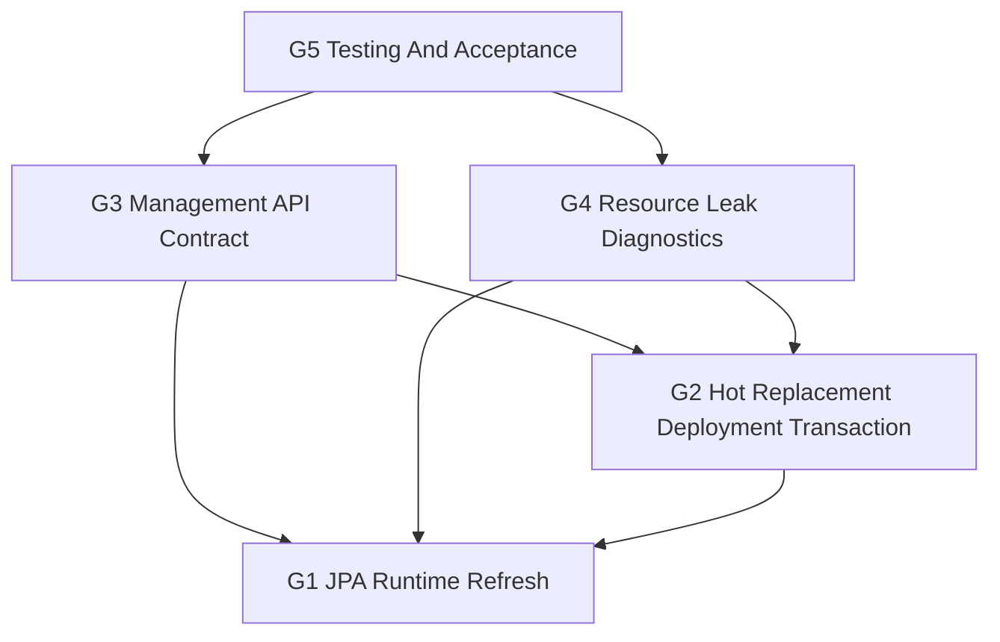

# Next-Version Production Goals

## Background

The framework already has plugin loading, lifecycle management, Web/JPA integration, HTTP management APIs, complex JPA samples, and several production-readiness designs. The next version should avoid opening more large capability areas and instead converge the most important production gaps into one traceable goal set.

This plan builds on these current designs:

- [jpa-runtime-refresh.md](jpa-runtime-refresh.md)
- [jpa-runtime-refresh-drain-spi.md](jpa-runtime-refresh-drain-spi.md)
- [plugin-hot-replacement-deployment-improvement.md](plugin-hot-replacement-deployment-improvement.md)
- [plugin-http-management-api.md](plugin-http-management-api.md)
- [plugin-http-management-api-hardening.md](plugin-http-management-api-hardening.md)
- [runtime-safety-phase3.md](runtime-safety-phase3.md)
- [verification-foundation.md](verification-foundation.md)

## Version Goals

The next version has only these five primary goals:

| ID | Goal | Deliverable |
| --- | --- | --- |
| G1 | Close the JPA runtime refresh loop | Disabled, plan-only, execute, drain, records, management entrypoints, and runtime smoke |
| G2 | Make hot replacement a deployment transaction | Deployment plan, replace, health check, rollback, persistent records, and failure recovery |
| G3 | Close the management API contract and governance loop | Stable HTTP contract, error codes, authn/authz, idempotency, audit, rate limiting, and deployment/JPA query semantics |
| G4 | Add resource leak diagnostics | Verifiable cleanup after plugin stop, reload, hot replacement, and JPA refresh |
| G5 | Establish testing and acceptance | Module tests, runtime smoke, failure injection, and acceptance reports as release gates |

## Non-Goals

- No cross-datasource strong transactions or XA.
- No online Hibernate metamodel mutation.
- No management console UI inside core, starter, or management starter modules.
- No cluster-level hot replacement consistency, distributed locks, or multi-node rolling deployment.
- No new major framework dependency unless a topic design explicitly justifies it.
- No change to existing default plugin start, stop, packaging, or dependency-scope semantics.

## Overall Constraints

- Keep all production code Java 8 compatible.
- `pf4boot-core` must not depend on JPA modules.
- Management write APIs are exposed only under `/pf4boot/admin/**`.
- JPA reload management entrypoints are provided only by the optional JPA management starter.
- Hot replacement and JPA reload must both plan before execute.
- Mutating operations must support idempotency keys, audit records, and safe error responses.
- Chinese design updates must be synchronized to English documents.
- Do not add large unrelated capability areas before these five goals are complete.

## G1 JPA Runtime Refresh Loop

### Scope

JPA refresh operates on a single `domainId` and uses a restart-style flow: stop consumers, rebuild the provider JPA environment, and start consumers. The first version must keep `DISABLED` as the default and deliver `PLAN_ONLY` first.

### Required Capabilities

- `JpaPluginBindingRegistry` records shared consumer to domain bindings accurately.
- `JpaDomainReloadPlanService` returns provider, consumers, unrelated plugins, stopOrder, startOrder, warnings, and blockers.
- `JpaDomainReloadService` executes `STOP_CONSUMERS_AND_REBUILD`.
- Reuse `PluginTrafficDrainer` for drain.
- In-memory reload records support state transitions, failure codes, drain reports, and idempotency-key mapping.
- Optional JPA management starter exposes plan, execute, record, and current-query endpoints.
- Actuator exposes a read-only JPA reload summary.

### Acceptance Gates

- Default `DISABLED` mode changes no runtime behavior.
- `PLAN_ONLY` triggers no stop/start operations.
- Only `EXACT_BINDING` consumers may enter execute.
- Old DataSource, EMF, TM, and descriptor exports are gone after provider stop.
- The new descriptor is ready after provider start.
- Drain timeout stops no plugin.
- Unrelated plugins remain available when provider refresh fails.
- Runtime smoke emits `result.json` and JUnit XML.

## G2 Hot Replacement Deployment Transaction

### Scope

Hot replacement is a governance transaction above lifecycle operations. It does not change low-level `start/stop/reload` semantics. The replacement unit remains a plugin package.

### Required Capabilities

- `PluginDeploymentService` provides plan, replace, rollback, and record query operations.
- `DeploymentPlan` includes target package, target plugin, versions, impact scope, stop/start order, precheck result, and rollback basis.
- `DeploymentRecord` persists state, phase duration, error code, affected plugins, and package summaries.
- Staged package validation covers plugin ID, version, dependencies, checksum, and path safety.
- Replace flow includes precheck, drain, stop dependents, stop target, activate package, load/start, and health check.
- Replace failure automatically rolls back the old package and previous start state.
- Health checks support basic state checks and optional plugin extension points.

### Acceptance Gates

- `dryRun=true` only creates a plan and mutates no runtime state.
- Concurrent replace requests with the same idempotency key have only one real executor.
- Plugin ID mismatch in the target package is rejected.
- Old version is restored when the new version fails to start.
- Health check failure enters rollback or manual intervention.
- Deployment records expose full phases and safe error codes.
- Unrelated plugins are unaffected on failure.

## G3 Management API Contract And Governance Loop

### Scope

Management APIs must move from merely callable endpoints to a stable contract that tools, UIs, scripts, and smaller models can implement reliably. This covers plugin lifecycle, deployment, JPA reload, audit, security rejection, idempotency, and query semantics.

### Required Capabilities

- Document the `/pf4boot/admin/**` API contract with paths, methods, headers, requests, responses, and error codes.
- All write operations use unified authentication, authorization, idempotency, rate limiting, CSRF/local-call policy, and audit.
- Precondition rejections must also write audit records.
- Error responses must not expose absolute paths, tokens, full stacks, or raw low-level exception messages.
- Confirm, replace, rollback, and JPA reload use separate permissions.
- Management API contract tests cover success, rejection, idempotency conflict, dry-run, and error redaction.

### Acceptance Gates

- The contract document is sufficient for client implementation.
- Missing token or insufficient permission returns stable safe errors.
- Validation failures, rate limiting, and idempotency conflicts are audited.
- Every write API has an idempotency strategy or an explicit reason why it does not need one.
- JPA management APIs are not registered unless the JPA management starter is present.

## G4 Resource Leak Diagnostics

### Scope

Resource leak diagnostics cover observable assertions after plugin stop, restart, reload, hot replacement, and JPA reload. The goal is to expose stable counts, existence checks, and diagnostic results, not internal mutable collections.

### Required Capabilities

- Classloader close state is observable.
- Scheduled task registration and cleanup counts are observable.
- Web mapping and interceptor cleanup is observable.
- Shared beans, extension beans, and platform/application/root exported bean cleanup is observable.
- `ApplicationContextProvider` no longer holds stopped plugin contexts.
- JPA provider stop exposes DataSource, EMF, TM, and descriptor cleanup results.
- Hot replacement and JPA reload records include cleanup-check summaries.

### Acceptance Gates

- Core resource counts drop to zero after plugin stop, or the remaining items are reported clearly.
- Resource counts do not grow after repeated plugin reloads.
- Web endpoints are unavailable after stop and restored after start.
- Scheduled tasks no longer fire after stop.
- Cleanup failure blocks hot replacement completion or marks manual intervention.

## G5 Testing And Acceptance

### Scope

The next version must make testing a release gate, not an optional add-on. The goal is not one-time full coverage, but coverage of the highest-risk production breakpoints.

### Required Capabilities

- Remove or adjust the root build strategy that disables tasks by test-like names, so explicit test tasks can run.
- Add module-level tests for `pf4boot-core`, `pf4boot-web-starter`, `pf4boot-jpa-starter`, `pf4boot-management-starter`, and `pf4boot-jpa-management-starter`.
- `samples/cross-plugin-jpa` covers JPA reload runtime smoke.
- Hot replacement smoke covers success, start-failure rollback, health-check failure, drain timeout, and unrelated isolation.
- Management API tests cover authentication, authorization, idempotency, rate limiting, audit, and error redaction.
- Smoke outputs machine-readable results, at least `result.json` and JUnit XML.

### Acceptance Gates

- Every goal has corresponding module tests or runtime smoke.
- Failure injection covers drain timeout, provider start failure, consumer start failure, and deployment rollback failure.
- CI or local acceptance commands are stable and do not depend on manually reading logs.
- Documented acceptance commands can run without release credentials.

## Phased Plan

| Phase | Goal | Output | Completion Condition |
| --- | --- | --- | --- |
| P1 | Test foundation and management contract freeze | Executable test strategy, API contract, error codes, audit/idempotency tests | G3/G5 foundation tests pass |
| P2 | Resource diagnostic observation points | Core/web/JPA cleanup observations and assertions | Stop/reload cleanup tests pass |
| P3 | Hot replacement deployment transaction | Deployment plan/replace/rollback/record | Success and failure-rollback smoke pass |
| P4 | JPA reload PLAN_ONLY | Binding registry, plan service, JPA management plan API | Plan output is stable and has no mutation |
| P5 | JPA reload execute loop | Drain, execute, record, Actuator, runtime smoke | JPA reload success, failure isolation, and idempotency pass |
| P6 | Full acceptance convergence | Docs, English translation, acceptance report, regression commands | All five goals satisfy their gates |

## Dependencies

## Risks

| Risk | Impact | Mitigation |
| --- | --- | --- |
| Weak test foundation makes later changes unverifiable | High | Complete explicit tests and key module tests in P1 |
| Hot replacement and JPA reload both modify lifecycle paths and cause regressions | High | Stabilize deployment service and cleanup diagnostics before JPA reload |
| In-memory records lose audit after failure | Medium | Persist hot replacement records first; JPA reload may start in-memory but keeps an extension interface |
| Permission granularity is too coarse | Medium | Use separate permissions for replace, rollback, confirm, and JPA reload |
| Diagnostics leak internals | Medium | Expose only counts, summaries, and stable diagnostic objects, not mutable collections |

## Definition Of Done

The next version is complete only when all of these are true:

1. G1 through G5 acceptance gates pass.
2. All new management write operations have authentication, idempotency, audit, and safe error responses.
3. Hot replacement and JPA reload failure paths have runtime smoke or failure-injection tests.
4. Cleanup diagnostics can identify the remaining resource type and plugin ID.
5. Chinese design and English translation are synchronized.
6. Acceptance commands and results are repeatable by later developers.

