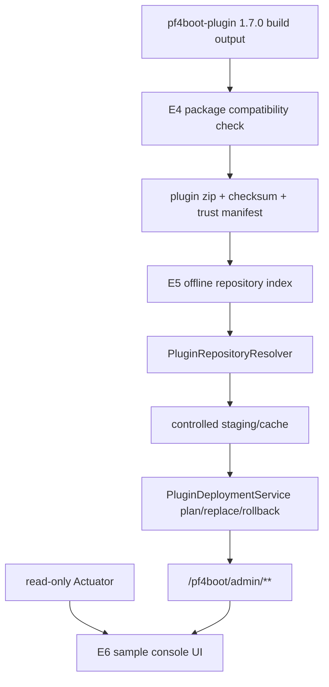

# Plugin Ecosystem 3.3 Late-Stage Design

## Background

The first three 3.3 goals have completed the official developer guide, the `pf4boot-plugin 1.7.0` baseline, and sample/template organization. The last three goals move from "plugins can be written" to "plugins can be delivered safely": compatibility matrix and package verification, plugin repository/distribution, and management console sample UI.

This design builds on:

- [plugin-ecosystem-3.3-roadmap.md](plugin-ecosystem-3.3-roadmap.md)
- [plugin-developer-experience-3.3-design.md](plugin-developer-experience-3.3-design.md)
- [plugin-loading-and-packaging.md](plugin-loading-and-packaging.md)
- [plugin-management-http-api-contract.md](plugin-management-http-api-contract.md)
- [decisions/plugin-repository-governance-decision.md](decisions/plugin-repository-governance-decision.md)
- [decisions/plugin-management-console-boundary.md](decisions/plugin-management-console-boundary.md)

## Goals

1. E4: define compatibility matrix and package verification to prevent packages that build but fail subtly at runtime.
2. E5: define offline-index repository and release distribution so plugin packages become governed artifacts.
3. E6: define sample console UI boundaries, screens, and API mappings to validate management APIs.

## Non-Goals

- Do not modify the external `pf4boot-plugin` repository.
- Do not implement a remote plugin marketplace, accounts, review flow, or central service.
- Do not put UI into `pf4boot-core`, starters, or management starter.
- Do not change 3.2 plugin loading, JPA reload, deployment transaction, or management API semantics.
- Do not support cross-datasource atomic transactions or cluster-wide deployment consistency.

## Current State

| Area | Existing Capability | Gap |
| --- | --- | --- |
| Packaging | `pf4boot-plugin 1.7.0` builds plugin packages and prints effective plugin properties and packaged libs | No unified compatibility matrix, host API bundling check, or machine-readable report |
| Loading | link, zip, development, and jar repositories | No release-metadata based distribution governance |
| Package governance | checksum/trust manifest WARN/ENFORCE design exists | No full path from sample/repository index to deployment precheck |
| Deployment | management API supports plan, replace, confirm, rollback, records | repository release requests and UI integration need closure |
| UI | `samples/plugin-management-console` is a static management client sample | replace, rollback, JPA reload, audit, and error display are incomplete |

## Constraints

- `pf4boot-core` does not depend on UI, remote repository SDKs, or frontend assets.
- Repository releases must eventually reuse `PluginDeploymentService` plan/replace/rollback.
- All write operations continue through `/pf4boot/admin/**` with authentication and idempotency.
- Actuator remains read-only.
- Compatibility matrix and package checks start in WARN mode and do not break historical plugins.
- Sample modules are still not published to Maven.

## Overall Architecture



## E4 Compatibility Matrix And Package Verification

### Compatibility Matrix Fields

| Field | Meaning | Example |
| --- | --- | --- |
| `pf4bootVersionRange` | framework version range | `[3.3.0,3.4.0)` |
| `pf4bootPluginVersionRange` | helper Gradle plugin version range | `[1.7.0,1.8.0)` |
| `springBootVersionRange` | Spring Boot range | `[2.7.0,2.8.0)` |
| `pf4jVersionRange` | PF4J range | `[3.15.0,3.16.0)` |
| `jdkRange` | JDK range | `[1.8,1.9)` |
| `packageFormatVersion` | plugin package format | `1` |
| `descriptorModes` | supported descriptor sources | `plugin.properties`, `manifest` |
| `requiredPackageRules` | required checks | `NO_HOST_API_BUNDLED` |

### Package Check Rules

| Rule | Level | Description |
| --- | --- | --- |
| `DESCRIPTOR_REQUIRED` | ERROR | package must expose plugin id, version, and plugin class |
| `PLUGIN_ID_MATCH` | ERROR | staged package id must match target id during replacement |
| `NO_HOST_API_BUNDLED` | ERROR/WARN | host APIs such as `pf4boot-api`, `pf4boot-jpa`, `pf4boot-web-support` must not be bundled |
| `DEPENDENCY_DECLARED` | WARN | runtime plugin dependencies must appear in descriptor dependencies |
| `BUNDLE_SCOPE_VALID` | WARN | `bundle` dependencies should not include host-provided APIs |
| `CHECKSUM_PRESENT` | WARN/ERROR | release package should have `.sha256` |
| `TRUST_MANIFEST_PRESENT` | WARN/ERROR | release package should have `.pf4boot-trust.json` |
| `VERSION_RANGE_COMPATIBLE` | WARN/ERROR | trust manifest version ranges must match the current host |

### Report

First-stage sample/build reports should use machine-readable JSON:

```json
{
  "schemaVersion": 1,
  "pluginId": "sample-workflow",
  "pluginVersion": "3.3.0-SNAPSHOT",
  "packagePath": "build/libs/plugin-workflow-3.3.0-SNAPSHOT.zip",
  "state": "PASSED",
  "rules": [
    {
      "rule": "NO_HOST_API_BUNDLED",
      "severity": "ERROR",
      "state": "PASSED",
      "message": "host APIs are not bundled"
    }
  ]
}
```

## E5 Plugin Repository And Distribution

E5 follows the existing decision: the first stage is an offline-index repository, not a remote marketplace. Repository release must resolve into a controlled staged package and then reuse deployment service.

### Module Boundary

| Module | Responsibility |
| --- | --- |
| `pf4boot-api` | optional public read-only repository/release summary models |
| `pf4boot-core` | resolver, path safety, checksum/trust verification, staging/cache |
| `pf4boot-management-starter` | repository release plan/replace request entry through deployment APIs |
| `samples/cross-plugin-jpa` | `repository-index.example.json` and smoke entry |
| `samples/plugin-management-console` | release selection and plan result display |

### Repository Index

```json
{
  "schemaVersion": 1,
  "repositoryId": "local-prod",
  "generatedAt": 1781280000000,
  "releases": [
    {
      "pluginId": "sample-workflow",
      "version": "3.3.0",
      "packagePath": "plugins/plugin-workflow-3.3.0.zip",
      "packageSha256": "lowercase-sha256",
      "trustManifestPath": "plugins/plugin-workflow-3.3.0.zip.pf4boot-trust.json",
      "compatibilityMatrixId": "pf4boot-3.3",
      "rolloutPolicy": "manual",
      "rollbackCandidate": true
    }
  ],
  "signature": "base64-signature"
}
```

### Management Request

```json
{
  "pluginId": "sample-workflow",
  "repositoryVersion": "3.3.0",
  "repositoryVersionRange": null,
  "repositoryRollback": false,
  "dryRun": true
}
```

Rules:

- `repositoryVersion` exact match has priority.
- `repositoryVersionRange` selects the highest compatible version and records why it was selected.
- `repositoryRollback=true` selects the latest available rollback candidate.
- Resolved package paths must remain under the repository root.
- HTTP responses expose summaries, not sensitive cache/staging absolute paths.

### State Machine

```text
INDEX_LOADING
  -> INDEX_VERIFIED
  -> RELEASE_RESOLVED
  -> PACKAGE_VERIFIED
  -> STAGED
  -> DEPLOYMENT_PLANNED
  -> DEPLOYMENT_EXECUTED

Any stage -> REJECTED
Execution failure -> reuse DeploymentState rollback/manual intervention
```

## E6 Management Console Sample UI

E6 remains a sample UI or independent sample project. It validates management APIs and Actuator summaries.

### Screens

| Screen/Area | Source | Operation |
| --- | --- | --- |
| Plugin list | `GET /pf4boot/admin/plugins`, `/actuator/pf4bootplugins` | start/stop/restart/reload/enable/disable |
| Governance summary | `/actuator/pf4bootgovernance` | read-only |
| Deployment plan | `POST /pf4boot/admin/deployments/plan` | staged path or repository release dry-run |
| Deployment execution | replace, confirm, rollback | must show idempotency key and risk |
| Deployment records | `GET /deployments`, `GET /deployments/{id}` | read-only |
| JPA reload | JPA management endpoints | plan, execute, record/current |
| Audit/operation summary | operation/deployment records or governance summary | read-only |
| Error display | response `code/message/warnings` | hide token, absolute paths, stack traces |

### UI State

```text
IDLE -> LOADING -> READY
READY -> PLANNING -> PLAN_READY / ERROR
PLAN_READY -> EXECUTING -> SUCCEEDED / FAILED / MANUAL_INTERVENTION
Any state -> AUTH_FAILED
```

### Security

- Token stays in memory/user input only; no localStorage, URL, or logs.
- Write operations generate or request `X-Idempotency-Key`.
- UI clearly distinguishes `dryRun=true` from real execution.
- Sample defaults are local-demo only; production uses enterprise auth or reverse proxy.

## Compatibility

- E4 defaults to WARN and does not change historical plugin loading.
- E5 repository is disabled by default; direct staged path remains available.
- E6 UI is not published and does not affect existing applications.
- New management response fields remain JSON backward compatible.

## Testing

| Goal | Tests |
| --- | --- |
| E4 | package unzip checks, host API bundling detection, missing descriptor, incompatible ranges |
| E5 | index parsing, path escape, checksum mismatch, release not found, repository dry-run |
| E6 | UI API mocks, management contract tests, runtime smoke, error sanitization |

## Risks

| Risk | Impact | Mitigation |
| --- | --- | --- |
| Checks are too strict for old plugins | Upgrade friction | Default WARN; ENFORCE only for new plugins/samples |
| Repository index leaks internal paths | Security issue | Relative paths only; HTTP summaries only |
| UI is mistaken for built-in framework capability | Boundary drift | Docs and sample README say it is not in starter |
| Remote marketplace scope grows | Scope creep | 3.3 only does offline index and local/intranet distribution |

## Open Questions

| Question | Recommendation |
| --- | --- |
| Should package checks move into `pf4boot-plugin` | Validate in this repo first; then send requirements to external helper plugin |
| Matrix as docs or JSON first | Start with docs; add JSON schema during E4 implementation |
| Pure static UI or frontend framework | Keep static sample unless interaction complexity proves a framework is needed |
| Should repository index signature be mandatory | Keep the field; WARN may be optional, ENFORCE must implement it |

