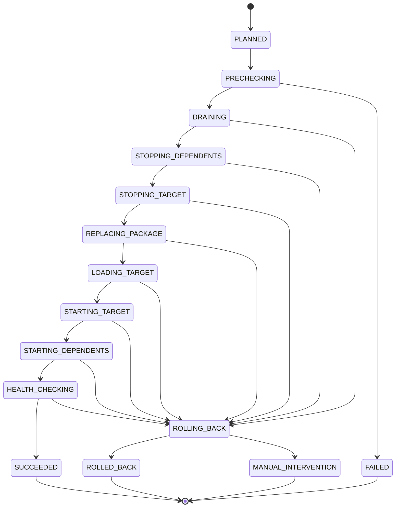

# Plugin Hot Replacement Deployment Improvement Design

## 1. Background

pf4boot already has runtime plugin lifecycle operations:

- plugins can be loaded, started, stopped, restarted, reloaded, unloaded, and deleted;
- `Pf4bootPluginManagerImpl` starts required dependencies first and stops dependent plugins before the target plugin;
- web integration registers controllers/interceptors after plugin startup and unregisters them during stop;
- `DefaultShareBeanMgr` records and unregisters shared beans, PF4J extensions, and scheduled tasks;
- `ZipPluginRepository`, `LinkPluginRepository`, and development repositories cover multiple loading sources.

These are lifecycle primitives, but they are not a complete safe hot replacement deployment flow. Hot replacement requires package staging, dependency-chain quiescence, traffic drain, health checks, rollback, version compatibility, and leak validation as one auditable stateful process.

## 2. Goals

- Provide an auditable hot replacement deployment flow without changing existing `start/stop/reload/delete` semantics.
- Execute ordered drain, stop, replace, load, start, and health check for the target plugin and its dependency chain.
- Automatically roll back to the old version when replacement fails.
- Support dependency version, framework version, model version, and configuration compatibility checks.
- Validate cleanup of web mappings, shared beans, scheduled tasks, JPA resources, classloaders, and plugin caches.
- Provide unified state, error codes, and acceptance criteria for management APIs, CLIs, and operations scripts.

## 3. Non-Goals

- No strict zero-downtime switching in the first phase; the first phase targets controlled short downtime plus automatic rollback.
- No distributed gateway or service mesh integration.
- No cross-datasource transaction migration in this design.
- No arbitrary class-level hot replacement; replacement unit remains the plugin package.
- No default automatic replacement behavior. Hot replacement must be triggered explicitly.

## 4. Current Capability and Gaps

| Area | Current Capability | Gap |
| --- | --- | --- |
| Lifecycle | supports start/stop/restart/reload/delete | no deployment transaction, state machine, or rollback record |
| Dependency order | dependencies start first, dependents stop first | no replacement impact precheck or user confirmation |
| Dynamic web | stop unregisters controller/interceptor | no traffic drain, in-flight request quiescence, or route draining state |
| Shared beans | stop unregisters recorded beans | no post-stop leak assertion or diagnostic output |
| Scheduled tasks | stop unregisters plugin tasks | no in-progress task drain, timeout, or forced-failure strategy |
| JPA/resources | plugin context close releases local beans | no transaction drain, pool close check, or shared domain dependency guard |
| Plugin package | can load from zip/link/development paths | no staged package, verification, activation, old package retention, or rollback directory |
| Health check | mostly depends on startup success | no custom plugin health probe or smoke endpoint |
| Version compatibility | descriptors have basic version fields | no dependency version range, model version, or schema migration strategy |

## 5. Core Constraints

- Replacement unit remains the plugin, not individual classes.
- PF4J dependency graph must be respected: stop dependents before replacing a provider, then start provider before dependents.
- Replacement must have a deployment id and persisted phase state for recovery and audit.
- Requests must not enter a half-unloaded plugin.
- `stopPlugin` success does not automatically mean all resources are released; cleanup validation is required.
- Database schema changes must not rely on unrestricted production `ddl-auto=update`.
- On failure, restore the old version first; if restore fails, enter manual intervention.

## 6. Overall Design

Add a hot replacement deployment orchestration layer above existing manager operations. It coordinates deployment without changing low-level lifecycle semantics.

Core concepts:

| Concept | Meaning |
| --- | --- |
| `DeploymentPlan` | replacement plan containing target plugin, target package, dependency impact, checks, and rollback data |
| `DeploymentState` | current deployment state |
| `DeploymentRecord` | persisted audit record for each step, error, package, and version |
| `PluginQuiesce` | plugin quiescent state where web entrypoints and scheduled tasks no longer accept new work |
| `HealthProbe` | extension point for post-start health checks |
| `RollbackSnapshot` | old package, descriptor, config, and startup state used for restoration |

## 7. Deployment State Machine



Illegal transitions must be rejected and recorded.

## 8. Standard Replacement Flow

### 8.1 Precheck

Precheck must not modify runtime state:

1. Parse target plugin descriptor.
2. Verify plugin ID matches the target.
3. Verify target version is newer or overwrite is explicitly allowed.
4. Verify `requires`, dependency version ranges, framework version, and JDK version.
5. Calculate impact scope: target plugin plus all started dependents.
6. Check unsupported plugin types or states.
7. Generate `DeploymentPlan` and `RollbackSnapshot`.

### 8.2 Drain and Quiescence

After entering drain:

- web plugins remove or mark target plugin routes as draining;
- new requests are rejected or receive a clear maintenance response;
- in-flight requests are allowed to finish until timeout;
- scheduled tasks in the affected chain stop accepting new executions;
- running tasks are allowed to finish until timeout;
- JPA transactions are allowed to finish; JDBC transactions are not forcefully interrupted.

### 8.3 Dependency Chain Stop

Stop order:

1. stop all plugins depending on the target;
2. stop the target plugin;
3. validate cleanup after each plugin stop.

Cleanup validation:

- web mappings removed;
- interceptors removed;
- shared beans unregistered;
- extension beans unregistered;
- scheduled tasks unregistered;
- plugin context closed;
- plugin classloader releasable;
- plugin caches cleared.

### 8.4 Package Replacement

Suggested directories:

```text
plugins/
  active/
  staged/
  backup/
  failed/
```

The first phase does not have to change the public repository layout, but the orchestration layer should:

- place target package in staged first;
- verify checksum/signature;
- move old package to backup and record its path;
- atomically activate the new package into the repository-visible path;
- restore old package when activation fails.

### 8.5 Load, Start, and Health Check

1. Reload target plugin.
2. Start target plugin.
3. Start previously stopped dependents in dependency order.
4. Run health checks:
   - plugin state is STARTED;
   - required shared beans are visible;
   - web endpoints are reachable;
   - JPA domain or local JPA is usable;
   - custom plugin health probes pass.
5. Roll back old version if health check fails.

### 8.6 Rollback

Rollback flow:

1. stop new version and any started dependents;
2. unload new version;
3. restore old package;
4. reload old version;
5. restore target plugin and dependents according to old startup state;
6. run old-version health check;
7. enter `MANUAL_INTERVENTION` if rollback fails.

## 9. Interface Design Suggestions

### 9.1 Management Service

```java
public interface PluginDeploymentService {
  DeploymentPlan planReplace(String pluginId, Path stagedPackage);

  DeploymentRecord replace(DeploymentPlan plan);

  DeploymentRecord rollback(String deploymentId);

  DeploymentRecord getRecord(String deploymentId);
}
```

### 9.2 Plugin Health Probe

```java
public interface PluginHealthProbe {
  HealthResult check();
}
```

Plugins may expose this extension point as a local bean. The deployment orchestrator calls it after plugin startup.

### 9.3 Plugin Quiesce Hook

```java
public interface PluginQuiesceHook {
  void beforeDrain();

  boolean isDrained();

  void afterResume();
}
```

The first phase does not require every plugin to implement it. Without a custom hook, the framework uses default web route draining, scheduled task pause, and timeout behavior.

## 10. Data Structure Suggestions

### 10.1 DeploymentRecord

| Field | Meaning |
| --- | --- |
| `deploymentId` | deployment ID |
| `pluginId` | target plugin ID |
| `fromVersion` | old version |
| `toVersion` | new version |
| `state` | current state |
| `affectedPlugins` | affected plugin list |
| `stagedPackage` | staged package path |
| `backupPackage` | backup package path |
| `startedBefore` | startup state before replacement |
| `startedAfter` | startup state after replacement |
| `errorCode` | error code |
| `errorMessage` | error message |
| `createdAt` | creation time |
| `updatedAt` | update time |

### 10.2 Error Codes

| Error Code | Scenario |
| --- | --- |
| `PHD-001` | invalid target package descriptor |
| `PHD-002` | plugin ID mismatch |
| `PHD-003` | version or compatibility check failed |
| `PHD-004` | plugin state in impact scope does not allow replacement |
| `PHD-005` | drain timeout |
| `PHD-006` | dependency-chain stop failed |
| `PHD-007` | package activation failed |
| `PHD-008` | new version load failed |
| `PHD-009` | new version start failed |
| `PHD-010` | health check failed |
| `PHD-011` | rollback failed and manual intervention is required |
| `PHD-012` | resource cleanup validation failed |

## 11. Database and JPA Plugin Constraints

Database-backed plugin replacement needs extra constraints:

- production schema migration must not rely on `ddl-auto=update`;
- prefer expand/contract migration:
  - add compatible tables/columns first;
  - run old and new plugins with compatible schema for a period;
  - clean old fields after validation;
- stop all JPA consumers before replacing a JPA domain provider;
- ensure no in-flight transactions or active connections before provider replacement;
- rollback must ensure new schema changes do not break the old version.

## 12. Observability

Deployment logs should include:

- deployment id;
- plugin id;
- from/to version;
- affected plugins;
- current state and duration;
- in-flight request/task counts during drain;
- post-stop cleanup leak counts;
- health check result;
- rollback result.

Suggested metrics:

- `pf4boot_deployment_total`
- `pf4boot_deployment_duration_seconds`
- `pf4boot_deployment_rollback_total`
- `pf4boot_plugin_inflight_requests`
- `pf4boot_plugin_cleanup_leak_total`

## 13. Compatibility

- Existing `reloadPlugin` remains a low-level lifecycle operation.
- New hot replacement deployment service is a higher-level entrypoint and should not change old API success paths.
- Plain plugins without web/JPA/health hooks can still use the base replacement flow.
- Strict version checks may block replacements that used to be allowed but were operationally risky.

## 14. Recommendation

- Do not present current `reloadPlugin` as safe hot replacement.
- Add a deployment orchestration layer with precheck, drain, stop, package replacement, start, health check, and rollback.
- First implement controlled short downtime and automatic rollback.
- Then improve fine-grained drain, task quiescence, and resource leak diagnostics.
