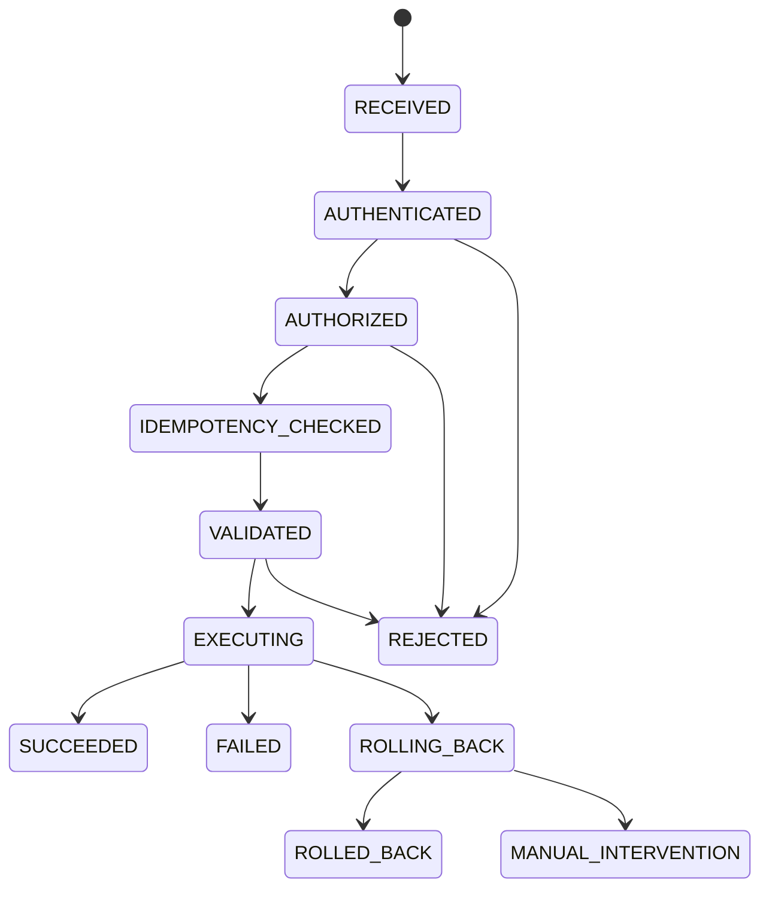

# Complete Plugin HTTP Management API Design

## Background

The framework still exposes `Pf4bootPluginManager` for load, start, stop, restart, reload, unload, and delete operations. It also has `PluginDeploymentService` for release-grade hot replacement orchestration. `pf4boot-actuator` is intentionally read-only and must not perform management mutations.

The missing piece is a standard HTTP management surface. Hosts can currently wrap internal beans themselves, but that easily causes inconsistent HTTP semantics, missing prechecks, bypassed deployment orchestration, missing idempotency and audit records, or exposed high-risk mutation endpoints.

## Goals

- Provide complete HTTP management APIs for plugin query, lifecycle operations, deployment planning, hot replacement, rollback, and deployment record queries.
- Keep read-only observability, low-level lifecycle operations, and release-grade deployment operations clearly separated.
- Keep HTTP mutation APIs disabled by default.
- Support local mode with minimum protection: loopback restriction, management token, audit logs, and semantic HTTP methods.
- Support remote mode with authentication, authorization, CSRF/origin controls, rate limits, audit, and idempotency.
- Provide stable response models and error codes for management UIs, operation platforms, CLIs, and local scripts.

## Non-Goals

- Do not turn `pf4boot-actuator` into a write surface.
- Do not build a full console UI in this phase.
- Do not bind the framework to a specific identity system. Remote mode integrates through SPI.
- Do not change low-level `Pf4bootPluginManager` semantics.
- Do not promise zero-downtime hot replacement.

## Current State

| Capability | Current State | Gap |
| --- | --- | --- |
| Low-level lifecycle | `Pf4bootPluginManager` supports lifecycle operations | Direct HTTP exposure bypasses precheck, idempotency, and audit |
| Release hot replacement | `PluginDeploymentService.planReplacement/replace` exists | No standard HTTP/CLI entrypoint |
| Read-only observability | `pf4boot-actuator` exposes snapshots and metrics | Correctly has no mutation APIs |
| Security | Previous notes discussed method semantics | No complete local/remote security model |
| Audit and records | Deployment recorder exists | Management requests do not have unified audit |

## Constraints

- HTTP management must be optional and disabled by default.
- All mutation operations must use non-GET semantic methods.
- Mutations must enter the existing lifecycle lock or deployment orchestration service.
- Release-grade replacement must use `PluginDeploymentService`, not a wrapper around `reloadPlugin`.
- HTTP models must not expose mutable internals, sensitive absolute paths, full stack traces, or credentials.
- Java 8 and Spring Boot 2.7.x compatibility must be preserved.

## Module Boundary

| Module | Responsibility |
| --- | --- |
| `pf4boot-api` | DTOs, error codes, operation types, audit events, authn/authz SPI |
| `pf4boot-core` | Reuse lifecycle and deployment orchestration; no HTTP dependency |
| `pf4boot-management-starter` | Controllers, validation, idempotency, audit, security interceptors |
| `pf4boot-actuator` | Remains read-only |
| `samples/*` | Local token, remote authorization SPI, plan and replacement examples |

Fixed decision: add `pf4boot-management-starter` so ordinary web integration does not accidentally expose management APIs. `pf4boot-web-starter` keeps dynamic MVC, interceptors, and static resources only.

## Security Modes

| Mode | Scenario | Required Protection | Default |
| --- | --- | --- | --- |
| `DISABLED` | Default | No write controller registered | Default |
| `LOCAL_TOKEN` | Local scripts, sidecars, controlled operation commands | loopback only, management token, audit, rate limit | Explicit opt-in |
| `REMOTE_DELEGATED` | Operation platforms, browsers, remote CLIs | delegated authn, RBAC, CSRF/origin controls, audit, rate limit, idempotency | Explicit opt-in |

Local calls do not need a full user system, but still need minimum protection because SSRF, port forwarding, container networks, and other local processes can reach local HTTP ports.

## Configuration

```yaml
spring:
  pf4boot:
    management:
      http:
        enabled: false
        base-path: /pf4boot/admin
        mode: DISABLED
        allow-loopback-only: true
        token: ${PF4BOOT_ADMIN_TOKEN:}
        token-header: X-PF4Boot-Admin-Token
        require-idempotency-key: true
        idempotency-header: X-Idempotency-Key
        dry-run-default: true
        audit-enabled: true
        rate-limit:
          enabled: true
          writes-per-minute: 30
        csrf:
          enabled: auto
```

Startup validation:

- `enabled=false`: no write controller is registered.
- `enabled=true` with `mode=DISABLED`: fail startup.
- `LOCAL_TOKEN`: token must be non-empty and loopback-only is enabled by default.
- `REMOTE_DELEGATED`: a `PluginManagementAuthorizer` or host security adapter must exist.
- Public binding without remote authorization fails startup.

## API Design

All responses use `PluginAdminResponse<T>`:

| Field | Type | Description |
| --- | --- | --- |
| `success` | `boolean` | Whether the request succeeded |
| `requestId` | `String` | Request id |
| `operationId` | `String` | Idempotency operation id |
| `code` | `String` | Error code or `OK` |
| `message` | `String` | Human-readable summary |
| `data` | `T` | Response payload |
| `warnings` | `List<String>` | Non-blocking warnings |

### Read APIs

| Method | Path | Description |
| --- | --- | --- |
| `GET` | `/pf4boot/admin/plugins` | List plugins |
| `GET` | `/pf4boot/admin/plugins/{pluginId}` | Plugin detail |
| `GET` | `/pf4boot/admin/deployments/{deploymentId}` | Deployment record |
| `GET` | `/pf4boot/admin/deployments` | Recent deployment records |

### Lifecycle APIs

| Method | Path | Behavior |
| --- | --- | --- |
| `POST` | `/pf4boot/admin/plugins/{pluginId}/start` | Start plugin |
| `POST` | `/pf4boot/admin/plugins/{pluginId}/stop` | Stop plugin |
| `POST` | `/pf4boot/admin/plugins/{pluginId}/restart` | Restart plugin |
| `POST` | `/pf4boot/admin/plugins/{pluginId}/reload` | Low-level reload for local/operational fallback |
| `POST` | `/pf4boot/admin/plugins/{pluginId}/enable` | Enable plugin |
| `DELETE` | `/pf4boot/admin/plugins/{pluginId}/enable` | Disable plugin |

### Deployment APIs

| Method | Path | Behavior |
| --- | --- | --- |
| `POST` | `/pf4boot/admin/deployments/plan` | Generate a hot replacement plan without runtime mutation |
| `POST` | `/pf4boot/admin/deployments/replace` | Execute hot replacement |
| `POST` | `/pf4boot/admin/deployments/{deploymentId}/rollback` | Roll back a deployment |
| `POST` | `/pf4boot/admin/deployments/{deploymentId}/confirm` | Confirm a manual gate or dry-run result |

Package paths must reference files under configured staging roots only.

## Authorization Model

| Permission | Operations |
| --- | --- |
| `pf4boot:plugin:read` | List, detail, deployment record queries |
| `pf4boot:plugin:lifecycle` | start/stop/restart/enable/disable |
| `pf4boot:plugin:reload` | low-level reload |
| `pf4boot:deployment:plan` | deployment plan |
| `pf4boot:deployment:replace` | hot replacement |
| `pf4boot:deployment:rollback` | rollback |
| `pf4boot:admin:all` | all operations |

SPI:

```java
public interface PluginManagementAuthorizer {
  PluginManagementPrincipal authenticate(PluginManagementRequest request);

  void authorize(PluginManagementPrincipal principal, PluginManagementOperation operation);
}
```

## Idempotency

- All writes require `X-Idempotency-Key`; local mode may later relax this by explicit config.
- Key scope is `principal + operation + pluginId + requestHash`.
- Same key and same body returns the previous result.
- Same key and different body returns `409 CONFLICT`.
- Running duplicate operations return current operation state without triggering lifecycle actions again.

## Management Request State



## Error Handling

| Code | HTTP Status | Scenario |
| --- | --- | --- |
| `PFM-001` | `400` | Invalid request |
| `PFM-002` | `401` | Unauthenticated or invalid token |
| `PFM-003` | `403` | Forbidden or disallowed source |
| `PFM-004` | `404` | Plugin or deployment record not found |
| `PFM-005` | `409` | Idempotency or state conflict |
| `PFM-006` | `429` | Rate limited |
| `PFM-007` | `422` | Precheck failed |
| `PFM-008` | `500` | Lifecycle operation failed |
| `PFM-009` | `503` | Management surface not ready |

Error responses must not include full stack traces, tokens, sensitive paths, or environment variables.

## Audit And Observability

Every write records request id, operation id, principal, source address, operation type, plugin id, target version, deployment id, dry-run flag, precheck result, final state, duration, and error code. Request payloads are stored as hashes or redacted summaries only.

Metrics:

- `pf4boot_management_request_total`
- `pf4boot_management_rejected_total`
- `pf4boot_management_operation_duration_seconds`
- `pf4boot_management_idempotency_hit_total`

## Compatibility

- Disabled by default, so existing applications are unaffected.
- `pf4boot-actuator` remains read-only.
- Low-level `Pf4bootPluginManager` APIs remain unchanged.
- Applications using older management endpoints need migration to the new paths, methods, and security configuration.
- Non-web applications are unaffected.

## Rollout

1. Local token mode for local CLI and smoke.
2. Remote delegated mode through host authn/authz adapters.
3. Persistent deployment, idempotency, and audit record SPI.
4. Deprecate old management endpoints if any remain.

## Verification

- `.\gradlew.bat :pf4boot-api:compileJava`
- `.\gradlew.bat :pf4boot-core:test`
- `.\gradlew.bat :pf4boot-web-starter:test`
- `.\gradlew.bat :pf4boot-management-starter:test`

If the management surface initially lives in `pf4boot-web-starter`, replace the last command with that module's tests.

## Open Questions

- `pf4boot-management-starter` is the fixed implementation direction and should not be replaced by `pf4boot-web-starter` auto-configuration.
- Whether to ship a Spring Security adapter. Recommendation: optional adapter only.
- Whether audit and idempotency records need file persistence in phase one. Recommendation: memory first, SPI later.
