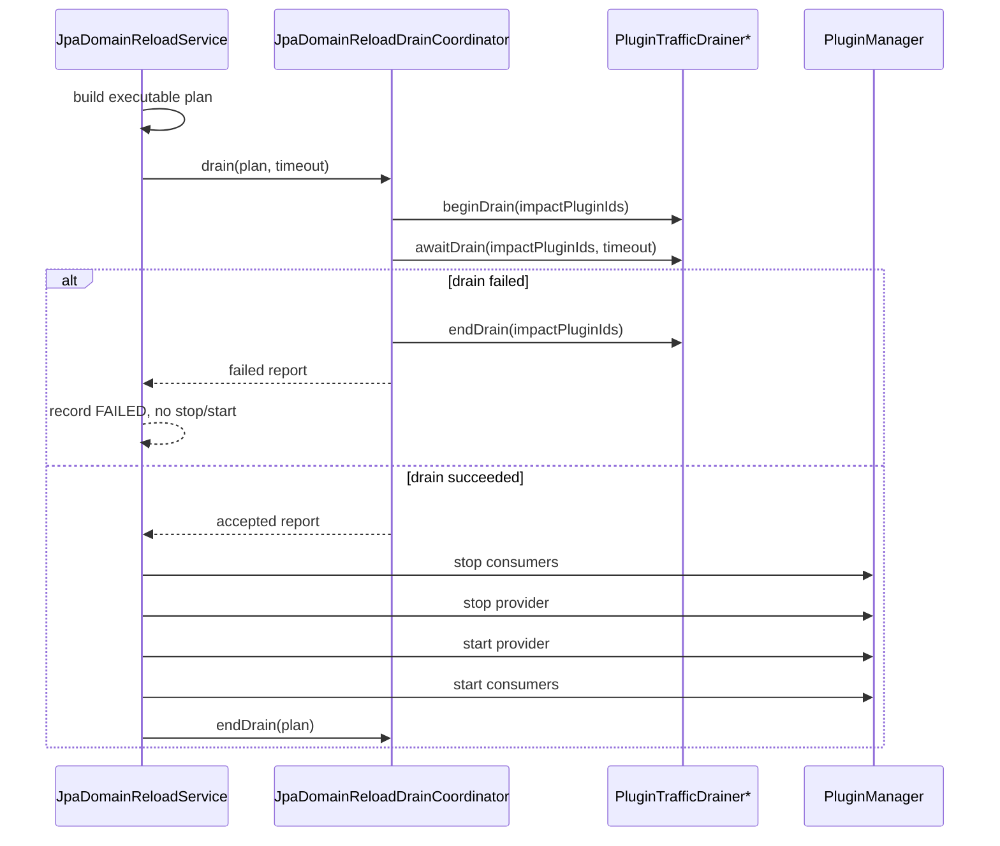

# JPA 运行时刷新 Drain SPI 设计

## 1. 背景

JPA 运行时刷新 V1 已经具备 `PLAN_ONLY`、精确 consumer 识别、重启式执行、管理接口和 runtime smoke 验收。当前最大不足是 `DRAINING` 阶段只记录状态，没有真正接入可扩展的 drain 机制。

仓库中已有通用热替换 drain 扩展点 `PluginTrafficDrainer`：

```java
void beginDrain(Collection<String> pluginIds);
boolean awaitDrain(Collection<String> pluginIds, long timeoutMillis) throws InterruptedException;
void endDrain(Collection<String> pluginIds);
```

Web、定时任务、共享 Bean 管理和热替换部署已经围绕该扩展点形成一套语义：先拒绝新入口，再等待在途工作归零，最后释放 draining 标记。JPA refresh 应复用这套机制，避免为同一批插件生命周期动作建立第二套 drain 协议。

## 2. 目标

1. JPA refresh 执行模式在停止 consumer/provider 前真正执行 drain。
2. drain 失败时不停止任何插件，reload record 进入 `FAILED`。
3. 同一套 `PluginTrafficDrainer` 同时服务热替换部署和 JPA refresh。
4. JPA refresh record 能记录 drain 结果、耗时、失败 drainer 和失败原因。
5. 没有 drainer Bean 时保持兼容：允许继续执行，但记录明确 warning。
6. 支持后续接入更细粒度的业务 drain，例如事务计数、后台任务、消息消费暂停。

## 3. 非目标

1. 不在本阶段强制中断 JDBC 事务、线程或请求。
2. 不承诺生产无停顿刷新。
3. 不在 `PluginTrafficDrainer` 上新增破坏性方法。
4. 不实现跨 domain、跨数据源或跨 JVM 的分布式 drain。
5. 不把 schema 迁移纳入 drain。schema 仍由外部迁移流程负责。

## 4. 影响模块

| 模块 | 职责 |
| --- | --- |
| `pf4boot-api` | 保持 `PluginTrafficDrainer` 兼容；如需新增 report 模型，放在 `pf4boot-jpa` 而不是改动通用接口 |
| `pf4boot-jpa` | 扩展 `JpaDomainDrainReport`，承载 JPA refresh 的 drain 摘要 |
| `pf4boot-jpa-starter` | 新增 drain coordinator，并在 `DefaultJpaDomainReloadService` 的 `DRAINING` 阶段调用 |
| `pf4boot-web-starter` | 继续通过现有 `PluginTrafficDrainer` 拒绝新 Web 请求并等待 in-flight 归零 |
| `pf4boot-core` | 继续通过 `DefaultShareBeanMgr`/`DefaultScheduledMgr` 暂停定时任务并等待运行中任务结束 |
| `samples/cross-plugin-jpa` | 增加 runtime smoke：drain 成功、drain 超时/拒绝时不停止插件 |
| `docs/design` | 更新 JPA refresh、Web、热替换和开发指南中的 drain 说明 |

## 5. 总体设计

### 5.1 复用通用 drainer

JPA refresh 不新增平行接口，直接注入所有 `PluginTrafficDrainer`：

```java
class JpaDomainReloadDrainCoordinator {
  JpaDomainDrainReport drain(JpaDomainReloadPlan plan, long timeoutMillis);
  void endDrain(JpaDomainReloadPlan plan);
}
```

coordinator 是 `pf4boot-jpa-starter` 的内部运行时组件，不作为公共 API。公共 API 只暴露 drain 结果模型，避免用户依赖内部编排。

### 5.2 Drain 影响范围

JPA refresh 的 drain 目标插件列表为：

1. `plan.stopOrder` 中的所有 exact consumers；
2. `plan.providerPluginId`；
3. 去重后按 `plan.stopOrder + provider` 的顺序传给 drainer。

原因：

- consumer 是主要业务入口，必须先拒绝新请求和新任务。
- provider 理论上应保持数据源职责单一，但仍可能有定时任务、初始化任务或内部管理入口，纳入 drain 更稳妥。
- unrelated 插件不能被 drain，保证隔离性。
- inferred consumer 不可执行，因此不会进入 execute drain。

### 5.3 执行时序



关键约束：

- `beginDrain` 后必须在 `finally` 中调用 `endDrain`。
- drain 失败时不能进入 `STOPPING_CONSUMERS`。
- drain 成功后，draining 标记应保持到 provider 和 consumers 启动完成，避免刷新窗口中又有新入口进入旧链路。
- 如果执行中进入人工介入，仍必须尽力调用 `endDrain`，避免插件永久处于 draining。

### 5.4 多 drainer 行为

多个 drainer 按 Spring 注入顺序执行。建议后续支持 `@Order`，但 V1.1 不要求。

规则：

1. `beginDrain` 对所有 drainer 依次调用。
2. 任一 `beginDrain` 抛异常，立即对已 begin 的 drainer 反向调用 `endDrain`，返回 `DRAIN_REJECTED`。
3. `awaitDrain` 依次调用，每个 drainer 使用同一个剩余超时预算。
4. 任一 `awaitDrain=false`，返回 `DRAIN_TIMEOUT`。
5. 任一 `awaitDrain` 抛异常，返回 `DRAIN_REJECTED`。
6. `endDrain` 对已 begin 的 drainer 反向调用；`endDrain` 失败只记录 warning，不覆盖主失败原因。

### 5.5 超时预算

有效超时取值：

1. `JpaDomainReloadRequest.drainTimeoutMillis > 0` 时使用请求值；
2. 否则使用 `pf4boot.plugin.jpa.domain-reload.default-drain-timeout`；
3. 若仍小于等于 0，视为不等待，只执行一次 begin/await 检查。

多个 drainer 共享一个总预算，而不是每个 drainer 都获得完整 timeout。这样用户配置的 `30s` 表示整次 drain 最多 30 秒。

### 5.6 Drain report

建议把 `JpaDomainDrainReport` 从简单 boolean/message 扩展为不可变模型：

| 字段 | 说明 |
| --- | --- |
| `accepted` | drain 是否成功 |
| `failureCode` | `DRAIN_TIMEOUT`、`DRAIN_REJECTED` 或 null |
| `message` | 摘要信息 |
| `pluginIds` | 本次 drain 影响插件 |
| `drainerResults` | 每个 drainer 的结果 |
| `startedAt` / `finishedAt` | 时间戳 |
| `durationMillis` | 耗时 |
| `warnings` | endDrain 失败、无 drainer 等非阻断信息 |

新增 `JpaDomainDrainerResult`：

| 字段 | 说明 |
| --- | --- |
| `drainerName` | bean 名或类名 |
| `phase` | `BEGIN`、`AWAIT`、`END` |
| `accepted` | 当前阶段是否成功 |
| `durationMillis` | 阶段耗时 |
| `message` | 摘要信息，不包含堆栈和敏感参数 |

`JpaDomainReloadRecord` 增加 `drainReport` 字段。若为了兼容暂不改构造器，可以先把 report 摘要写入 failureMessage/warnings；但推荐在同一阶段补充正式字段。

#### 5.6.1 字段和构造器定稿

`JpaDomainDrainReport` 保留当前构造器，新增完整构造器：

```java
public JpaDomainDrainReport(boolean accepted, String message)

public JpaDomainDrainReport(
    boolean accepted,
    JpaDomainReloadFailureCode failureCode,
    String message,
    List<String> pluginIds,
    List<JpaDomainDrainerResult> drainerResults,
    long startedAt,
    long finishedAt,
    List<String> warnings)
```

字段规则：

| 字段 | 类型 | 默认/校验 | 说明 |
| --- | --- | --- | --- |
| `accepted` | `boolean` | 必填 | `true` 才允许进入 stop/start |
| `failureCode` | `JpaDomainReloadFailureCode` | 成功为 null | 只允许 `DRAIN_TIMEOUT`、`DRAIN_REJECTED` 或 null |
| `message` | `String` | 可空，最大 512 字符 | 对外摘要，不包含堆栈 |
| `pluginIds` | `List<String>` | null 转空不可变列表 | drain 影响插件，顺序稳定 |
| `drainerResults` | `List<JpaDomainDrainerResult>` | null 转空不可变列表 | 每个 drainer 每个阶段的结果 |
| `startedAt` | `long` | 毫秒时间戳 | drain 开始时间 |
| `finishedAt` | `long` | 毫秒时间戳 | drain 结束时间；未结束时可为 0 |
| `durationMillis` | getter 派生 | `max(0, finishedAt - startedAt)` | 不单独存储，避免不一致 |
| `warnings` | `List<String>` | null 转空不可变列表 | 非阻断问题 |

新增 `JpaDomainDrainerPhase`：

```java
public enum JpaDomainDrainerPhase {
  BEGIN,
  AWAIT,
  END
}
```

新增 `JpaDomainDrainerResult`：

```java
public class JpaDomainDrainerResult {
  public JpaDomainDrainerResult(
      String drainerName,
      JpaDomainDrainerPhase phase,
      boolean accepted,
      long startedAt,
      long finishedAt,
      String message)
}
```

字段规则：

| 字段 | 类型 | 默认/校验 | 说明 |
| --- | --- | --- | --- |
| `drainerName` | `String` | 必填；空值使用类名或 `unknown` | bean 名优先，类名兜底 |
| `phase` | `JpaDomainDrainerPhase` | 必填 | 当前阶段 |
| `accepted` | `boolean` | 必填 | 阶段是否成功 |
| `startedAt` / `finishedAt` | `long` | 毫秒时间戳 | 阶段耗时来源 |
| `durationMillis` | getter 派生 | `max(0, finishedAt - startedAt)` | 不单独存储 |
| `message` | `String` | 可空，最大 512 字符 | 失败或成功摘要 |

`JpaDomainReloadRecord` 增加字段：

```java
private final JpaDomainDrainReport drainReport;

public JpaDomainReloadRecord(
    ...,
    String rollbackSummary) {
  this(..., rollbackSummary, null);
}

public JpaDomainReloadRecord(
    ...,
    String rollbackSummary,
    JpaDomainDrainReport drainReport)
```

兼容规则：

- 保留当前构造器签名，避免现有测试和调用方一次性全部修改。
- 新增 getter `getDrainReport()`。
- JSON 序列化新增字段属于向后兼容扩展；旧客户端可以忽略。
- `drainReport` 为 null 表示旧记录或未进入 drain 阶段。

#### 5.6.2 对外 JSON 形态示例

```json
{
  "reloadId": "jpa-reload-1",
  "state": "FAILED",
  "failureCode": "DRAIN_TIMEOUT",
  "drainReport": {
    "accepted": false,
    "failureCode": "DRAIN_TIMEOUT",
    "message": "drainer timed out: pluginRequestMappingHandlerMapping",
    "pluginIds": ["sample-workflow", "sample-user-book-service", "sample-demo-jpa-domain"],
    "durationMillis": 30001,
    "warnings": [],
    "drainerResults": [
      {
        "drainerName": "pluginRequestMappingHandlerMapping",
        "phase": "AWAIT",
        "accepted": false,
        "durationMillis": 30000,
        "message": "in-flight requests not drained"
      }
    ]
  }
}
```

#### 5.6.3 Coordinator 接近代码的伪代码

```java
JpaDomainDrainReport drain(JpaDomainReloadPlan plan, long timeoutMillis) {
  List<String> pluginIds = impactPluginIds(plan);
  List<NamedDrainer> drainers = orderedDrainers();
  long startedAt = now();
  List<JpaDomainDrainerResult> results = new ArrayList<>();
  List<String> warnings = new ArrayList<>();
  List<NamedDrainer> begun = new ArrayList<>();

  if (drainers.isEmpty()) {
    if (properties.getDomainReload().isRequireDrainer()) {
      return rejected("no PluginTrafficDrainer found", pluginIds, startedAt, results, warnings);
    }
    warnings.add("no PluginTrafficDrainer found");
    return accepted("no drainer, continue for compatibility", pluginIds, startedAt, results, warnings);
  }

  try {
    for (NamedDrainer drainer : drainers) {
      long phaseStarted = now();
      try {
        drainer.beginDrain(pluginIds);
        begun.add(drainer);
        results.add(success(drainer, BEGIN, phaseStarted));
      } catch (RuntimeException e) {
        results.add(failed(drainer, BEGIN, phaseStarted, sanitize(e)));
        endBegunDrainers(begun, pluginIds, results, warnings);
        return rejected("drainer begin rejected", pluginIds, startedAt, results, warnings);
      }
    }

    long deadline = timeoutMillis <= 0 ? now() : now() + timeoutMillis;
    for (NamedDrainer drainer : drainers) {
      long remaining = timeoutMillis <= 0 ? 0 : Math.max(0, deadline - now());
      long phaseStarted = now();
      try {
        boolean drained = drainer.awaitDrain(pluginIds, remaining);
        results.add(result(drainer, AWAIT, drained, phaseStarted, drained ? "drained" : "timeout"));
        if (!drained) {
          endBegunDrainers(begun, pluginIds, results, warnings);
          return timeout("drainer await timed out", pluginIds, startedAt, results, warnings);
        }
      } catch (InterruptedException e) {
        Thread.currentThread().interrupt();
        results.add(failed(drainer, AWAIT, phaseStarted, "interrupted"));
        endBegunDrainers(begun, pluginIds, results, warnings);
        return rejected("drainer interrupted", pluginIds, startedAt, results, warnings);
      } catch (RuntimeException e) {
        results.add(failed(drainer, AWAIT, phaseStarted, sanitize(e)));
        endBegunDrainers(begun, pluginIds, results, warnings);
        return rejected("drainer await rejected", pluginIds, startedAt, results, warnings);
      }
    }
    return accepted("drained", pluginIds, startedAt, results, warnings);
  } catch (RuntimeException e) {
    endBegunDrainers(begun, pluginIds, results, warnings);
    return rejected("drainer failed", pluginIds, startedAt, results, warnings);
  }
}

void endDrain(JpaDomainReloadPlan plan) {
  endBegunDrainers(currentBegunDrainersFor(plan), impactPluginIds(plan), results, warnings);
}
```

实现要求：

- `NamedDrainer` 应保存 beanName、delegate 和 begin 状态。
- 如果没有 beanName，`drainerName` 使用 `delegate.getClass().getName()`。
- `sanitize(e)` 只保留异常 message，最长 512 字符，不输出堆栈。
- `endBegunDrainers` 必须反向调用。
- `endDrain` 失败只追加 warning，不改变主 `failureCode`。
- 单次 reload 的 begun drainer 状态不能放在 singleton 字段里，避免并发 reload 互相污染；应由 drain 返回的 report 或执行栈局部变量持有。

#### 5.6.4 自动配置落点

`JpaDomainReloadAutoConfiguration` 调整为：

```java
@Bean
@ConditionalOnMissingBean
public JpaDomainReloadDrainCoordinator jpaDomainReloadDrainCoordinator(
    ObjectProvider<PluginTrafficDrainer> trafficDrainers,
    Pf4bootJpaProperties properties) {
  return new JpaDomainReloadDrainCoordinator(trafficDrainers, properties);
}

@Bean
@ConditionalOnMissingBean
public JpaDomainReloadService jpaDomainReloadService(
    ObjectProvider<Pf4bootPluginManager> pluginManager,
    DefaultJpaDomainReloadPlanService planService,
    JpaDomainReloadRecordRepository recordRepository,
    JpaDomainReloadDrainCoordinator drainCoordinator,
    Pf4bootJpaProperties properties) {
  return new DefaultJpaDomainReloadService(
      pluginManager.getIfAvailable(),
      planService,
      recordRepository,
      drainCoordinator,
      properties);
}
```

`Pf4bootJpaProperties.DomainReload` 新增：

```java
private boolean requireDrainer = false;
private boolean drainEndOnFailure = true;
```

属性 setter 不抛异常，保持 Spring Boot 配置绑定宽容；非法超时仍按当前规则归一化。

### 5.7 与 Web drain 的关系

`PluginRequestMappingHandlerMapping` 已实现 `PluginTrafficDrainer`：

- `beginDrain` 后插件路由进入 draining；
- 新请求返回 503；
- in-flight 请求计数归零后 `awaitDrain` 返回 true。

JPA refresh 接入通用 drainer 后，consumer 插件的 Web controller 会自然进入维护窗口。runtime smoke 应增加一条并发测试：发起一个长请求，触发 JPA reload，确认 reload 等待长请求或按超时失败。

### 5.8 与定时任务 drain 的关系

`DefaultShareBeanMgr` 转发到 `DefaultScheduledMgr`：

- drain 后不再启动目标插件的新定时任务；
- 已经运行中的任务完成后 `awaitDrain` 返回 true；
- 超时返回 false。

JPA refresh 不需要理解定时任务实现，只依赖 `PluginTrafficDrainer`。

### 5.9 与事务 drain 的关系

第一版不尝试侵入 Spring 事务拦截器，也不强行统计所有 JDBC 连接。原因：

- `@Transactional` 可能分布在业务插件、共享 service、宿主 service 上，边界复杂。
- 强行代理所有事务管理器会影响兼容性。
- Web/任务入口 drain 已能阻止大部分新事务进入。

后续如果需要精确事务 drain，可在 `pf4boot-jpa-starter` 增加可选 drainer：

```java
public interface JpaDomainTransactionDrainer {
  JpaDomainDrainerResult begin(String domainId, Collection<String> pluginIds);
  JpaDomainDrainerResult await(String domainId, Collection<String> pluginIds, long timeoutMillis);
  void end(String domainId, Collection<String> pluginIds);
}
```

但该接口不应在当前阶段直接引入，除非先完成事务计数和代理边界设计。

## 6. 配置

沿用已有配置：

```yaml
pf4boot:
  plugin:
    jpa:
      domain-reload:
        default-drain-timeout: 30s
```

建议新增：

```yaml
pf4boot:
  plugin:
    jpa:
      domain-reload:
        require-drainer: false
        drain-end-on-failure: true
```

| 配置 | 默认值 | 说明 |
| --- | --- | --- |
| `require-drainer` | `false` | 没有任何 `PluginTrafficDrainer` 时是否阻断 execute |
| `drain-end-on-failure` | `true` | drain 失败或执行失败时是否强制调用 `endDrain` |

`require-drainer=false` 保持兼容；生产建议开启为 `true`，避免误以为已经摘流。

## 7. 错误码和状态

复用已有 failure code：

- `DRAIN_TIMEOUT`：至少一个 drainer 超时或返回 false。
- `DRAIN_REJECTED`：drainer begin/await 抛异常，或配置要求 drainer 但未发现 drainer。

状态流转：

```text
PLANNED -> DRAINING -> STOPPING_CONSUMERS ...
PLANNED -> DRAINING -> FAILED
```

drain 失败的 record 必须满足：

- `state=FAILED`；
- `failureCode=DRAIN_TIMEOUT` 或 `DRAIN_REJECTED`；
- `transitions` 至少包含 `PLANNED`、`DRAINING`、`FAILED`；
- 没有任何 plugin stop/start 操作。

## 8. 管理接口和 Actuator

管理 reload 返回的 record 应包含 drain report 摘要。Actuator `pf4bootjpareload` 应增加最近一次 drain 摘要：

- 最近 drain 是否成功；
- 最近 drain 耗时；
- 最近失败 code；
- 最近影响插件数；
- 最近 warnings 数。

不输出完整异常堆栈、绝对路径、token 或请求参数明文。

## 9. 测试和验收

### 9.1 单元测试

`pf4boot-jpa-starter`：

1. 无 drainer 且 `require-drainer=false`：执行继续，record/report 有 warning。
2. 无 drainer 且 `require-drainer=true`：返回 `DRAIN_REJECTED`，不 stop。
3. drainer begin 抛异常：返回 `DRAIN_REJECTED`，已 begin drainer 被 end。
4. drainer await 返回 false：返回 `DRAIN_TIMEOUT`，不 stop。
5. 多 drainer 共享 timeout：第二个 drainer 只能拿到剩余预算。
6. drain 成功：stop/start 顺序保持不变，最终调用 `endDrain`。
7. stop/start 阶段失败：仍调用 `endDrain`。
8. endDrain 抛异常：record 成功或主失败不被覆盖，但 warnings 记录。

### 9.2 Web/任务集成测试

1. Web consumer 正在处理请求时触发 reload，reload 等待 in-flight 归零。
2. Web consumer 长请求超过 drain timeout，reload 返回 `DRAIN_TIMEOUT`，插件仍 started。
3. 定时任务正在执行时触发 reload，reload 等待任务结束。
4. 定时任务超过 drain timeout，reload 失败且不停止插件。

### 9.3 Runtime smoke

`samples/cross-plugin-jpa` 新增：

- `jpaReloadDrainSuccess`：正常请求路径下 drain 成功。
- `jpaReloadDrainTimeoutNoMutation`：模拟长请求或测试 drainer 超时，reload 失败且 workflow/unrelated 插件仍可访问。
- `actuatorJpaReloadDrainSummary`：Actuator 输出最近 drain 摘要。

### 9.4 验收标准

| 验收项 | 标准 |
| --- | --- |
| AC-01 | JPA reload execute 调用所有可用 `PluginTrafficDrainer` |
| AC-02 | drain 失败不进入 consumer/provider stop |
| AC-03 | drain 成功后仍保持原 stop/start 顺序 |
| AC-04 | 所有路径都调用 `endDrain` 或记录无法调用的 warning |
| AC-05 | record 能查询 drain report |
| AC-06 | runtime smoke 覆盖 drain 成功和超时无变更 |
| AC-07 | 默认兼容：没有 drainer 不破坏现有执行 |
| AC-08 | 生产可选严格模式：`require-drainer=true` 时无 drainer 阻断 |

## 10. 实施顺序

1. 扩展 `JpaDomainDrainReport` 和新增 drainer result 模型。
2. 在 `pf4boot-jpa-starter` 增加 `JpaDomainReloadDrainCoordinator`。
3. `JpaDomainReloadAutoConfiguration` 注入 `ObjectProvider<PluginTrafficDrainer>`。
4. `DefaultJpaDomainReloadService` 在 `DRAINING` 阶段调用 coordinator。
5. `JpaDomainReloadRecord` 增加 drain report。
6. 管理接口和 Actuator 输出 drain 摘要。
7. 补单元测试。
8. 补 sample runtime smoke。
9. 更新验收文档。

## 11. 兼容性

- `PluginTrafficDrainer` 不变，已有 web/core 实现无需修改。
- JPA reload 默认 `DISABLED`，新增 drain 行为只影响显式 execute。
- 没有 drainer 时默认继续执行并记录 warning，避免破坏非 Web/非任务宿主。
- 如果 `JpaDomainReloadRecord` 构造器增加字段，需要保留旧构造器或提供向后兼容构造方法。
- 管理接口响应增加字段属于向后兼容扩展。

## 12. 未决问题和建议

| 问题 | 建议 |
| --- | --- |
| 是否立刻新增事务级 drainer？ | 暂不做。先接入通用 drainer，验证 Web/任务入口 drain 对 JPA refresh 的收益 |
| 没有 drainer 时是否应该默认失败？ | 默认不失败，新增 `require-drainer=true` 给生产严格模式 |
| 是否把 drainer 名称暴露为 bean name？ | 优先使用 bean name；没有 bean name 时使用类名，但不输出包外敏感路径 |
| 多 drainer 超时如何分配？ | 共享总预算，避免总耗时超过用户配置 |
| endDrain 失败是否覆盖主结果？ | 不覆盖，记录 warning；否则成功刷新可能被收尾诊断误判为失败 |
