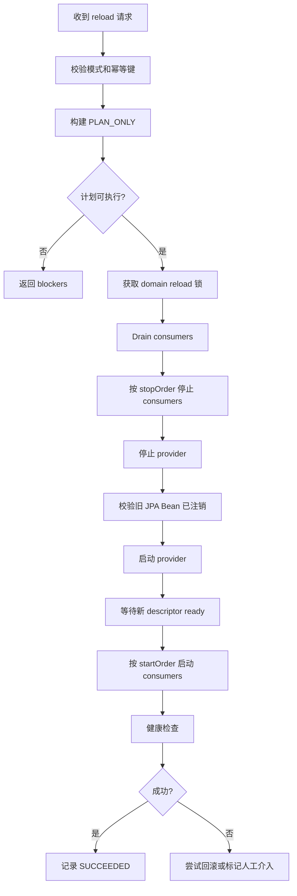

# JPA 运行时刷新设计

> 状态说明：JPA reload 是宿主治理能力，当前推荐配置前缀为
> `spring.pf4boot.jpa.reload.*`。本文中出现的 `pf4boot.plugin.jpa.domain-reload.*`
> 属于早期前缀，在 `3.x` 兼容期仍可读取但会提示迁移。

## 1. 背景

当前跨插件 JPA 方案通过 `pf4boot-jpa-domain-starter` 提供共享数据源、`EntityManagerFactory`、`PlatformTransactionManager` 和 `JpaDomainDescriptor`，消费插件通过 `pf4boot-jpa-starter` 的 `SHARED` 模式绑定同一个 domain，从而进入同一个事务环境。

已有决策见 [decisions/jpa-runtime-refresh-decision.md](decisions/jpa-runtime-refresh-decision.md)：不支持直接修改已经创建的 Hibernate metamodel；JPA 运行时刷新必须通过停止受影响消费插件、重建 domain JPA 环境、再启动消费插件完成。本文把该决策细化到可以直接实施的模块边界、接口、状态机、配置和验证路径。

## 2. 目标

1. 默认不启用运行时刷新，保持现有行为和兼容性。
2. 先提供 `PLAN_ONLY` 模式，只识别影响范围和执行顺序，不做运行时变更。
3. 在执行模式中只刷新一个 JPA domain，不影响无关插件和其它 domain。
4. 刷新通过重建 provider 插件的 JPA 环境完成，不在线修改 Hibernate metamodel。
5. 支持管理接口、Actuator 只读观测、runtime smoke 和验收记录。
6. 插件本地 JPA、跨数据源事务、XA 和跨 domain 联动刷新不在本设计范围内。

## 3. 非目标

1. 不支持在 `EntityManagerFactory` 已启动后追加、删除或替换实体元数据。
2. 不支持跨多个数据源或多个 domain 的原子刷新。
3. 不把刷新做成插件热替换的默认副作用。刷新必须通过显式管理操作触发。
4. 不承诺正在执行的长事务可被无损迁移。执行模式必须经过 drain 超时、失败记录和人工恢复兜底。
5. 不要求没有 JPA 需求的插件依赖 JPA starter 或 domain provider。

## 4. 现状锚点

### 4.1 Domain provider

`pf4boot-jpa-domain-starter` 当前由 `Pf4bootJpaDomainStarter` 创建：

- domain 数据源；
- `LocalContainerEntityManagerFactoryBean`；
- `JpaTransactionManager`；
- `DomainJpaPlatformExporter`。

`DomainJpaPlatformExporter` 会把以下 Bean 导出到平台上下文：

- `domain.{domainId}.dataSource`
- `domain.{domainId}.entityManagerFactory`
- `domain.{domainId}.transactionManager`
- `domain.{domainId}.descriptor`

`JpaDomainDescriptor` 位于 `pf4boot-jpa`，字段包括：

- `domainId`
- `providerPluginId`
- `entityPackages`
- `dataSourceBeanName`
- `entityManagerFactoryBeanName`
- `transactionManagerBeanName`
- `ready`
- `createdAt`

这些字段是刷新规划和执行的主要事实来源。

### 4.2 Shared consumer

`pf4boot-jpa-starter` 的 `PluginJPAStarter` 在 `mode=SHARED` 时会解析 `JpaPluginBinding`，并校验：

- `domainId` 存在；
- `domain.{domainId}.descriptor` 存在且 `ready=true`；
- `EntityManagerFactory` 和 `TransactionManager` Bean 名称匹配 descriptor；
- 本地 BeanFactory 里存在给 Spring Data JPA 识别的占位 BeanDefinition。

消费插件的 Repository 仍然由插件自己定义，示例中通过 `@EnableJpaRepositories` 指向 domain provider 导出的 EMF/TM。

## 5. 设计决策

### 5.0 V1 定位

V1 名称：`JPA domain 重启式刷新`。

V1 不是无感热刷新，也不是 Hibernate metamodel 在线变更。V1 的目标是提供一个可规划、可观测、可审计、可回退到人工介入的受控维护动作。

V1 分两个交付层级：

1. `V1-Plan`：默认建议先交付，提供 `DISABLED`、`PLAN_ONLY`、binding registry、影响范围、阻断项和只读观测。
2. `V1-Execute`：在 `V1-Plan` 稳定后交付，提供显式配置下的 provider 重启式刷新。

生产启用建议：

- 开发和 sample：可以启用 `STOP_CONSUMERS_AND_REBUILD` 做端到端验证。
- 测试环境：先运行 `PLAN_ONLY`，确认影响范围稳定后再开启执行模式。
- 生产环境：V1 执行模式只能作为维护窗口能力，不承诺无停顿。

### 5.1 刷新单位

刷新单位是单个 `domainId`。一次请求只允许刷新一个 domain。

同一 provider 插件原则上只提供一个 domain。若未来允许一个 provider 提供多个 domain，执行模式必须先拒绝该 provider 或要求所有 domain 都处于同一刷新事务，本阶段不做多 domain 支持。

### 5.2 刷新方式

执行模式采用“停止消费插件 -> 重建 provider JPA 环境 -> 启动消费插件”的方式。

首个可落地版本推荐通过 provider 插件生命周期重启完成重建：

1. drain 并停止依赖该 domain 的消费插件；
2. 停止 provider 插件，使 `DomainJpaPlatformExporter.destroy()` 注销已导出的 JPA Bean；
3. 重新启动 provider 插件，使 starter 重新创建 DataSource、EMF、TM 和 descriptor；
4. 校验新 descriptor ready；
5. 按依赖顺序启动消费插件；
6. 执行健康检查并记录刷新结果。

如果后续需要在不停止 provider 插件的情况下重建内部 EMF/TM，必须先新增 provider 内部的 close/recreate 契约，并证明 exporter、BeanDefinition、Repository 代理和事务管理器引用都不会泄漏旧对象。本阶段不采用该复杂路线。

### 5.3 影响范围识别

`PLAN_ONLY` 必须输出：

- provider 插件 ID；
- domain descriptor 快照；
- 直接或间接依赖该 provider 且绑定该 `domainId` 的消费插件；
- 可能受影响但无法精确确认的候选插件；
- 不受影响插件列表；
- 停止顺序；
- 启动顺序；
- drain 能力和风险；
- 阻断项和警告。

识别优先级：

1. 精确识别：插件运行时可解析到 `JpaPluginBinding`，且 `mode=SHARED`、`domainId` 匹配。
2. 辅助识别：插件能力声明包含 JPA consumer 和目标 domain/datasource 信息。
3. 保守识别：PF4J 依赖图中直接或间接依赖 provider 插件，但无法解析绑定时标记为 `INFERRED`。

执行模式只允许在所有待停止消费插件都达到 `EXACT` 或用户显式允许 `INFERRED` 的情况下继续。

### 5.4 无关插件隔离

以下插件不能因为 JPA domain 刷新失败而停止：

- 未依赖 provider 插件的插件；
- 不使用 `pf4boot-jpa-starter` 的插件；
- 使用 `mode=LOCAL` 的插件；
- 绑定其它 `domainId` 的插件。

P10 已通过 no-jpa/unrelated sample 验证 provider 停止时无关插件仍可工作。JPA 运行时刷新必须复用并扩展该 smoke。

### 5.5 默认安全策略

默认配置为 `DISABLED`。在 `DISABLED` 下：

- 服务 Bean 可以不存在；
- 管理接口返回能力未启用；
- Actuator 只显示只读状态；
- 不允许执行 plan 或 reload。

建议阶段性启用顺序：

1. `DISABLED`
2. `PLAN_ONLY`
3. `STOP_CONSUMERS_AND_REBUILD`

执行模式必须要求幂等键，避免管理请求重放导致重复刷新。

## 6. 模块边界

### 6.1 `pf4boot-jpa`

承载 JPA 运行时刷新公共模型和 SPI。原因是当前 `JpaDomainDescriptor` 已在该模块，JPA 专用 API 放在这里比放入通用 `pf4boot-api` 更合适。

建议新增包：

- `net.xdob.pf4boot.jpa.reload`

建议新增类型：

- `JpaDomainReloadMode`
- `JpaDomainReloadState`
- `JpaDomainReloadRequest`
- `JpaDomainReloadPlan`
- `JpaDomainReloadRecord`
- `JpaDomainDrainReport`
- `JpaDomainReloadService`
- `JpaDomainReloadPlanService`
- `JpaDomainReloadRecordRepository`
- `JpaDomainReloadException`
- `JpaDomainReloadFailureCode`

所有模型必须 Java 8 兼容，不使用 record、sealed class、var、Stream.toList 等高版本语法。

### 6.2 `pf4boot-jpa-starter`

负责 shared consumer 绑定识别和本地绑定登记。

建议新增：

- `JpaPluginBindingRegistry`：插件启动时登记 `JpaPluginBinding`，插件停止时移除。
- `JpaDomainConsumerResolver`：按 `domainId` 查询已加载 consumer，并标记 `EXACT`、`INFERRED`。
- `DefaultJpaDomainReloadPlanService`：构建 `PLAN_ONLY` 计划。

`PluginJPAStarter` 在 shared 模式解析绑定成功后，应把绑定注册到 `JpaPluginBindingRegistry`。这比事后重新读取每个插件环境更可靠。

### 6.3 `pf4boot-jpa-domain-starter`

负责 domain provider 侧的刷新前后校验。

建议新增：

- provider descriptor 快照工具；
- provider restart 后 descriptor ready 校验；
- exporter 注销完整性检查；
- EMF/TM 关闭诊断。

首个版本不在 provider 内部做热重建，只校验 provider 插件重启后的 JPA 资源重建结果。

### 6.4 `pf4boot-core`

不引入 JPA 依赖。只复用现有插件生命周期、依赖图、热替换、部署记录和锁。

如现有生命周期服务缺少“按计划停止/启动一组插件并记录结果”的可复用方法，可以在 core 中补通用编排方法，但方法参数不得出现 JPA 类型。

### 6.5 `pf4boot-management-starter`

提供基础 HTTP 管理入口，只包含插件查询、生命周期操作和部署编排。该模块不得依赖 `pf4boot-jpa`，也不得注册 JPA reload controller。

保留的基础能力包括：

- plugin list/start/stop/restart/reload/enable/disable；
- plugin-deploy plan/replace/confirm/rollback；
- 部署记录查询、鉴权、幂等、审计、限流和写请求安全校验。

### 6.6 `pf4boot-jpa-management-starter`

提供可选 JPA reload HTTP 管理入口。该模块显式依赖 `pf4boot-jpa` 和 `pf4boot-management-starter`，复用基础管理的鉴权、请求工厂、审计和路径校验 Bean。只有应用显式引入该 starter 时才注册以下接口：

- `POST /pf4boot/admin/jpa/domains/{domainId}/reload/plan`
- `POST /pf4boot/admin/jpa/domains/{domainId}/reload`
- `GET /pf4boot/admin/jpa/reloads/{reloadId}`
- `GET /pf4boot/admin/jpa/domains/{domainId}/reload/current`

基础 CLI 不生成 `plugin-jpa-reload` 命令；若需要 JPA reload CLI，应由可选扩展包或显式启用的命令集提供。

### 6.7 `pf4boot-actuator`

只读暴露基础插件观测，不依赖 `pf4boot-jpa`：

- 插件快照；
- 治理摘要；
- 基础 metrics。

### 6.8 `pf4boot-jpa-management-starter` Actuator 扩展

该可选 starter 同时注册 `pf4bootjpareload` 只读端点，暴露：

- reload 模式；
- 最近一次 reload 状态；
- 最近一次失败原因；
- 当前是否有进行中的 reload；
- domain descriptor 摘要。

Actuator 不提供执行入口。

### 6.9 `samples/cross-plugin-jpa`

扩展示例和 runtime smoke：

- 正常业务调用仍成功；
- `PLAN_ONLY` 输出 provider、consumer、unrelated；
- provider reload 成功后 shared consumer 恢复；
- provider reload 失败时 unrelated 插件仍可访问；
- 报告写入 `result.json` 和 JUnit XML。

## 7. 公共模型草案

### 7.0 开发落地约束

实现时不要一次性把所有字段都做成可变 Map。公共模型应使用普通 Java class，字段 `private final` 优先，通过构造器或 builder 创建，集合字段对外返回不可变副本或防御性拷贝。

命名要求：

- public API 类型放在 `net.xdob.pf4boot.jpa.reload`。
- starter 内部实现放在 `net.xdob.pf4boot.jpa.starter.reload`。
- domain starter 内部诊断放在 `net.xdob.pf4boot.jpa.domain.starter.reload`。
- 管理 DTO 放在 management starter 现有管理包下的 `jpa` 子包。

错误码必须稳定，不要直接把异常类名作为 API 输出。

### 7.1 枚举

```java
public enum JpaDomainReloadMode {
    DISABLED,
    PLAN_ONLY,
    STOP_CONSUMERS_AND_REBUILD
}
```

```java
public enum JpaDomainReloadState {
    PLANNED,
    DRAINING,
    STOPPING_CONSUMERS,
    STOPPING_PROVIDER,
    STARTING_PROVIDER,
    STARTING_CONSUMERS,
    HEALTH_CHECKING,
    SUCCEEDED,
    FAILED,
    ROLLED_BACK,
    MANUAL_INTERVENTION_REQUIRED
}
```

### 7.2 请求

`JpaDomainReloadRequest` 字段：

- `domainId`
- `mode`
- `dryRun`
- `idempotencyKey`
- `requestedBy`
- `reason`
- `allowInferredConsumers`
- `drainTimeoutMillis`
- `healthCheckTimeoutMillis`
- `providerReplacementPath`，可选；为空表示仅重启当前 provider

V1 字段约束：

| 字段 | V1 规则 |
| --- | --- |
| `domainId` | 必填，只允许非空字符串 |
| `mode` | plan 接口可为空，按当前配置解析；execute 接口必须为 `STOP_CONSUMERS_AND_REBUILD` |
| `dryRun` | plan 接口恒等于 `true`；execute 接口忽略或拒绝 `true` |
| `idempotencyKey` | execute 接口必填；plan 接口可选 |
| `requestedBy` | 可选，由管理安全上下文补充；没有安全上下文时填 `local` 或 `unknown` |
| `reason` | 可选，最长 512 字符 |
| `allowInferredConsumers` | 默认 `false`；V1 execute 建议即使为 `true` 也先拒绝 inferred consumer，只保留字段兼容 |
| `drainTimeoutMillis` | 小于等于 0 时使用默认配置 |
| `healthCheckTimeoutMillis` | 小于等于 0 时使用默认配置 |
| `providerReplacementPath` | V1 阶段不实现 provider 包替换；后续 P2 已接入 `PluginDeploymentService` 执行 staged provider 替换 |

### 7.3 计划

`JpaDomainReloadPlan` 字段：

- `planId`
- `domainId`
- `providerPluginId`
- `descriptor`
- `consumers`
- `inferredConsumers`
- `unaffectedPlugins`
- `stopOrder`
- `startOrder`
- `warnings`
- `blockers`
- `createdAt`
- `executable`

`executable=false` 的常见原因：

- reload mode 为 `DISABLED`；
- 找不到 descriptor；
- descriptor 未 ready；
- provider 未运行；
- 存在 inferred consumer 且未允许；
- 当前已有同 domain reload 执行中；
- provider 插件提供多个 domain；
- lifecycle 服务不支持必需操作。

V1 必须定义以下 blocker code：

| code | 含义 |
| --- | --- |
| `RELOAD_DISABLED` | 当前配置为 `DISABLED` |
| `PLAN_ONLY_MODE` | 当前只允许生成计划，不允许执行 |
| `DOMAIN_NOT_FOUND` | 找不到 domain descriptor |
| `DOMAIN_NOT_READY` | descriptor 存在但未 ready |
| `PROVIDER_NOT_RUNNING` | provider 插件不存在或未运行 |
| `INFERRED_CONSUMER_PRESENT` | 存在无法精确确认的 consumer |
| `CONCURRENT_RELOAD` | 同一 domain 或全局已有 reload 执行中 |
| `MULTI_DOMAIN_PROVIDER_UNSUPPORTED` | provider 暴露多个 domain |
| `LIFECYCLE_OPERATION_UNAVAILABLE` | 缺少必需生命周期操作 |
| `UNSUPPORTED_REPLACEMENT_PATH` | V1 阶段不支持通过 reload 请求替换 provider 包；P2 之后通常改用 provider replacement 失败码 |

### 7.4 记录

`JpaDomainReloadRecord` 字段：

- `reloadId`
- `planId`
- `domainId`
- `state`
- `startedAt`
- `finishedAt`
- `request`
- `plan`
- `stateTransitions`
- `failureCode`
- `failureMessage`
- `rollbackSummary`

记录实现可以先使用内存 ring buffer，后续再接入持久化部署记录。管理接口必须避免输出敏感路径和完整异常堆栈。

V1 record repository 规则：

- 使用内存 ring buffer。
- key 为 `reloadId`。
- 维护 `idempotencyKey -> reloadId` 映射。
- 超出 `max-recent-records` 时淘汰最旧记录。
- 被淘汰记录的 idempotency key 映射也要清理。
- 记录里只保存路径摘要，不保存敏感绝对路径。

### 7.5 服务接口草案

```java
public interface JpaDomainReloadPlanService {
    JpaDomainReloadPlan plan(JpaDomainReloadRequest request);
}
```

```java
public interface JpaDomainReloadService {
    JpaDomainReloadPlan plan(JpaDomainReloadRequest request);

    JpaDomainReloadRecord reload(JpaDomainReloadRequest request);

    JpaDomainReloadRecord getRecord(String reloadId);

    JpaDomainReloadRecord getCurrent(String domainId);
}
```

V1 行为要求：

- `plan()` 不得调用任何插件 stop/start/reload 方法。
- `reload()` 必须先调用 `plan()` 并复用同一份计划。
- `reload()` 不允许绕过 blocker 强行执行。
- `getCurrent(domainId)` 返回该 domain 正在执行的 record；没有则返回 `null` 或空响应，由管理层转为 404/empty。

### 7.6 Consumer 信息模型

建议新增 `JpaDomainConsumer`：

- `pluginId`
- `pluginVersion`
- `domainId`
- `mode`
- `detection`
- `dependencyPath`
- `entityManagerFactoryRef`
- `transactionManagerRef`
- `descriptorRef`

`detection` 枚举：

- `EXACT_BINDING`
- `CAPABILITY_DECLARED`
- `INFERRED_DEPENDENCY`

V1 execute 只接受 `EXACT_BINDING`。`CAPABILITY_DECLARED` 和 `INFERRED_DEPENDENCY` 只用于 plan 输出和人工判断。

## 8. V1 计划算法

`DefaultJpaDomainReloadPlanService` 按以下顺序实现，测试也按该顺序覆盖：

1. 读取配置，解析请求 mode。
2. 若 mode 为 `DISABLED`，返回 `RELOAD_DISABLED` blocker。
3. 按 `domainId` 查找 `JpaDomainDescriptor`。
4. descriptor 不存在返回 `DOMAIN_NOT_FOUND`。
5. descriptor `ready=false` 返回 `DOMAIN_NOT_READY`。
6. 根据 descriptor 的 `providerPluginId` 查找 provider 插件状态。
7. provider 不存在或未运行返回 `PROVIDER_NOT_RUNNING`。
8. 从 `JpaPluginBindingRegistry` 查询精确 consumer。
9. 从 PF4J 依赖图查询依赖 provider 的候选插件。
10. 将已在 registry 中确认的插件标为 `EXACT_BINDING`。
11. 依赖 provider 但没有 registry 绑定的插件标为 `INFERRED_DEPENDENCY`。
12. `mode=LOCAL` 或绑定其它 domain 的插件加入 unaffected，并附带原因。
13. 计算 `stopOrder`，依赖链下游优先。
14. 计算 `startOrder`，依赖链上游优先。
15. 存在 inferred consumer 时添加 `INFERRED_CONSUMER_PRESENT` blocker。
16. 当前配置为 `PLAN_ONLY` 时添加 `PLAN_ONLY_MODE` blocker，但仍返回完整计划。
17. 没有 blocker 且配置为执行模式时 `executable=true`。

计划输出必须稳定排序，避免测试和管理 UI 因顺序抖动产生噪声。

## 9. V1 执行算法

### 9.1 主流程



### 9.2 执行细节

1. 校验 `idempotencyKey`。已有相同 key 时直接返回原 record。
2. 获取全局 reload 锁和 domain reload 锁。
3. 再次生成 plan，防止 plan 到 execute 之间状态变化。
4. 若 plan 不可执行，写入 `FAILED` record 并返回。
5. 将 record 状态置为 `DRAINING`。
6. 调用 `JpaDomainReloadDrainCoordinator` 复用通用 `PluginTrafficDrainer` 执行 drain；drain 被拒绝或超时时写入失败 record，且不执行 stop/start。
7. 状态置为 `STOPPING_CONSUMERS`，按 `stopOrder` 停止 consumer。
8. 状态置为 `STOPPING_PROVIDER`，停止 provider。
9. 校验平台上下文中旧 JPA 导出 Bean 不再存在。
10. 状态置为 `STARTING_PROVIDER`，启动 provider。
11. 等待 `domain.{domainId}.descriptor` ready，直到超时。
12. 状态置为 `STARTING_CONSUMERS`，按 `startOrder` 启动 consumer。
13. 状态置为 `HEALTH_CHECKING`，执行最小健康检查。
14. 成功后置为 `SUCCEEDED`。
15. 任一步失败都写入 failure code，并进入恢复逻辑。

### 9.2.1 Drain SPI 行为

JPA reload 的 drain 不定义平行 SPI，统一复用热替换部署已经使用的 `PluginTrafficDrainer`：

1. coordinator 注入宿主中所有 `PluginTrafficDrainer` Bean。
2. impact plugin ids 为 `stopOrder + providerPluginId`，去重并保持顺序稳定。
3. 先调用所有 drainer 的 `beginDrain(pluginIds)`，再在同一个总超时预算内依次调用 `awaitDrain(pluginIds, remainingMillis)`。
4. 任一 drainer begin 异常、await 异常或 await 返回 `false` 时，reload 记录 `drainReport.accepted=false`，failure code 为 `DRAIN_REJECTED` 或 `DRAIN_TIMEOUT`，并立即收尾，不停止 consumer/provider。
5. drain 成功后，reload 继续原有 stop/start 流程；成功、失败或异常收尾都必须调用已 begin drainer 的 `endDrain(pluginIds)`。
6. 没有 drainer 时默认兼容继续执行并写入 warning；如果 `require-drainer=true`，则返回 `DRAIN_REJECTED`。
7. `drain-end-on-failure=true` 时，即使 stop/start 阶段失败也尽量调用 `endDrain`，end 失败只记录 warning，不覆盖主失败原因。

`JpaDomainReloadRecord` 持有完整 `drainReport`，管理接口查询 reload record 时自然返回；Actuator `pf4bootjpareload` 只输出最近一次 drain 的摘要字段，避免泄露异常堆栈或敏感请求内容。

### 9.3 V1 健康检查

V1 健康检查分层：

1. 必做：provider descriptor ready。
2. 必做：EMF/TM/DataSource Bean 存在且 bean name 与 descriptor 一致。
3. 必做：consumer 插件状态为 started。
4. sample 必做：业务 summary 接口可访问。
5. 可选：调用 provider 或 consumer 暴露的健康检查扩展点。

### 9.4 V1 恢复逻辑

V1 不做复杂自动包回滚。恢复目标是尽量回到“旧 provider 和旧 consumer 可用”，失败时明确进入人工介入。

| 失败阶段 | 恢复动作 | 终态 |
| --- | --- | --- |
| plan 不可执行 | 不做 stop/start | `FAILED` |
| drain 失败 | 不做 stop/start | `FAILED` |
| consumer 停止失败 | 已停止 consumer 反向启动 | 全部恢复则 `FAILED`，恢复失败则 `MANUAL_INTERVENTION_REQUIRED` |
| provider 停止失败 | 已停止 consumer 反向启动 | 全部恢复则 `FAILED`，恢复失败则 `MANUAL_INTERVENTION_REQUIRED` |
| provider 启动失败 | 重试启动 provider 一次，再启动 consumers | 恢复成功则 `FAILED`，恢复失败则 `MANUAL_INTERVENTION_REQUIRED` |
| consumer 启动失败 | 保持 provider started，记录失败 consumer | `MANUAL_INTERVENTION_REQUIRED` |
| 健康检查失败 | 不再自动停止 provider，记录失败 | `MANUAL_INTERVENTION_REQUIRED` |

## 10. 锁和并发

必须至少有三层保护：

1. domain reload 锁：同一 `domainId` 同时只允许一个 reload。
2. lifecycle 编排锁：执行停止和启动时复用现有生命周期互斥机制。
3. 幂等键：同一个 `idempotencyKey` 重复请求返回同一 record，不重复执行。

不同 domain 的 reload 默认也建议串行执行。后续确认生命周期服务、插件依赖图和 shared bean registry 全部可并发后，才允许按 domain 并发。

## 11. 失败处理

### 11.1 Plan 阶段失败

不做运行时变更，返回 `blockers` 和 `warnings`。

### 11.2 Drain 失败

不停止插件，record 标记 `FAILED`，failure code 为 `DRAIN_TIMEOUT` 或 `DRAIN_REJECTED`。

### 11.3 Consumer 停止失败

停止流程中断。已经停止的 consumer 应尝试按反向顺序启动回来。若恢复失败，标记 `MANUAL_INTERVENTION_REQUIRED`。

### 11.4 Provider 启动失败

若是重启当前 provider：

1. 尝试再次启动旧 provider；
2. 若旧 provider 启动成功，启动已停止 consumers；
3. 若旧 provider 也失败，保持 unrelated 插件运行，标记人工介入。

若请求携带 `providerReplacementPath`：

1. 失败后回滚到旧 provider 包；
2. 重新启动旧 provider；
3. 再启动 consumers；
4. 回滚失败时标记人工介入。

### 11.5 Consumer 启动失败

provider 已成功刷新。失败 consumer 保持停止或失败状态，不影响 unrelated 插件。record 必须包含失败 consumer 列表，并标记 `MANUAL_INTERVENTION_REQUIRED`，由管理接口允许后续单独启动。

## 12. 配置

建议配置前缀：

```yaml
pf4boot:
  plugin:
    jpa:
      domain-reload:
        mode: DISABLED
        require-idempotency-key: true
        default-drain-timeout: 30s
        default-health-check-timeout: 60s
        allow-inferred-consumers: false
        max-recent-records: 100
        require-drainer: false
        drain-end-on-failure: true
```

配置说明：

- `mode`：默认 `DISABLED`。
- `require-idempotency-key`：执行模式必须为 `true`，测试可临时关闭。
- `allow-inferred-consumers`：默认 `false`，避免误停插件。
- `max-recent-records`：内存记录上限。
- `require-drainer`：默认 `false`，无 drainer 时兼容继续；设为 `true` 时无 drainer 会阻断执行。
- `drain-end-on-failure`：默认 `true`，stop/start 失败时仍释放已 begin 的 drain 状态。

## 13. HTTP 使用示例

### 13.1 只生成计划

```http
POST /pf4boot/admin/jpa/domains/demo/reload/plan
Content-Type: application/json

{
  "reason": "preview demo domain refresh"
}
```

响应示例：

```json
{
  "domainId": "demo",
  "providerPluginId": "sample-demo-jpa-domain",
  "executable": true,
  "stopOrder": ["sample-workflow", "sample-user-book-service"],
  "startOrder": ["sample-user-book-service", "sample-workflow"],
  "unaffectedPlugins": ["sample-unrelated-service"],
  "warnings": []
}
```

### 13.2 执行重启式刷新

```http
POST /pf4boot/admin/jpa/domains/demo/reload
Content-Type: application/json
Idempotency-Key: reload-demo-20260615-001

{
  "reason": "rebuild demo EntityManagerFactory after provider upgrade",
  "mode": "STOP_CONSUMERS_AND_REBUILD",
  "drainTimeoutMillis": 30000,
  "healthCheckTimeoutMillis": 60000
}
```

响应示例：

```json
{
  "reloadId": "reload-20260615-001",
  "domainId": "demo",
  "state": "SUCCEEDED",
  "stoppedConsumers": ["sample-workflow", "sample-user-book-service"],
  "restartedProvider": "sample-demo-jpa-domain",
  "startedConsumers": ["sample-user-book-service", "sample-workflow"]
}
```

## 14. 开发任务拆分

V1 建议按以下代码任务切分，任一任务都必须带测试：

| 任务 | 模块 | 输出 |
| --- | --- | --- |
| DEV-1 reload 公共模型 | `pf4boot-jpa` | enums、request、plan、record、failure code、service interface |
| DEV-2 配置属性 | `pf4boot-jpa-starter` | domain reload properties，默认 DISABLED |
| DEV-3 binding registry | `pf4boot-jpa-starter` | shared binding 注册和清理 |
| DEV-4 plan service | `pf4boot-jpa-starter` | PLAN_ONLY 影响范围、顺序和 blocker |
| DEV-5 record repository | `pf4boot-jpa-starter` 或 `pf4boot-jpa` 实现包 | 内存 ring buffer 和 idempotency 映射 |
| DEV-6 execute service | `pf4boot-jpa-starter` | 锁、stop/start 编排、状态迁移 |
| DEV-7 provider 校验 | `pf4boot-jpa-domain-starter` | descriptor ready、导出 Bean 注销校验 |
| DEV-8 管理接口 | `pf4boot-management-starter` | plan、execute、record 查询 |
| DEV-9 Actuator | `pf4boot-actuator` | 只读摘要 |
| DEV-10 sample smoke | `samples/cross-plugin-jpa` | plan/success/failure isolation checks |

## 15. 测试矩阵

### 15.1 单元测试

| 测试点 | 模块 | 必测场景 |
| --- | --- | --- |
| 配置默认值 | `pf4boot-jpa-starter` | 未配置时 `DISABLED` |
| mode 解析 | `pf4boot-jpa-starter` | `DISABLED`、`PLAN_ONLY`、`STOP_CONSUMERS_AND_REBUILD` |
| request 校验 | `pf4boot-jpa` 或 starter | 空 domain、reason 超长、execute 缺幂等键 |
| record repository | starter | ring buffer 淘汰、idempotency 命中 |
| binding registry | starter | 注册、覆盖、移除、停止清理 |
| plan blocker | starter | domain 缺失、not ready、provider 未运行、inferred consumer |
| 排序 | starter | stop 下游优先，start 上游优先，输出稳定 |

### 15.2 集成测试

| 测试点 | 模块 | 必测场景 |
| --- | --- | --- |
| shared consumer 精确识别 | `pf4boot-jpa-starter` | `mode=SHARED` 且 domain 匹配 |
| local plugin 排除 | `pf4boot-jpa-starter` | `mode=LOCAL` 不进 reload plan |
| unrelated 排除 | `pf4boot-jpa-starter` | 非 JPA 插件不进 stopOrder |
| provider export 清理 | `pf4boot-jpa-domain-starter` | provider 停止后 descriptor/EMF/TM/DataSource 不存在 |
| provider restart ready | `pf4boot-jpa-domain-starter` | provider 启动后新 descriptor ready |
| 管理接口禁用态 | `pf4boot-management-starter` | `DISABLED` 不执行 |
| 管理接口 plan | `pf4boot-management-starter` | 返回 provider、consumer、unrelated、blockers |

### 15.3 Runtime smoke

| 检查项 | 预期 |
| --- | --- |
| `jpaReloadPlanOnly` | 返回 demo provider、user-book/workflow consumers、unrelated 插件 |
| `jpaReloadDisabledNoMutation` | 禁用态执行 reload 不停止任何插件 |
| `jpaReloadSuccess` | 执行模式刷新后业务接口仍成功 |
| `jpaReloadIdempotency` | 同一幂等键重复请求返回同一 reloadId |
| `jpaReloadDrainSuccess` | 成功 reload record 包含 accepted drain report |
| `jpaReloadDrainTimeoutNoMutation` | drain timeout 写入失败记录，且不停止 workflow/unrelated 插件 |
| `actuatorJpaReloadDrainSummary` | Actuator JPA reload 摘要包含最近 drain failure code 和影响插件数量 |
| `jpaReloadProviderFailureIsolation` | provider 启动失败时 unrelated 插件仍 200 |
| `jpaReloadReport` | `result.json` 和 JUnit XML 包含 reload 检查 |

## 16. 兼容性

源码兼容：

- 现有插件不需要改代码。
- shared consumer 可逐步获得更精确的 binding registry。

二进制兼容：

- 新增类型和 Bean，不修改现有 public 方法签名。
- `JpaDomainDescriptor` 不改字段语义。

运行时兼容：

- 默认 `DISABLED`，无行为变化。
- `PLAN_ONLY` 只读。
- 执行模式需要显式配置和管理操作。

打包兼容：

- provider 仍通过 `pf4boot-jpa-domain-starter` 提供 domain。
- consumer 仍通过 `pf4boot-jpa-starter` 绑定 shared domain。

## 17. 实施约束

1. 所有新增 Java 代码必须 Java 8 兼容。
2. 不允许 core 模块依赖 JPA 模块。
3. 不允许为了刷新把无关插件纳入 stop/start 编排。
4. `PLAN_ONLY` 必须先完成并被 smoke 验证，再实现执行模式。
5. 管理接口输出不得包含敏感绝对路径、token、完整堆栈。
6. 中英文设计、规划、验收文档必须同步更新。

## 18. V1 完成标准

V1 只能在以下条件全部满足时标记完成：

1. `DISABLED` 默认无行为变化。
2. `PLAN_ONLY` 能稳定输出影响范围、顺序、blocker 和 unrelated 插件。
3. Binding registry 能精确识别 shared consumer，并能在插件停止后清理。
4. 执行模式只能在显式配置、无 blocker、幂等键存在时启动。
5. provider 重启后旧导出 Bean 清理、新 descriptor ready 都有测试。
6. 执行失败不会停止 unrelated 插件。
7. Runtime smoke 覆盖 plan、success、drain success、drain timeout no-mutation、failure isolation 和报告输出。
8. 管理接口和 Actuator 输出不泄露敏感路径、token 或完整堆栈。
9. 中文文档、英文文档、验收清单同步更新。

## 19. 未决问题和建议

| 问题 | 建议 |
| --- | --- |
| 管理接口放在 `pf4boot-management-starter` 还是新建 JPA 管理 starter | 首版放在 `pf4boot-management-starter`，通过 `JpaDomainReloadService` 条件注册；若依赖膨胀再拆新模块 |
| 是否支持 inferred consumer 执行刷新 | 默认拒绝，只允许 PLAN 输出；执行模式需要显式 `allowInferredConsumers=true` |
| provider 是否内部重建 EMF 而不重启插件 | 暂不支持，先走 provider 插件重启，降低泄漏风险 |
| reload 记录是否持久化 | 首版内存 ring buffer；后续接入部署记录持久化 |
| 是否允许不同 domain 并发 reload | 暂时串行，等生命周期锁和 registry 证明可并发后再开放 |
