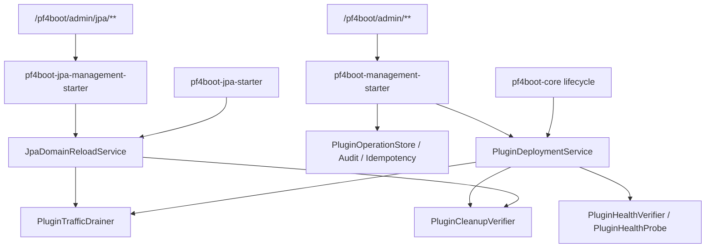
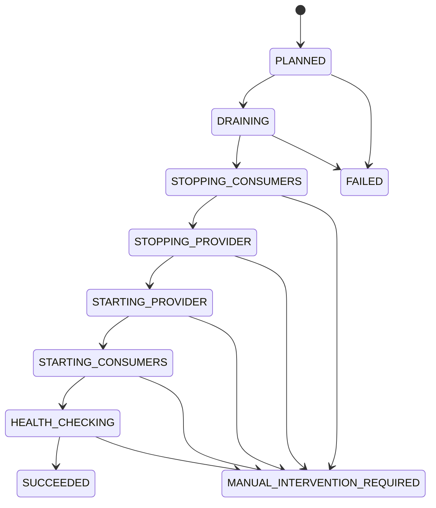

# 下一版本生产化实施设计

## 背景

[next-version-production-goals.md](next-version-production-goals.md) 已经把下一版本收敛为 5 个目标：JPA 运行时刷新、热替换部署事务、管理接口治理、资源泄漏诊断、测试与验收体系。当前代码并不是从零开始：`pf4boot-api` 已有部署、管理、诊断相关模型；`pf4boot-core` 已有 `DefaultPluginDeploymentService`；`pf4boot-management-starter` 已有 HTTP 管理入口、鉴权、幂等、审计和部署记录 store；`pf4boot-jpa*` 已有 reload 模型、计划服务、执行服务、JPA 管理 starter 和 runtime smoke。

本设计的目标是把已有能力收束成可实施的下一版本方案，明确哪些接口要冻结、哪些缺口要补齐、哪些测试是版本完成门槛。

## 目标

1. 形成一套可被其它模型直接实施的阶段化设计。
2. 以现有类型和包名为基准，减少无谓重命名。
3. 明确跨目标的共用基础：管理请求、幂等、部署记录、drain、cleanup、health check 和验收报告。
4. 保持 Java 8、模块边界和当前插件生命周期语义。
5. 把未决问题收敛到少量可延后决策点，不阻塞下一步开发。

## 非目标

- 不实现管理控制台 UI。
- 不支持多节点部署一致性。
- 不支持跨数据源强事务。
- 不把 JPA reload 放入基础 management starter。
- 不为了设计统一而大规模重构已有包名和类名。

## 现状锚点

| 领域 | 当前代码锚点 | 设计判断 |
| --- | --- | --- |
| 部署事务 | `net.xdob.pf4boot.deployment.*`、`DefaultPluginDeploymentService` | 保留现有模型，补齐 rollback/query SPI 和持久化恢复边界 |
| 管理接口 | `PluginManagementController`、`PluginManagementOperation`、`PluginOperationStore` | 冻结 `/pf4boot/admin/**`，补契约测试和 JPA reload 权限扩展 |
| JPA reload | `net.xdob.pf4boot.jpa.reload.*`、`DefaultJpaDomainReloadService` | 保留 provider 重启式刷新，强化 provider replacement 和 record 持久化 |
| 资源诊断 | `PluginCleanupVerifier`、`PluginHealthVerifier`、`PluginLifecycleDiagnostic` | 统一 cleanup report 摘要，接入部署和 JPA reload 记录 |
| 测试 | 各模块已有 JUnit4 测试、sample smoke | 把测试命令和机器可读 smoke 输出变成完成门槛 |

## 核心约束

- `pf4boot-core` 不依赖 `pf4boot-jpa*`。
- `pf4boot-management-starter` 不依赖 `pf4boot-jpa*`。
- `pf4boot-jpa-management-starter` 可以依赖 `pf4boot-management-starter` 和 `pf4boot-jpa`。
- 新 public API 类型优先放在 `pf4boot-api`；JPA 专属 API 放在 `pf4boot-jpa`。
- 所有新增接口方法若会影响已有实现，优先使用 Java 8 default method 过渡。
- 管理接口响应只输出稳定错误码和安全摘要，不输出完整异常、token 或敏感绝对路径。

## 总体架构



## G1 JPA 运行时刷新设计

### 模块边界

| 模块 | 职责 |
| --- | --- |
| `pf4boot-jpa` | reload 公共模型、状态、失败码、请求、计划、记录、服务接口 |
| `pf4boot-jpa-starter` | binding registry、plan service、execute service、drain coordinator、record repository |
| `pf4boot-jpa-domain-starter` | provider 导出和清理校验，descriptor ready 校验 |
| `pf4boot-jpa-management-starter` | JPA reload HTTP 管理入口和只读 actuator 摘要 |
| `pf4boot-core` | 只提供生命周期、部署服务、drain/cleanup/health SPI，不出现 JPA 类型 |

### 接口冻结

保留现有接口：

```java
public interface JpaDomainReloadPlanService {
  JpaDomainReloadPlan plan(JpaDomainReloadRequest request);
}

public interface JpaDomainReloadService {
  JpaDomainReloadPlan plan(JpaDomainReloadRequest request);
  JpaDomainReloadRecord reload(JpaDomainReloadRequest request);
  JpaDomainReloadRecord getRecord(String reloadId);
  JpaDomainReloadRecord getCurrent(String domainId);
}
```

`JpaDomainReloadRequest` 必须稳定支持：

| 字段 | 规则 |
| --- | --- |
| `domainId` | path 和 body 不一致时拒绝 |
| `mode` | execute 必须解析为 `STOP_CONSUMERS_AND_REBUILD` |
| `idempotencyKey` | execute 必填，优先来自管理 header |
| `providerReplacementPath` | 可选；存在时委托 `PluginDeploymentService` 替换 provider |
| `reason` | 安全截断，最长 512 字符 |
| `drainTimeoutMillis` | 小于等于 0 使用配置默认值 |

### 状态机



### 执行流程

1. 管理入口创建 `PluginManagementRequest` 并完成鉴权、授权、限流和幂等占位。
2. `JpaDomainReloadService.reload()` 重新生成 plan，不复用陈旧 plan。
3. plan 存在 blocker 时写入 `FAILED` record，不执行 stop/start。
4. 获取 domain reload 锁，默认不同 domain 串行。
5. 调用 `JpaDomainReloadDrainCoordinator`，复用所有 `PluginTrafficDrainer`。
6. 没有 `providerReplacementPath` 时执行 consumer stop、provider stop/start、consumer start。
7. 有 `providerReplacementPath` 时先停止 consumer，再委托 `PluginDeploymentService.replace(providerId, stagedPath)` 替换 provider。
8. 执行 provider descriptor ready、consumer state、可选 health check。
9. 写入 record，管理接口返回安全摘要。

### 缺口与实施项

| 编号 | 缺口 | 设计动作 |
| --- | --- | --- |
| JPA-1 | JPA reload 权限未进入 `PluginManagementOperation` | 新增 `JPA_RELOAD_PLAN`、`JPA_RELOAD_EXECUTE`、`JPA_RELOAD_QUERY` |
| JPA-2 | provider replacement 和 deployment record 的关联需要稳定字段 | `JpaProviderReplacementSummary` 保存 deploymentId、state、errorCode、package summary |
| JPA-3 | record 持久化策略需要冻结 | 默认内存，配置启用 file store；接口仍为 `JpaDomainReloadRecordRepository` |
| JPA-4 | Actuator 只读摘要需避免泄露 | 只输出 domain、state、failureCode、drain summary、更新时间 |

## G2 热替换部署事务设计

### 接口扩展

当前 `PluginDeploymentService` 已有 `planReplacement` 和 `replace`。下一版本建议以 default method 补齐查询和回滚，避免破坏已有实现：

```java
public interface PluginDeploymentService {
  DeploymentRecord planReplacement(String targetPluginId, Path stagedPluginPath);
  DeploymentRecord replace(String targetPluginId, Path stagedPluginPath);

  default DeploymentRecord rollback(String deploymentId) {
    throw new UnsupportedOperationException("Deployment rollback is not supported");
  }

  default DeploymentRecord getRecord(String deploymentId) {
    throw new UnsupportedOperationException("Deployment record query is not supported");
  }
}
```

### 数据结构补强

`DeploymentRecord` 保留现有字段，建议新增或在兼容构造器中补齐：

| 字段 | 用途 |
| --- | --- |
| `rollbackSnapshot` | 旧包、旧版本、旧启动状态 |
| `phaseResults` | 每个阶段开始、结束、耗时、错误码 |
| `cleanupResults` | stop 后资源清理摘要 |
| `healthResults` | 启动后健康检查摘要 |
| `packageSummary` | staged/active/backup 路径摘要和 checksum |

若不想立即扩大构造器，可先把新增字段挂在 `DeploymentPlan` 或新增 `DeploymentRecordDetails`，管理接口保持向后兼容。

### 状态机

沿用现有 `DeploymentState`：

```text
PLANNED -> PRECHECKED -> DRAINING -> STOPPING -> CLEANUP_VERIFYING
  -> ACTIVATING -> STARTING -> VERIFYING -> SUCCEEDED
任一执行态 -> ROLLING_BACK -> SUCCEEDED / MANUAL_INTERVENTION
预检失败 -> FAILED
```

说明：

- `APPLYING` 保留为兼容旧记录的汇总态，新实现应优先写更细状态。
- `ROLLING_BACK` 之后如果旧版本恢复成功，最终状态可以是 `FAILED` 或 `SUCCEEDED_WITH_ROLLBACK`。当前枚举没有 `ROLLED_BACK`，建议暂用 `FAILED` 并在 message/errorCode 中说明 rollback succeeded；后续如要新增枚举需同步管理契约。

### 预检

`planReplacement` 必须不修改运行态，至少检查：

- staged path 在允许目录下。
- staged 包 descriptor 可读取。
- staged 插件 ID 等于 target plugin ID。
- 版本和依赖范围可接受。
- 影响范围可计算。
- 目标插件和 dependents 状态允许替换。
- 管理面 dry-run、真实 replace 都复用同一预检逻辑。

### 回滚

回滚策略按阶段区分：

| 失败阶段 | 恢复动作 |
| --- | --- |
| precheck | 不修改运行态 |
| drain | 结束 drain，不停止插件 |
| stop dependent 失败 | 已停止插件反向启动 |
| target stop 后失败 | 旧 target 和 dependents 反向启动 |
| activation 失败 | 恢复旧包后启动旧版本 |
| new start/health 失败 | 停新版本、恢复旧包、启动旧版本 |
| rollback 失败 | `MANUAL_INTERVENTION`，保留 backup/staged/failed 摘要 |

## G3 管理接口契约和治理设计

### API 边界

基础管理 starter 只负责：

- `/plugins/**`
- `/deployments/**`
- operation 查询、审计、幂等、限流、安全错误响应

JPA 管理 starter 只负责：

- `/jpa/domains/{domainId}/reload/plan`
- `/jpa/domains/{domainId}/reload`
- `/jpa/reloads/{reloadId}`
- `/jpa/domains/{domainId}/reload/current`

### 权限模型

建议扩展 `PluginManagementOperation`：

| 操作 | 权限 |
| --- | --- |
| `JPA_RELOAD_PLAN` | `pf4boot:jpa-reload:plan` |
| `JPA_RELOAD_EXECUTE` | `pf4boot:jpa-reload:execute` |
| `JPA_RELOAD_QUERY` | `pf4boot:jpa-reload:query` |

本地 token 默认授予这些权限。远程 authorizer 可以按需拒绝。

### 幂等性

- 生命周期类写操作可以继续按现有策略处理。
- `DEPLOYMENT_REPLACE`、`DEPLOYMENT_ROLLBACK`、`DEPLOYMENT_CONFIRM`、`JPA_RELOAD_EXECUTE` 必须要求幂等键。
- 幂等 key 的作用域为 `principal + operation + target + key`。
- 命中已有成功或执行中记录时返回已有 record，不重复执行。

### 错误响应

错误响应统一形态：

```json
{
  "success": false,
  "errorCode": "FORBIDDEN",
  "message": "Operation is not allowed",
  "operationId": "op-..."
}
```

`message` 使用安全文案。详细异常只进入日志或审计，但需要脱敏。

## G4 资源泄漏诊断设计

### 诊断接口

保留现有：

- `PluginCleanupVerifier`
- `PluginHealthVerifier`
- `PluginLifecycleDiagnostic`
- `PluginCleanupReport`

下一版本统一 cleanup 结果：

| 来源 | 输出 |
| --- | --- |
| core/share bean | shared bean、scheduled task、application context provider、classloader |
| web starter | mapping count、interceptor count、drain inflight count |
| JPA domain starter | DataSource、EMF、TM、descriptor 导出残留 |
| deployment service | `DeploymentRecord.cleanupResults` |
| JPA reload service | `JpaDomainReloadRecord.cleanupResults` 或 provider replacement summary |

### 阻断规则

- `DeploymentCheckSeverity.ERROR` 阻断热替换进入成功态，触发回滚。
- JPA provider 停止后若旧 JPA 导出 Bean 残留，reload 进入 `MANUAL_INTERVENTION_REQUIRED`。
- 诊断对象不得暴露内部集合，只暴露插件 ID、资源类型、计数、摘要和 error code。

## G5 测试与验收设计

### 测试分层

| 层级 | 范围 | 命令 |
| --- | --- | --- |
| API 编译 | public SPI 兼容 | `.\gradlew.bat :pf4boot-api:compileJava` |
| Core 单测 | lifecycle、deployment、cleanup | `.\gradlew.bat :pf4boot-core:test` |
| Web 单测 | mapping、interceptor、drain、cleanup | `.\gradlew.bat :pf4boot-web-starter:test` |
| JPA 单测 | binding、plan、execute、record | `.\gradlew.bat :pf4boot-jpa-starter:test` |
| 管理单测 | auth、idempotency、audit、contract | `.\gradlew.bat :pf4boot-management-starter:test` |
| JPA 管理单测 | optional registration、JPA reload endpoints | `.\gradlew.bat :pf4boot-jpa-management-starter:test` |
| Runtime smoke | sample package and runtime | `.\gradlew.bat :samples:cross-plugin-jpa:app-run:runtimeSmoke` 或等价任务 |

### 验收报告

每个 smoke 必须输出：

- `result.json`：机器可读结果。
- JUnit XML：CI 可读结果。
- 关键接口响应摘要：不能包含 token、绝对路径或完整堆栈。

### 失败注入

必须覆盖：

- drain timeout。
- provider start failure。
- consumer start failure。
- deployment activation failure。
- deployment health check failure。
- cleanup verifier failure。
- idempotency duplicate request。

## 分阶段实施计划

| 阶段 | 设计输出 | 代码输出 | 验收 |
| --- | --- | --- | --- |
| P1 | 管理契约和权限冻结 | JPA reload operation、contract tests、错误响应补齐 | management 和 jpa-management test |
| P2 | cleanup 结果统一 | cleanup summary 接入 deployment/JPA record | core、web、jpa-domain test |
| P3 | 部署 SPI 补强 | rollback/getRecord default method、record details、store 查询 | deployment service test |
| P4 | JPA reload provider replacement 收敛 | replacement summary、record 持久化、权限接入 | jpa-starter 和 jpa-management test |
| P5 | runtime smoke 扩展 | cross-plugin-jpa smoke 覆盖 reload/deploy/failure | result.json 和 JUnit XML |
| P6 | 文档和验收冻结 | 更新 contract、developer guide、英文翻译 | 全部目标验收命令通过 |

## 实施状态

| 项目 | 状态 | 证据 |
| --- | --- | --- |
| P1 JPA reload 独立权限 | 已落地 | `PluginManagementOperation` 新增 `JPA_RELOAD_PLAN`、`JPA_RELOAD_EXECUTE`、`JPA_RELOAD_QUERY` |
| P1 本地 token 默认授权 | 已落地 | `LocalTokenPluginManagementAuthorizer` 默认授予 `pf4boot:jpa-reload:*` 权限 |
| P1 JPA reload 写安全和幂等 | 已落地 | `JpaDomainReloadManagementController.reload` 接入 write security、idempotency 和 operation record |
| P1 窄验证 | 已通过 | `.\gradlew.bat :pf4boot-jpa-management-starter:test`、`.\gradlew.bat :pf4boot-management-starter:test` |
| P2 cleanup summary 模型 | 已落地 | `PluginCleanupSummary` 汇总 cleanup verifier 结果 |
| P2 部署记录 cleanup 摘要 | 已落地 | `DeploymentRecord.getCleanupSummary()` 暴露热替换 stop 后清理摘要 |
| P2 JPA reload cleanup 摘要 | 已落地 | `JpaDomainReloadRecord.getCleanupSummary()` 暴露 provider JPA export 清理或 provider replacement 清理摘要 |
| P2 窄验证 | 已通过 | `.\gradlew.bat :pf4boot-core:test :pf4boot-jpa-starter:test` |
| P3 部署 SPI 查询和回滚 | 已落地 | `PluginDeploymentService` 新增兼容 default `getRecord`、`rollback(String)`、`rollback(DeploymentRecord)` |
| P3 默认部署服务回滚 | 已落地 | `DefaultPluginDeploymentService` 支持记录查询和显式 rollback |
| P3 管理回滚委托 | 已落地 | `PluginManagementController.rollback` 委托 `PluginDeploymentService.rollback(source)` |
| P3 窄验证 | 已通过 | `.\gradlew.bat :pf4boot-core:test :pf4boot-management-starter:test`、`.\gradlew.bat :pf4boot-jpa-starter:test :pf4boot-jpa-management-starter:test` |
| P4 provider replacement summary | 已落地 | `JpaProviderReplacementSummary` 暴露 deploymentId、state、errorCode、rollbackStatus、版本和 staged 包路径 |
| P4 JPA reload record 持久化覆盖 | 已落地 | `FileJpaDomainReloadRecordRepositoryTest` 覆盖 provider replacement summary、cleanup summary、latest 和 idempotency 重载恢复 |
| P4 provider replacement 失败码映射 | 已落地 | `DefaultJpaDomainReloadService` 将 `DeploymentRecord.errorCode` 写入 summary，并保留 reload failure code 映射 |
| P4 窄验证 | 已通过 | `.\gradlew.bat :pf4boot-jpa-starter:test` |
| P5 runtime 组装清洁性 | 已落地 | `assembleSampleRuntime` 每次清理完整 runtime 输出目录，避免旧版本 jar 污染 `lib/*` 类路径 |
| P5 smoke 失败注入覆盖 | 已落地 | Gradle `runtimeSmoke` 覆盖部署失败预检 `SMOKE_FAILURE_CASE`，并写入 `failureCase` 报告项 |
| P5 provider replacement smoke 覆盖 | 已落地 | `runtimeSmoke` 校验 JPA provider replacement summary 和 cleanup summary 可通过管理响应观测 |
| P5 runtime smoke 报告 | 已通过 | `.\gradlew.bat :samples:cross-plugin-jpa:app-run:runtimeSmoke` 生成 `result.json` 和 JUnit XML，24 checks、0 failures |
| P6 文档同步 | 已落地 | 中文设计、英文设计和验收状态已同步更新 |
| P6 收口验证 | 已通过 | `.\gradlew.bat :pf4boot-core:test :pf4boot-management-starter:test :pf4boot-jpa-starter:test :pf4boot-jpa-management-starter:test` |

## 兼容性

- 新增 `PluginManagementOperation` 枚举值会影响自定义 authorizer。默认本地 token 放行，远程 authorizer 需要补权限映射。
- `PluginDeploymentService` 新增 `getRecord`、`rollback(String)` 和 `rollback(DeploymentRecord)` default method，不破坏二进制兼容。
- `DeploymentRecord` 如新增字段必须保留现有构造器。
- `PluginCleanupSummary` 为新增只读模型；`DeploymentRecord` 和 `JpaDomainReloadRecord` 以可选字段暴露它，旧构造器保持兼容。
- `JpaProviderReplacementSummary.errorCode` 为可选新增字段；旧构造器和旧 JSON 记录保持可读，缺失时返回 `null`。
- 管理接口新增字段时保持 JSON 向后兼容，旧客户端可忽略。
- JPA reload 默认仍为 `DISABLED`，未引入 JPA 管理 starter 时不注册管理入口。
- sample runtime 组装会删除 `build/runtime` 后重新复制依赖；该目录只能作为生成产物使用，不应存放手工文件。

## 开放问题

| 问题 | 建议 |
| --- | --- |
| 是否新增 `DeploymentState.ROLLED_BACK` | 暂不新增，先用现有状态和 errorCode/message 表达，避免扩大兼容影响 |
| JPA reload record 是否默认文件持久化 | 默认仍内存；sample 和生产建议启用 file store |
| runtime smoke 任务名是否统一 | 建议统一成 `runtimeSmoke`，如果现有 sample 任务名不同，先增加别名任务 |
| cleanupResults 放入 `DeploymentRecord` 还是新 detail 对象 | 建议新增 detail 对象，避免构造器膨胀 |
