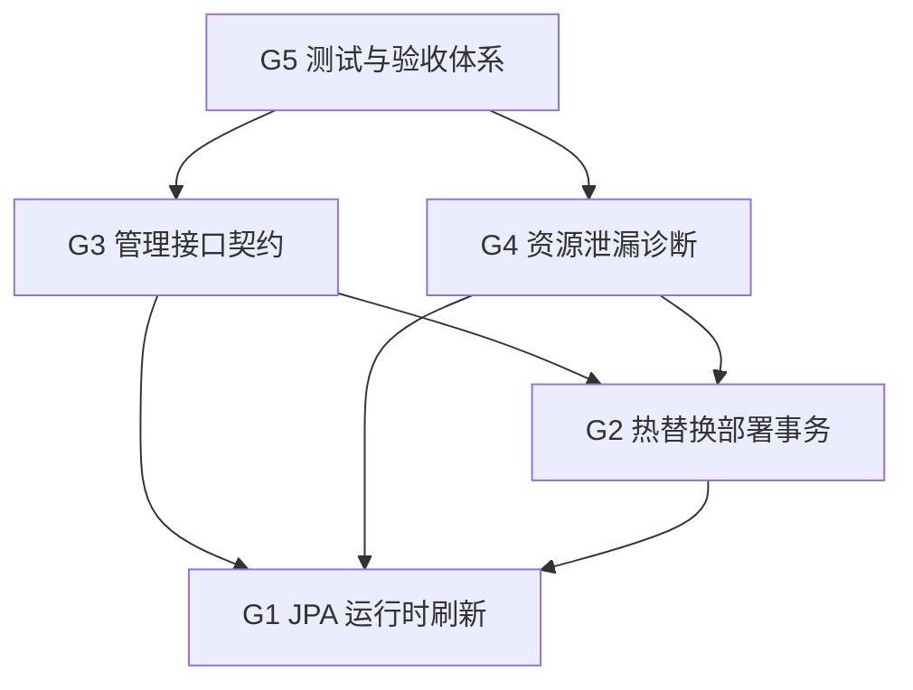

# 下一版本生产化目标

## 背景

当前框架已经具备插件加载、生命周期管理、Web/JPA 集成、HTTP 管理接口、复杂 JPA 示例和部分生产化设计。下一版本不再扩大新的能力面，而是把已经确认最关键的生产级短板收敛为一个版本目标集合，便于后续按阶段实施、验收和追踪。

本规划承接以下当前设计：

- [jpa-runtime-refresh.md](jpa-runtime-refresh.md)
- [jpa-runtime-refresh-drain-spi.md](jpa-runtime-refresh-drain-spi.md)
- [plugin-hot-replacement-deployment-improvement.md](plugin-hot-replacement-deployment-improvement.md)
- [plugin-http-management-api.md](plugin-http-management-api.md)
- [plugin-http-management-api-hardening.md](plugin-http-management-api-hardening.md)
- [runtime-safety-phase3.md](runtime-safety-phase3.md)
- [verification-foundation.md](verification-foundation.md)

## 版本目标

下一版本只把以下 5 项作为主目标：

| 编号 | 目标 | 交付结果 |
| --- | --- | --- |
| G1 | JPA 运行时刷新闭环 | 支持禁用态、计划态、执行态、drain、record、管理入口和 runtime smoke |
| G2 | 热替换部署事务 | 支持部署 plan、replace、health check、rollback、持久化记录和失败恢复 |
| G3 | 管理接口契约和治理闭环 | 稳定 HTTP 契约、错误码、鉴权、幂等、审计、限流和部署/JPA 查询语义 |
| G4 | 资源泄漏诊断 | 插件停止、reload、热替换、JPA 刷新后可验证核心资源已经释放 |
| G5 | 测试与验收体系 | 让模块级测试、runtime smoke、失败注入和验收报告成为版本完成门槛 |

## 非目标

- 不做跨数据源强事务或 XA。
- 不做 Hibernate metamodel 在线变更。
- 不把管理控制台 UI 放入 core、starter 或 management starter。
- 不做集群级热替换一致性、分布式锁或多节点滚动发布。
- 不引入新的主框架依赖，除非对应专题设计明确说明必要性。
- 不改变现有插件默认启动、停止、打包和依赖作用域语义。

## 总体约束

- 所有生产代码保持 Java 8 兼容。
- `pf4boot-core` 不得依赖 JPA 模块。
- 管理写接口统一通过 `/pf4boot/admin/**` 暴露。
- JPA reload 管理入口只能由可选 JPA 管理 starter 提供。
- 热替换和 JPA reload 都必须先 plan，再执行。
- 执行类写操作必须支持幂等键、审计记录和安全错误响应。
- 所有新增中文设计变更必须同步英文文档。
- 当前版本目标完成前，不新增与这 5 项无关的大型能力面。

## G1 JPA 运行时刷新闭环

### 范围

JPA 刷新以单个 `domainId` 为单位，采用“停止 consumer、重建 provider JPA 环境、启动 consumer”的重启式刷新。首版必须保留 `DISABLED` 默认态，并优先完成 `PLAN_ONLY`。

### 必做能力

- `JpaPluginBindingRegistry` 精确记录 shared consumer 与 domain 的绑定关系。
- `JpaDomainReloadPlanService` 输出 provider、consumer、unrelated、stopOrder、startOrder、warnings 和 blockers。
- `JpaDomainReloadService` 执行 `STOP_CONSUMERS_AND_REBUILD`。
- 复用 `PluginTrafficDrainer` 完成 drain。
- 内存 reload record 支持状态迁移、失败码、drain report 和幂等键映射。
- 可选 JPA 管理 starter 提供 plan、execute、record、current 查询接口。
- Actuator 只读输出 JPA reload 摘要。

### 验收门槛

- 默认 `DISABLED` 时没有运行时行为变化。
- `PLAN_ONLY` 不触发任何 stop/start。
- consumer 识别只允许 `EXACT_BINDING` 进入执行。
- provider 停止后旧 DataSource、EMF、TM、descriptor 不再导出。
- provider 启动后新 descriptor ready。
- drain timeout 不停止任何插件。
- provider 刷新失败时 unrelated 插件仍可用。
- runtime smoke 输出 `result.json` 和 JUnit XML。

## G2 热替换部署事务

### 范围

热替换部署作为生命周期之上的治理事务，不改变底层 `start/stop/reload` 语义。替换单位仍是插件包。

### 必做能力

- `PluginDeploymentService` 提供 plan、replace、rollback、record 查询。
- `DeploymentPlan` 包含目标包、目标插件、版本、影响范围、停止/启动顺序、预检结果和回滚依据。
- `DeploymentRecord` 持久化记录状态、阶段耗时、错误码、影响插件和包摘要。
- staged 包校验包括插件 ID、版本、依赖、checksum 和路径安全。
- replace 流程包括 precheck、drain、stop dependents、stop target、activate package、load/start、health check。
- replace 失败后自动回滚旧包和旧启动状态。
- health check 支持基础状态检查和插件可选扩展点。

### 验收门槛

- `dryRun=true` 只生成计划，不修改运行态。
- 同一幂等键并发 replace 只有一个真实执行者。
- 目标包插件 ID 不匹配时拒绝执行。
- 新版本启动失败时能恢复旧版本。
- health check 失败时进入 rollback 或 manual intervention。
- 部署记录可查询完整阶段和安全错误码。
- 失败时不影响无关插件。

## G3 管理接口契约和治理闭环

### 范围

管理接口要从“可调用”收敛为“可被工具、UI、脚本和小模型稳定实现”的契约。该目标覆盖插件生命周期、部署、JPA reload、审计、安全拒绝、幂等和查询。

### 必做能力

- 明确 `/pf4boot/admin/**` API 契约文档，包括路径、方法、header、request、response 和错误码。
- 所有写操作统一鉴权、授权、幂等、限流、CSRF/本地调用策略和审计。
- 前置拒绝也必须写审计记录。
- 错误响应不得透出绝对路径、token、完整堆栈或底层异常原文。
- confirm、replace、rollback、JPA reload 使用独立权限点。
- 管理 API contract 测试覆盖成功、拒绝、幂等冲突、dry-run 和异常脱敏。

### 验收门槛

- 契约文档能直接指导调用方实现客户端。
- 无 token 或权限不足返回稳定安全错误。
- 参数校验失败、限流、幂等冲突都有审计。
- 所有写接口都有幂等策略或明确说明为什么不需要。
- JPA 管理接口不在未引入 JPA 管理 starter 时注册。

## G4 资源泄漏诊断

### 范围

资源泄漏诊断覆盖插件 stop、restart、reload、热替换和 JPA reload 之后的可观测断言。目标不是暴露内部可变集合，而是提供稳定的计数、存在性和诊断结果。

### 必做能力

- classloader close 状态可观测。
- scheduled task 注册和注销计数可观测。
- Web mapping 和 interceptor 注销可观测。
- shared bean、extension bean、platform/application/root 导出 bean 注销可观测。
- `ApplicationContextProvider` 不再持有已停止插件 context。
- JPA provider 停止后 DataSource、EMF、TM、descriptor 清理结果可观测。
- 热替换和 JPA reload record 保存 cleanup check 摘要。

### 验收门槛

- 插件 stop 后核心资源计数归零或给出明确残留项。
- 插件 reload 多次后资源计数不增长。
- Web endpoint 停止后不可访问，重启后可恢复。
- 定时任务停止后不再触发。
- 资源清理失败能阻断热替换完成或标记 manual intervention。

## G5 测试与验收体系

### 范围

下一版本要把测试从“附加项”变成版本完成门槛。重点不是追求一次性全量覆盖，而是覆盖生产化路径的高风险断点。

### 必做能力

- 移除或调整根构建中按任务名禁用 test 的策略，让显式 test 可执行。
- 为 `pf4boot-core`、`pf4boot-web-starter`、`pf4boot-jpa-starter`、`pf4boot-management-starter`、`pf4boot-jpa-management-starter` 建立模块级测试。
- `samples/cross-plugin-jpa` 覆盖 JPA reload runtime smoke。
- 热替换部署覆盖成功、启动失败回滚、health check 失败、drain timeout 和 unrelated isolation。
- 管理接口覆盖鉴权、授权、幂等、限流、审计和错误脱敏。
- smoke 输出机器可读结果，至少包含 `result.json` 和 JUnit XML。

### 验收门槛

- 每个目标都有对应模块级测试或 runtime smoke。
- 失败注入覆盖 drain timeout、provider start failure、consumer start failure、deployment rollback failure。
- CI 或本地验收命令清单稳定，不依赖人工阅读日志判断成功。
- 文档列出的验收命令可以在无发布凭据环境下执行。

## 阶段计划

| 阶段 | 目标 | 输出 | 完成条件 |
| --- | --- | --- | --- |
| P1 | 测试地基和管理契约冻结 | 可执行 test 策略、API contract、错误码、审计/幂等测试 | G3/G5 的基础测试通过 |
| P2 | 资源诊断观测点 | core/web/JPA cleanup 观测和断言 | stop/reload 资源清理测试通过 |
| P3 | 热替换部署事务 | deployment plan/replace/rollback/record | 成功和失败回滚 smoke 通过 |
| P4 | JPA reload PLAN_ONLY | binding registry、plan service、JPA 管理 plan 接口 | plan 输出稳定且不修改运行态 |
| P5 | JPA reload 执行闭环 | drain、execute、record、Actuator、runtime smoke | JPA reload 成功、失败隔离和幂等验收通过 |
| P6 | 全量验收收敛 | 文档、英文翻译、验收报告、回归命令 | 5 个目标全部满足完成门槛 |

## 依赖关系

## 风险点

| 风险 | 影响 | 缓解 |
| --- | --- | --- |
| 测试地基不足导致后续变更不可验证 | 高 | P1 先完成显式 test 和关键模块测试 |
| 热替换和 JPA reload 同时改生命周期导致交叉回归 | 高 | 先固化 deployment service 和 cleanup 诊断，再接 JPA reload |
| record 只用内存导致失败后丢失审计 | 中 | 热替换部署记录优先持久化；JPA reload 首版可内存但要保留扩展接口 |
| 管理接口权限粒度不足 | 中 | replace、rollback、confirm、JPA reload 独立权限点 |
| 资源诊断暴露内部实现 | 中 | 只暴露计数、摘要和稳定诊断对象，不暴露可变集合 |

## 完成定义

下一版本只有在以下条件全部满足时才视为完成：

1. G1 到 G5 的验收门槛全部通过。
2. 所有新增管理写操作都有鉴权、幂等、审计和安全错误响应。
3. 热替换和 JPA reload 的失败路径都有 runtime smoke 或失败注入测试。
4. 资源清理诊断可以定位残留类型和插件 ID。
5. 中文设计和英文翻译同步。
6. 验收命令和结果可以被后续开发者重复执行。

