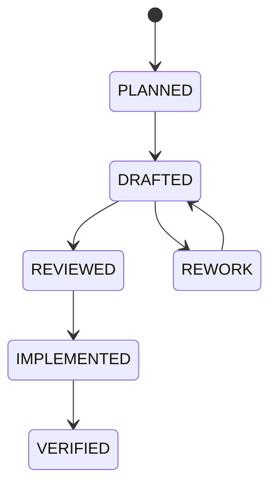
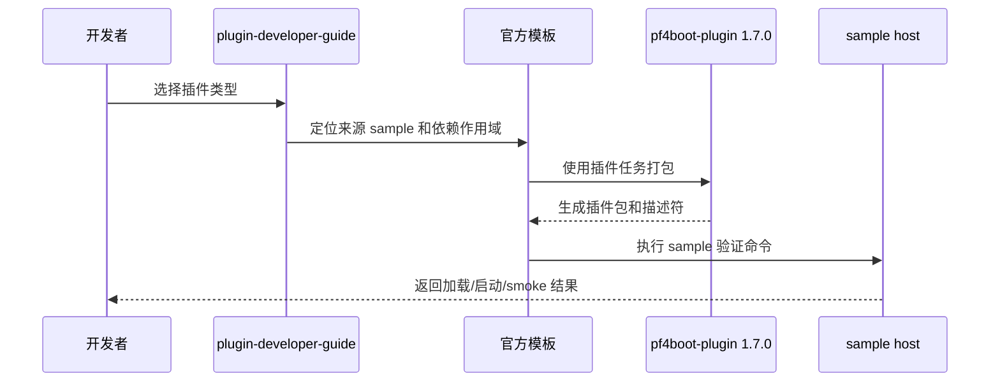

# 插件开发者体验 3.3 设计

## 背景

3.2 之后，框架运行时能力已经具备生产化基础，但插件开发者仍需要在多个文档之间理解 Gradle 插件、依赖作用域、插件描述符、JPA 分层、sample 结构和管理接口。3.3 第一阶段聚焦开发者体验，把官方开发指南、`pf4boot-plugin 1.7.0` 能力基线和官方模板/sample 整理成可以直接实施的闭环。

## 目标

1. 重写官方插件开发指南，使其按开发任务和插件类型组织。
2. 对齐 `pf4boot-plugin 1.7.0`，明确本仓库如何消费辅助 Gradle 插件能力。
3. 梳理官方模板和复杂 samples，使 sample 既能演示能力，也能作为模板来源。
4. 为后续兼容矩阵、打包校验、插件仓库和管理控制台 UI 留出稳定接缝。

## 非目标

- 不修改 `pf4boot-plugin` 外部仓库。
- 不在本阶段实现新的 Gradle 插件功能。
- 不改变 `pf4boot-core`、JPA reload 或部署事务运行时语义。
- 不把 sample 模块加入 Maven 发布范围。
- 不把管理控制台 UI 放入框架 starter。

## 现状/已有流程

| 领域 | 当前状态 |
| --- | --- |
| 辅助 Gradle 插件 | 根 `build.gradle` 使用 `net.xdob.pf4boot:pf4boot-plugin:1.7.0` |
| 插件 sample | `samples/cross-plugin-jpa` 覆盖 JPA domain、consumer、workflow、unrelated、runtime smoke |
| 补偿事务 sample | `samples/saga-outbox` 展示非跨数据源强事务的 Saga/Outbox 思路 |
| 管理 sample | `samples/plugin-management-console` 当前是管理接口对接 sample |
| 开发指南 | `plugin-developer-guide.md` 已覆盖依赖作用域、包校验、观测、JPA 和升级回滚，但结构偏能力清单 |
| 打包说明 | `plugin-loading-and-packaging.md` 已说明仓库、loader、descriptor 和 Gradle 作用域 |

## 核心约束

- 文档中的插件写法必须能在当前仓库或 `pf4boot-plugin 1.7.0` 能力下成立。
- 所有模板必须说明适用场景、必选依赖、禁止依赖和验证命令。
- JPA domain provider 保持职责单一，不定义 entity、Repository、Controller 或业务 service。
- Consumer 插件的 entity 与 Repository 必须按包分组，不互相混放。
- 插件间业务协作走导出的 service API，不跨插件直接注入对方内部 Repository。
- 复杂 sample 的构建输出和历史发布 jar 不能被当作模板源码。

## 设计方案

### 文档分层

| 文档 | 职责 |
| --- | --- |
| `plugin-ecosystem-3.3-roadmap.md` | 3.3 六项目标总路线图 |
| `plugin-developer-experience-3.3-design.md` | E1-E3 的设计约束和落地方案 |
| `plugin-developer-experience-3.3-plan.md` | E1-E3 的实施计划、验收和追踪 |
| `plugin-developer-guide.md` | 面向插件开发者的最终指南，后续由计划驱动重写 |
| `plugin-loading-and-packaging.md` | 保持加载、打包、descriptor 和运行目录的技术细节 |
| sample README | 每个 sample 的运行、验证和模板说明 |

### 开发指南目标结构

`plugin-developer-guide.md` 后续应按以下结构重写：

1. 快速开始：从空插件到可加载包。
2. 插件工程结构：源码目录、`plugin.properties`/DSL、资源、测试。
3. 依赖作用域决策表：`compileOnlyApi`、`bundle`、`plugin`、`platformApi`。
4. 插件类型指南：service、web、JPA domain、JPA consumer、workflow、management client。
5. JPA 专题：model/provider/consumer 分层、多 domain 包扫描、事务边界、reload 限制。
6. 打包与校验：zip、lib、descriptor、checksum、trust manifest。
7. 运维接入：管理 API、热替换、rollback、JPA reload、Actuator。
8. 故障排查：启动失败、依赖缺失、类冲突、JPA 失败码、管理接口拒绝。
9. 迁移指南：从旧示例、旧 JPA 配置和旧打包写法迁移。

### `pf4boot-plugin 1.7.0` 基线

本仓库只声明和消费 `pf4boot-plugin 1.7.0`，不直接改外部插件仓库。对齐动作分三类：

| 类型 | 说明 |
| --- | --- |
| 已确认事实 | 根 `build.gradle` 已使用 `pf4boot-plugin:1.7.0`；官方插件 sample 已应用 `net.xdob.pf4boot-plugin` |
| 待核对能力 | 1.7.0 是否提供模板生成、manifest 生成、包校验、任务名约定和 descriptor DSL 的最终语义 |
| 本仓库动作 | 用文档、sample 和验证命令对齐 1.7.0；如发现能力缺口，记录到 E4/E5，不修改外部仓库 |

后续实施必须产出一张能力基线表：

| 能力 | 1.7.0 支持状态 | 本仓库使用位置 | 文档入口 | 验证方式 |
| --- | --- | --- | --- | --- |
| 插件工程应用 | 待核对 | `samples/*/plugin-*` | 开发指南 | `rg "apply plugin: 'net.xdob.pf4boot-plugin'" samples` |
| 依赖作用域 | 待核对 | sample `build.gradle` | 开发指南、打包说明 | sample compile/package |
| descriptor 生成 | 待核对 | sample `plugin.properties` 或 DSL | 开发指南 | 解包检查 descriptor |
| 插件包任务 | 待核对 | sample Gradle tasks | sample README | `assembleSamplePlugins` 或插件包任务 |
| 校验/manifest | 待核对 | repository/trust 示例 | E4/E5 | 后续校验任务 |

### 官方模板矩阵

| 模板 | 必选模块 | 禁止事项 | 最小验证 |
| --- | --- | --- | --- |
| service plugin | `pf4boot-api`、需要导出的 API | 不引入 JPA starter | `compileJava`、插件包任务 |
| web plugin | `pf4boot-web-support`、Web starter 运行环境 | 不直接操作 host MVC 内部集合 | web-starter test、sample host smoke |
| JPA domain plugin | `pf4boot-jpa-domain-starter`、model 模块 | 不定义 Repository/service/controller | domain plugin compile、runtime smoke |
| JPA consumer plugin | `pf4boot-jpa-starter`、model 模块、domain 插件依赖 | 不创建本地 EMF/TM | jpa-starter test、runtime smoke |
| workflow plugin | 服务 API、必要的 JPA consumer/domain 依赖 | 不跨插件注入内部 Repository | workflow smoke |
| management client | HTTP client 或 sample UI | 不依赖 core 内部类 | management-starter contract test |

### sample 梳理策略

`samples/cross-plugin-jpa`：

- 保留为最复杂官方样例。
- README 增加“模板来源”章节，标明哪些模块适合作为模板，哪些是 demo-only。
- runtime smoke 继续作为 JPA reload、provider replacement 和 unrelated isolation 的验收入口。

`samples/saga-outbox`：

- 保留为跨数据源不做强事务时的业务一致性示例。
- README 强调它不是框架级 XA 能力。

`samples/plugin-management-console`：

- 保留为管理接口消费 sample。
- 在 E6 前先补齐 API 边界说明，不实现复杂 UI。

## 接口设计

本阶段不新增 Java public API。文档和 sample 层面要冻结以下“开发者接口”：

| 接口类型 | 契约 |
| --- | --- |
| Gradle 插件 | 官方插件工程应用 `net.xdob.pf4boot-plugin` |
| 依赖作用域 | host 提供用 `compileOnlyApi`，插件自带用 `bundle`，插件依赖用 `plugin` |
| 插件描述符 | 文档必须说明 DSL 与 `plugin.properties` 的优先级和推荐路径 |
| sample 命令 | README 中的命令必须可复制执行 |
| HTTP 管理 | 管理客户端只依赖 `/pf4boot/admin/**` 和只读 Actuator |

## 数据结构

本阶段新增的是文档数据结构，不新增运行时持久化数据：

| 数据结构 | 位置 | 字段 |
| --- | --- | --- |
| 能力基线表 | 开发指南或独立章节 | 能力、1.7.0 支持状态、使用位置、验证方式 |
| 模板矩阵 | 开发指南、sample README | 模板名、来源模块、依赖、禁止事项、验证命令 |
| sample 清单 | sample README | 模块、职责、运行命令、验证命令、demo-only 提示 |

## 状态机

文档实施状态使用以下状态：

## 时序流程

## 异常处理

| 异常 | 处理 |
| --- | --- |
| 1.7.0 能力与文档假设不一致 | 文档标记为待确认，不把假设写成事实 |
| sample 命令不可执行 | 阻断对应模板完成，补命令或调整 sample |
| 旧写法仍存在 | 在迁移章节说明兼容边界，避免直接删除导致用户无路径可迁 |
| 模板复制会引入 demo-only 代码 | README 明确标识，并在模板矩阵中列禁止复制项 |

## 幂等性

文档和 sample 整理本身没有运行时幂等状态，但实施要求：

- 重复执行 README 验证命令不应依赖上一次 runtime 输出。
- sample runtime 组装必须清理生成目录，避免历史 jar 污染。
- 文档中的命令不应要求手工删除 build 产物才能成功。

## 回滚策略

- 文档变更可以通过 Git 回退，不涉及运行时数据迁移。
- 若开发指南重写后发现遗漏，保留原有章节内容直到新章节覆盖完成，再删除重复段落。
- 若 sample 梳理引入构建失败，优先回退 sample README/Gradle 改动，不影响生产模块发布。

## 兼容性

- 不改变 3.2 运行时 API。
- 不改变插件加载器、仓库顺序和默认打包规则。
- 对旧插件写法只做文档迁移提示，不在第一阶段删除兼容路径。
- `pf4boot-plugin 1.7.0` 是 3.3 文档基线；若后续升级辅助插件，必须更新基线表。

## 灰度/迁移

1. 第一阶段只新增 3.3 设计和规划文档。
2. 第二阶段重写开发指南，但保留旧内容覆盖不到的章节。
3. 第三阶段更新 sample README 和模板矩阵。
4. 第四阶段再进入 E4-E6 的详细设计。

## 测试方案

| 类型 | 命令/检查 |
| --- | --- |
| 文档链接 | 检查 `docs/design/README.md` 和英文 README 链接 |
| 编码 | `git diff --check`，检查无 U+FFFD |
| sample compile | `.\gradlew.bat :samples:cross-plugin-jpa:demo-host:assembleSamplePlugins` |
| runtime smoke | `.\gradlew.bat :samples:cross-plugin-jpa:app-run:runtimeSmoke` |
| 管理 console | `.\gradlew.bat :samples:plugin-management-console:test` |

## 风险点

| 风险 | 影响 | 缓解 |
| --- | --- | --- |
| 文档引用了 1.7.0 未实际提供的能力 | 使用者按文档失败 | 基线表必须区分已确认与待核对 |
| sample 过复杂，不适合当模板 | 使用者复制 demo-only 代码 | README 标识模板来源和禁止复制项 |
| 开发指南与打包说明重复冲突 | 长期维护困难 | 开发指南讲路径，打包说明讲机制 |
| 英文翻译不同步 | 后续模型实施偏差 | 每次中文文档变更同步英文 |

## 分阶段实施计划

详细追踪见 [plugin-developer-experience-3.3-plan.md](plugin-developer-experience-3.3-plan.md)。

