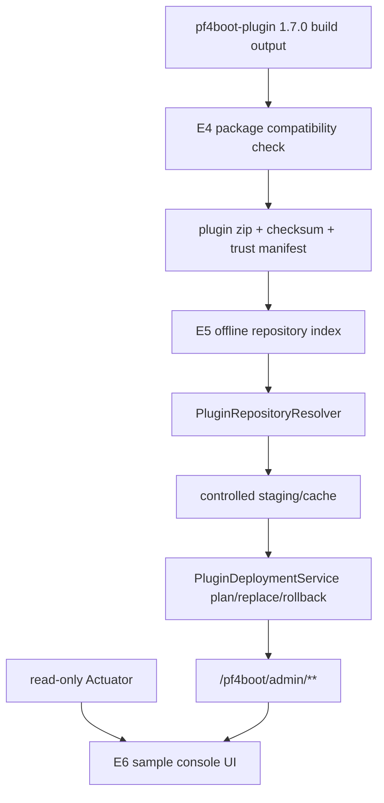

# 插件生态 3.3 后三项设计

## 背景

3.3 前三项已经完成官方开发指南、`pf4boot-plugin 1.7.0` 基线和 sample 模板梳理。后续三项要把“能写插件”继续推进到“能稳定交付插件”：兼容矩阵和打包校验、插件仓库/分发、管理控制台 sample UI。

本设计承接以下既有文档和决策：

- [plugin-ecosystem-3.3-roadmap.md](plugin-ecosystem-3.3-roadmap.md)
- [plugin-developer-experience-3.3-design.md](plugin-developer-experience-3.3-design.md)
- [plugin-loading-and-packaging.md](plugin-loading-and-packaging.md)
- [plugin-management-http-api-contract.md](plugin-management-http-api-contract.md)
- [decisions/plugin-repository-governance-decision.md](decisions/plugin-repository-governance-decision.md)
- [decisions/plugin-management-console-boundary.md](decisions/plugin-management-console-boundary.md)

## 目标

1. E4：定义兼容矩阵和插件包校验能力，避免插件包“能打出来但运行时半坏”。
2. E5：定义离线索引仓库和 release 分发路径，让插件包从本地文件进入可治理发布物。
3. E6：定义管理控制台 sample UI 的边界、页面和 API 映射，用 UI 反向验证管理 API 是否稳定。

## 非目标

- 不修改 `pf4boot-plugin` 外部仓库；如发现辅助插件能力缺口，只记录需求或在本仓库文档中约束。
- 不实现远程插件市场、账号体系、审核流或中心服务。
- 不把 UI 放入 `pf4boot-core`、starter 或 management starter。
- 不改变 3.2 已有插件加载、JPA reload、部署事务和管理接口语义。
- 不支持跨数据源强事务或集群级部署一致性。

## 现状/已有流程

| 领域 | 已有能力 | 缺口 |
| --- | --- | --- |
| 打包 | `pf4boot-plugin 1.7.0` 生成插件包、effective plugin properties 和 packaged libs 输出 | 缺少统一兼容矩阵、host API 误打包检测和机器可读校验报告 |
| 加载 | 支持 link、zip、development、jar repository | 缺少基于 release metadata 的分发治理 |
| 包治理 | checksum、trust manifest、WARN/ENFORCE 设计已存在 | 缺少从 sample/仓库索引到部署预检的完整路径 |
| 部署 | 管理 API 支持 plan、replace、confirm、rollback、record | 仓库 release 请求和 UI 对接仍需收敛 |
| UI | `samples/plugin-management-console` 是静态管理客户端 sample | replace、rollback、JPA reload、审计、错误展示还不完整 |

## 核心约束

- `pf4boot-core` 不依赖 UI、远程仓库 SDK 或前端资源。
- 仓库 release 最终必须复用 `PluginDeploymentService` 的 plan/replace/rollback。
- 所有写管理操作必须继续通过 `/pf4boot/admin/**`，携带鉴权和幂等 header。
- Actuator 保持只读，UI 不得通过 Actuator 执行写操作。
- 兼容矩阵和包校验默认从 WARN 开始，不阻断历史插件。
- sample 模块仍不发布到 Maven 仓库。

## 总体架构



## E4 兼容矩阵和打包校验

### 目标

E4 要提供两层保护：

1. 兼容矩阵：说明插件包在哪些 `pf4boot`、`pf4boot-plugin`、Spring Boot、PF4J、JDK 和插件包格式组合下可运行。
2. 打包校验：在 sample 和后续插件发布流程中检测常见打包错误，例如 host API 被误打入插件包、descriptor 缺字段、依赖范围不匹配。

### 兼容矩阵格式

建议新增文档型矩阵，后续可演进为 JSON：

| 字段 | 含义 | 示例 |
| --- | --- | --- |
| `pf4bootVersionRange` | 框架版本范围 | `[3.3.0,3.4.0)` |
| `pf4bootPluginVersionRange` | 辅助 Gradle 插件版本范围 | `[1.7.0,1.8.0)` |
| `springBootVersionRange` | Spring Boot 兼容范围 | `[2.7.0,2.8.0)` |
| `pf4jVersionRange` | PF4J 兼容范围 | `[3.15.0,3.16.0)` |
| `jdkRange` | JDK 兼容范围 | `[1.8,1.9)` |
| `packageFormatVersion` | 插件包格式版本 | `1` |
| `descriptorModes` | 支持的描述符来源 | `plugin.properties`, `manifest` |
| `requiredPackageRules` | 必须通过的打包规则 | `NO_HOST_API_BUNDLED` |

### 包校验规则

| 规则 | 级别 | 描述 |
| --- | --- | --- |
| `DESCRIPTOR_REQUIRED` | ERROR | 插件包必须能解析 plugin id、version、plugin class |
| `PLUGIN_ID_MATCH` | ERROR | 部署替换时 staged 包 plugin id 必须等于目标 plugin id |
| `NO_HOST_API_BUNDLED` | ERROR/WARN | 插件包不得打入 `pf4boot-api`、`pf4boot-jpa`、`pf4boot-web-support` 等 host API |
| `DEPENDENCY_DECLARED` | WARN | 插件间运行时依赖必须进入 descriptor dependencies |
| `BUNDLE_SCOPE_VALID` | WARN | `bundle` 依赖不应包含 host-provided API |
| `CHECKSUM_PRESENT` | WARN/ERROR | 发布包应有 `.sha256` |
| `TRUST_MANIFEST_PRESENT` | WARN/ERROR | 发布包应有 `.pf4boot-trust.json` |
| `VERSION_RANGE_COMPATIBLE` | WARN/ERROR | trust manifest 中版本范围必须兼容当前 host |

### 校验报告

建议第一阶段在 sample 或构建报告中使用机器可读 JSON：

```json
{
  "schemaVersion": 1,
  "pluginId": "sample-workflow",
  "pluginVersion": "3.3.0-SNAPSHOT",
  "packagePath": "build/libs/plugin-workflow-3.3.0-SNAPSHOT.zip",
  "state": "PASSED",
  "rules": [
    {
      "rule": "NO_HOST_API_BUNDLED",
      "severity": "ERROR",
      "state": "PASSED",
      "message": "host APIs are not bundled"
    }
  ]
}
```

### 实施边界

- 首版可以先在本仓库 sample 中实现校验任务或脚本；如果能力应属于 `pf4boot-plugin`，记录为后续辅助插件需求，不直接改外部仓库。
- 校验结果应能被 runtime smoke 或 CI 读取。
- WARN 模式不阻断历史插件，ERROR 规则只在明确启用或 sample 验收中阻断。

## E5 插件仓库/分发设计

### 目标

E5 采用既有决策：第一阶段只做离线索引仓库，不做远程中心市场。仓库 release 必须最终转化为受控 staged package，然后复用部署服务。

### 模块边界

| 模块 | 职责 |
| --- | --- |
| `pf4boot-api` | 如需公共模型，放置 repository index/release 摘要只读模型 |
| `pf4boot-core` | repository resolver、路径安全、checksum/trust 校验、staging/cache |
| `pf4boot-management-starter` | repository release plan/replace 请求入口复用 deployment API |
| `samples/cross-plugin-jpa` | 提供 `repository-index.example.json` 和 smoke 入口 |
| `samples/plugin-management-console` | UI 展示仓库 release 选择和 plan 结果 |

### repository-index.json

第一阶段继续使用相对路径：

```json
{
  "schemaVersion": 1,
  "repositoryId": "local-prod",
  "generatedAt": 1781280000000,
  "releases": [
    {
      "pluginId": "sample-workflow",
      "version": "3.3.0",
      "packagePath": "plugins/plugin-workflow-3.3.0.zip",
      "packageSha256": "lowercase-sha256",
      "trustManifestPath": "plugins/plugin-workflow-3.3.0.zip.pf4boot-trust.json",
      "compatibilityMatrixId": "pf4boot-3.3",
      "rolloutPolicy": "manual",
      "rollbackCandidate": true
    }
  ],
  "signature": "base64-signature"
}
```

### 管理请求

沿用 `PluginDeploymentRequest` 的仓库字段：

```json
{
  "pluginId": "sample-workflow",
  "repositoryVersion": "3.3.0",
  "repositoryVersionRange": null,
  "repositoryRollback": false,
  "dryRun": true
}
```

解析规则：

- `repositoryVersion` 精确匹配优先。
- `repositoryVersionRange` 选择最高兼容版本，但必须记录选择依据。
- `repositoryRollback=true` 选择最近可用 rollback candidate。
- 仓库包路径解析后必须仍在 repository root 内。
- cache/staging 路径不得进入 HTTP 响应的敏感字段，只输出摘要。

### 状态机

```text
INDEX_LOADING
  -> INDEX_VERIFIED
  -> RELEASE_RESOLVED
  -> PACKAGE_VERIFIED
  -> STAGED
  -> DEPLOYMENT_PLANNED
  -> DEPLOYMENT_EXECUTED

任一阶段 -> REJECTED
执行失败 -> 复用 DeploymentState 的 rollback/manual intervention
```

### 异常处理

| 错误码建议 | 场景 | 行为 |
| --- | --- | --- |
| `PFR-001` | repository disabled | 返回不可用，不影响本地 staged path |
| `PFR-002` | index missing/invalid | dry-run 失败 |
| `PFR-003` | release not found | dry-run 失败 |
| `PFR-004` | package path escapes root | 阻断 |
| `PFR-005` | checksum mismatch | 阻断 |
| `PFR-006` | trust manifest invalid | WARN/ENFORCE 决定是否阻断 |
| `PFR-007` | no rollback candidate | plan warning 或失败 |

## E6 管理控制台 sample UI

### 目标

E6 只做 sample UI 或独立 sample 项目，不进入发布模块。它的价值是验证管理 API、Actuator 摘要和错误响应是否足够稳定。

### 页面范围

| 页面/区域 | 数据来源 | 操作 |
| --- | --- | --- |
| 插件列表 | `GET /pf4boot/admin/plugins`、`/actuator/pf4bootplugins` | start/stop/restart/reload/enable/disable |
| 治理摘要 | `/actuator/pf4bootgovernance` | 只读 |
| 部署计划 | `POST /pf4boot/admin/deployments/plan` | staged path 或 repository release dry-run |
| 部署执行 | `POST /pf4boot/admin/deployments/replace`、confirm、rollback | 必须显示 idempotency key 和风险 |
| 部署记录 | `GET /pf4boot/admin/deployments`、`GET /deployments/{id}` | 只读 |
| JPA reload | JPA management endpoints | plan、execute、record/current |
| 审计/操作摘要 | operation/deployment records 或治理摘要 | 只读 |
| 错误展示 | 统一响应体 `code/message/warnings` | 不显示 token、绝对路径、堆栈 |

### UI 状态

```text
IDLE -> LOADING -> READY
READY -> PLANNING -> PLAN_READY / ERROR
PLAN_READY -> EXECUTING -> SUCCEEDED / FAILED / MANUAL_INTERVENTION
任一状态 -> AUTH_FAILED
```

### 安全要求

- token 只保存在浏览器内存或用户输入框，不写入日志、localStorage 或 URL。
- 写操作自动生成或要求用户提供 `X-Idempotency-Key`。
- UI 必须把 `dryRun=true` 和真实执行区别展示清楚。
- sample 默认地址和 token 只用于本地演示；生产必须接企业鉴权或反向代理。

### 验收方式

- 静态测试：校验 UI 只包含 HTTP/Actuator 调用，不引用 core Java 内部类。
- API mock 测试：401/403、409、预检失败、rollback、manual intervention 展示。
- sample smoke：启动 `cross-plugin-jpa` runtime 后，通过 UI 或 headless 测试完成 list、plan、replace dry-run、JPA reload plan 和错误展示。

## 兼容性

- E4 校验默认 WARN，不改变历史插件加载。
- E5 repository 默认关闭，直接 staged path 继续可用。
- E6 UI 不进入发布模块，不影响已有应用。
- 新增管理响应字段必须保持 JSON 向后兼容。

## 灰度/迁移

| 阶段 | 策略 |
| --- | --- |
| 设计期 | 只新增设计、规划、sample README |
| WARN 期 | 开启包校验报告和 repository dry-run，不阻断部署 |
| ENFORCE 期 | 对官方 sample 和新发布插件启用 ERROR 阻断 |
| UI 期 | sample UI 先用 mock/本地 runtime 验收，再考虑产品化 |

## 测试方案

| 目标 | 测试 |
| --- | --- |
| E4 | 插件包解包校验、host API 误打包检测、descriptor 缺失、版本范围不兼容 |
| E5 | index 解析、路径越界、checksum mismatch、release not found、repository dry-run |
| E6 | UI API mock、管理接口 contract、runtime smoke、错误脱敏 |

## 风险点

| 风险 | 影响 | 缓解 |
| --- | --- | --- |
| 校验规则过严导致历史插件无法部署 | 升级阻力 | 默认 WARN，ENFORCE 只在新插件和 sample 中启用 |
| 仓库索引泄露内部路径 | 安全问题 | 只允许相对路径，HTTP 响应只输出摘要 |
| UI 被误认为框架内置能力 | 边界混乱 | 文档和 sample README 明确不进入 starter |
| 远程市场需求膨胀 | 范围失控 | 3.3 只做离线索引和本地/内网分发 |

## 开放问题

| 问题 | 建议 |
| --- | --- |
| 包校验任务是否应沉淀进 `pf4boot-plugin` | 先在本仓库 sample 验证规则；稳定后再向外部辅助插件提需求 |
| 兼容矩阵先文档还是 JSON | 先文档，E4 实施时补 JSON schema |
| UI 使用纯静态还是引入前端框架 | 先保持静态 sample，除非交互复杂度证明需要框架 |
| repository index 是否签名 | 第一阶段字段保留，WARN 模式可不强制；ENFORCE 前必须实现 |

