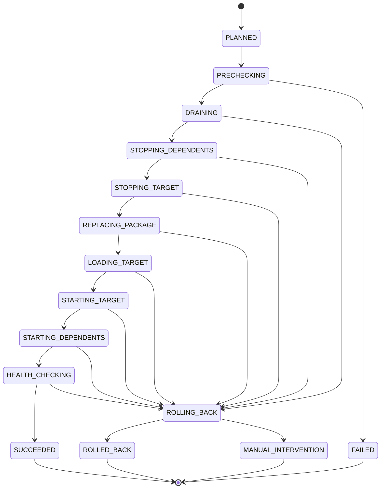

# 插件热替换部署现状改进方案

## 1. 背景

pf4boot 当前已经具备运行时插件生命周期能力：

- 插件可以加载、启动、停止、重启、重载、卸载和删除。
- `Pf4bootPluginManagerImpl` 在启动时会先启动必需依赖，停止时会先停止依赖当前插件的插件。
- Web 集成会在插件启动后注册 controller/interceptor，在停止时注销映射和拦截器。
- `DefaultShareBeanMgr` 会记录并注销共享 Bean、PF4J extension 和定时任务。
- `ZipPluginRepository`、`LinkPluginRepository` 和 development repository 已覆盖多种加载来源。

这些能力是“生命周期操作”的基础，但还不等同于“安全热替换部署”。热替换部署需要把插件包更新、依赖链排空、流量静默、健康检查、失败回滚、版本兼容和资源泄漏验证串成一个有状态流程。

## 2. 目标

- 在不破坏现有 `start/stop/reload/delete` 语义的前提下，提供可审计的热替换部署流程。
- 对被替换插件及其依赖链执行有序 drain、stop、replace、load、start、health check。
- 替换失败时自动回滚到旧版本，并恢复原有依赖链。
- 支持依赖版本、框架版本、模型版本和配置兼容性检查。
- 对 Web 映射、共享 Bean、定时任务、JPA 资源、classloader 和插件缓存做清理验证。
- 为管理 API/CLI/运维脚本提供统一状态、错误码和验收口径。

## 3. 非目标

- 不承诺零中断强一致切换；第一阶段目标是“可控短暂停机 + 自动回滚”。
- 不引入分布式流量网关或服务网格。
- 不在本方案中实现跨数据源事务迁移。
- 不支持任意 class 级别热替换；替换单位仍是插件包。
- 不把热替换作为默认自动行为，必须由显式部署动作触发。

## 4. 当前能力与不足

| 领域 | 当前能力 | 不足 |
| --- | --- | --- |
| 生命周期 | 支持 start/stop/restart/reload/delete | 缺少部署事务、状态机、回滚记录 |
| 依赖顺序 | 启动依赖先启动，停止依赖方先停止 | 缺少“替换影响范围”预检和用户确认 |
| Web 动态能力 | stop 时注销 controller/interceptor | 缺少流量静默、在途请求排空和入口摘除状态 |
| 共享 Bean | stop 时按记录注销 | 缺少 stop 后泄漏断言和诊断输出 |
| 定时任务 | stop 时注销插件定时任务 | 缺少任务执行中排空、超时和强制终止策略 |
| JPA/资源 | 插件上下文关闭时释放本地 Bean | 缺少事务排空、连接池关闭、共享 domain 依赖约束 |
| 插件包 | 可从 zip/link/development 路径加载 | 缺少 staged 包、校验、激活、旧包保留和回滚目录 |
| 健康检查 | 主要依赖启动是否成功 | 缺少插件自定义健康检查和 smoke endpoint |
| 版本兼容 | 现有 descriptor 有基础版本字段 | 缺少依赖版本范围、模型版本和数据库迁移策略 |

## 5. 核心约束

- 仍以插件为替换单位，不支持类级热替换。
- 必须尊重 PF4J 依赖图：替换 provider 前先停止 dependents，恢复时先启动 provider 再启动 dependents。
- 替换动作必须有 deployment id，并持久化阶段状态，便于失败恢复和审计。
- 替换期间不能让请求进入半卸载插件。
- `stopPlugin` 成功不等于资源完全释放，必须有后置清理验证。
- 涉及数据库 schema 的插件不得依赖无约束 `ddl-auto=update` 完成生产迁移。
- 替换失败时优先恢复旧版本，恢复失败时进入人工介入状态。

## 6. 总体方案

新增“热替换部署编排层”，不直接改变底层生命周期语义，而是在现有 manager 操作之上组织部署流程。

建议核心概念：

| 概念 | 含义 |
| --- | --- |
| `DeploymentPlan` | 一次热替换的计划，包含目标插件、目标包、影响依赖链、校验项和回滚信息 |
| `DeploymentState` | 部署状态机当前状态 |
| `DeploymentRecord` | 持久化审计记录，记录每一步开始/结束时间、错误和包版本 |
| `PluginQuiesce` | 插件静默状态，表示 Web 入口和定时任务已暂停接收新工作 |
| `HealthProbe` | 插件启动后的健康检查扩展点 |
| `RollbackSnapshot` | 旧包、旧 descriptor、旧配置和旧启动状态的恢复依据 |

## 7. 部署状态机



非法状态转换必须被拒绝，并写入部署记录。

## 8. 标准热替换流程

### 8.1 预检

预检阶段不修改运行态：

1. 解析目标插件包 descriptor。
2. 校验插件 ID 与当前要替换的插件一致。
3. 校验目标版本高于或允许覆盖当前版本。
4. 校验 `requires`、依赖插件版本范围、框架版本、JDK 版本。
5. 计算影响范围：目标插件 + 所有依赖它的已启动插件。
6. 检查是否存在不允许热替换的插件类型或状态。
7. 生成 `DeploymentPlan` 和 `RollbackSnapshot`。

### 8.2 流量静默与任务排空

进入 drain 后：

- Web 插件先摘除或标记目标插件路由为 draining，拒绝新请求或返回明确维护响应。
- 等待在途请求结束，超过超时时间则失败并回滚。
- 暂停目标依赖链中的定时任务，不再触发新任务。
- 等待正在执行的任务结束，超过超时进入失败策略。
- JPA 场景等待当前事务完成；不强行中断 JDBC 事务。

### 8.3 依赖链停止

停止顺序：

1. 先停止所有依赖目标插件的插件。
2. 再停止目标插件。
3. 每停止一个插件后执行资源清理验证。

资源清理验证包括：

- Web mapping 是否移除。
- Interceptor 是否移除。
- 共享 Bean 是否注销。
- Extension Bean 是否注销。
- 定时任务是否注销。
- 插件上下文是否关闭。
- 插件 classloader 是否可释放。
- 插件相关缓存是否清理。

### 8.4 包替换

建议引入目录约定：

```text
plugins/
  active/
  staged/
  backup/
  failed/
```

第一阶段可以不改变现有仓库结构，但部署编排层应至少做到：

- 目标包先进入 staged。
- 校验 checksum/signature。
- 旧包进入 backup，并记录路径。
- 新包原子激活到插件仓库可见位置。
- 激活失败时恢复旧包。

### 8.5 加载、启动与健康检查

1. 重新 load 目标插件。
2. 启动目标插件。
3. 按依赖顺序启动之前被停止的 dependents。
4. 执行 health check：
   - 插件状态为 STARTED。
   - 必要共享 Bean 可见。
   - Web endpoint 可访问。
   - JPA domain 或本地 JPA 可用。
   - 插件自定义 health probe 通过。
5. health check 失败则回滚旧版本。

### 8.6 回滚

回滚流程：

1. 停止新版本及其已启动 dependents。
2. 卸载新版本。
3. 恢复旧包。
4. 重新加载旧版本。
5. 按旧启动状态恢复目标插件和 dependents。
6. 执行旧版本 health check。
7. 失败则进入 `MANUAL_INTERVENTION`，保留现场记录。

## 9. 接口设计建议

### 9.1 管理服务接口

```java
public interface PluginDeploymentService {
  DeploymentPlan planReplace(String pluginId, Path stagedPackage);

  DeploymentRecord replace(DeploymentPlan plan);

  DeploymentRecord rollback(String deploymentId);

  DeploymentRecord getRecord(String deploymentId);
}
```

### 9.2 插件健康检查扩展点

```java
public interface PluginHealthProbe {
  HealthResult check();
}
```

健康检查扩展点可以通过插件本地 Bean 提供，部署编排层在插件启动后调用。

### 9.3 插件静默扩展点

```java
public interface PluginQuiesceHook {
  void beforeDrain();

  boolean isDrained();

  void afterResume();
}
```

第一阶段可不要求所有插件实现。没有实现时使用框架默认的 Web mapping 摘除、定时任务暂停和超时等待策略。

## 10. 数据结构建议

### 10.1 DeploymentRecord

| 字段 | 含义 |
| --- | --- |
| `deploymentId` | 部署 ID |
| `pluginId` | 目标插件 ID |
| `fromVersion` | 旧版本 |
| `toVersion` | 新版本 |
| `state` | 当前状态 |
| `affectedPlugins` | 影响插件列表 |
| `stagedPackage` | staged 包路径 |
| `backupPackage` | backup 包路径 |
| `startedBefore` | 替换前启动状态 |
| `startedAfter` | 替换后启动状态 |
| `errorCode` | 错误码 |
| `errorMessage` | 错误信息 |
| `createdAt` | 创建时间 |
| `updatedAt` | 更新时间 |

### 10.2 错误码建议

| 错误码 | 场景 |
| --- | --- |
| `PHD-001` | 目标包 descriptor 无效 |
| `PHD-002` | 插件 ID 不匹配 |
| `PHD-003` | 版本或兼容性检查失败 |
| `PHD-004` | 影响范围内插件状态不允许替换 |
| `PHD-005` | drain 超时 |
| `PHD-006` | 停止依赖链失败 |
| `PHD-007` | 包激活失败 |
| `PHD-008` | 新版本加载失败 |
| `PHD-009` | 新版本启动失败 |
| `PHD-010` | 健康检查失败 |
| `PHD-011` | 回滚失败，需要人工介入 |
| `PHD-012` | 资源清理验证失败 |

## 11. 数据库与 JPA 插件约束

带数据库的插件热替换必须额外约束：

- schema 迁移不得依赖生产环境 `ddl-auto=update`。
- 推荐 expand/contract：
  - 先添加兼容字段/表。
  - 新旧插件同时兼容一段时间。
  - 验证稳定后再清理旧字段。
- provider 类插件替换前必须停止依赖它的 JPA consumer。
- 替换 JPA domain provider 时，必须确认没有在途事务和活动连接。
- 回滚时必须确认新版本 schema 变更不会破坏旧版本启动。

## 12. 可观测性

部署流程应输出：

- deployment id
- plugin id
- from/to version
- affected plugins
- 当前状态和耗时
- drain 中在途请求/任务数量
- stop 后资源残留统计
- health check 结果
- rollback 结果

建议补充 metrics：

- `pf4boot_deployment_total`
- `pf4boot_deployment_duration_seconds`
- `pf4boot_deployment_rollback_total`
- `pf4boot_plugin_inflight_requests`
- `pf4boot_plugin_cleanup_leak_total`

## 13. 兼容性

- 现有 `reloadPlugin` 可继续作为低层生命周期操作保留。
- 新的热替换部署服务应作为更高层入口，不改变旧 API 成功路径。
- 没有 Web/JPA/health hook 的普通插件仍可使用基础热替换流程。
- 引入严格版本兼容检查可能阻止历史上可替换但风险较高的插件，这是预期行为。

## 14. 推荐结论

- 不把当前 `reloadPlugin` 直接包装成“安全热替换”。
- 新增部署编排层，按状态机执行预检、drain、停止、替包、启动、健康检查和回滚。
- 第一阶段先实现可控短暂停机和自动回滚。
- 第二阶段再优化更细粒度的流量静默、任务排空和资源泄漏诊断。
