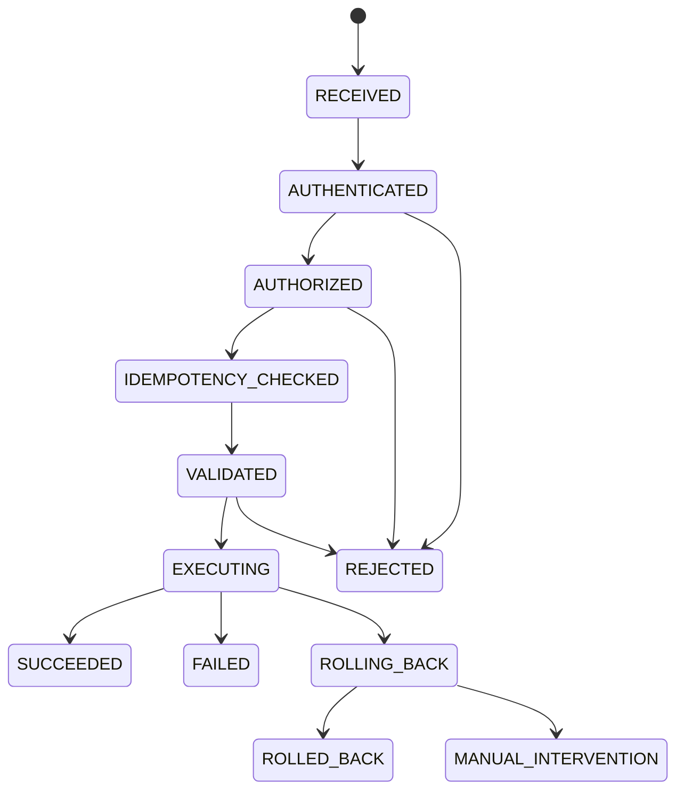

# 插件 HTTP 管理接口完整支持方案

## 背景

当前框架仍保留 `Pf4bootPluginManager` 的加载、启动、停止、重启、重载、卸载和删除能力，也已经新增 `PluginDeploymentService` 承载发布级热替换编排。`pf4boot-actuator` 只提供只读观测端点，不承载插件状态变更。

缺口在于：宿主如果希望通过 HTTP 管理插件，只能自行包装底层 Bean，容易出现接口方法语义不一致、缺少预检、绕过热替换编排、缺少幂等和审计，甚至把高危变更接口裸露到公网。本方案补齐一个可选、默认关闭、可治理的 HTTP 管理面。

## 目标

- 提供完整 HTTP 管理接口，覆盖插件查询、启停、重启、重载、部署预检、热替换、回滚和部署记录查询。
- 明确只读观测、低层生命周期操作和发布级部署操作的边界。
- HTTP 写操作默认关闭，开启时必须显式选择本地模式或远程模式。
- 本地模式提供最小保护：loopback 限制、管理 token、审计日志和语义化 HTTP 方法。
- 远程模式提供完整认证、授权、CSRF/来源约束、限流、审计和幂等控制。
- 为管理 UI、运维平台、CLI 和本地脚本提供稳定响应模型和错误码。

## 非目标

- 不把 `pf4boot-actuator` 改造成写操作入口；Actuator 继续保持只读观测。
- 不在本阶段实现完整控制台 UI。
- 不引入特定身份系统强绑定；远程模式通过 SPI 对接宿主现有 Spring Security、网关或自定义认证。
- 不改变 `Pf4bootPluginManager` 低层 API 语义。
- 不承诺零中断热替换；发布级替换仍遵循 `PluginDeploymentService` 的可控短暂停机和回滚模型。

## 现状/已有流程

| 能力 | 当前状态 | 问题 |
| --- | --- | --- |
| 低层生命周期 | `Pf4bootPluginManager` 支持 start/stop/restart/reload/delete | 直接暴露为 HTTP 容易绕过预检、幂等和审计 |
| 发布级热替换 | `PluginDeploymentService.planReplacement/replace` 已存在 | 尚无标准 HTTP/CLI 入口 |
| 只读观测 | `pf4boot-actuator` 暴露插件快照和 metrics | 不能执行管理动作，这是正确边界 |
| 安全设计 | 历史文档曾讨论方法语义和默认风险 | 未形成完整本地/远程安全模式 |
| 审计与记录 | 部署记录有内存 recorder 基础 | 管理请求本身缺少统一操作记录 |

## 核心约束

- 管理 HTTP 能力必须是可选模块或可选自动配置，默认不暴露写接口。
- 所有状态变更接口必须使用语义化非 GET 方法。
- 所有写操作必须串行进入生命周期锁或部署编排服务，不能绕过现有依赖顺序。
- 发布级替换必须走 `PluginDeploymentService`，不能把 `reloadPlugin` 包装成“安全热替换”。
- HTTP 模型不得暴露内部可变对象、绝对敏感路径、完整异常堆栈或凭证。
- Java 8、Spring Boot 2.7.x 兼容。

## 模块边界

| 模块 | 职责 |
| --- | --- |
| `pf4boot-api` | 管理请求/响应 DTO、错误码、操作类型、审计事件、认证授权 SPI |
| `pf4boot-core` | 复用生命周期和部署编排，不新增 HTTP 依赖 |
| `pf4boot-management-starter` | 注册 HTTP Controller、请求校验、幂等、审计和安全拦截 |
| `pf4boot-actuator` | 继续只读，不提供启停或部署操作 |
| `samples/*` | 演示本地 token 模式、远程授权 SPI、部署预检和热替换调用 |

固定新增 `pf4boot-management-starter`，避免普通 Web 插件能力被动带出管理接口。`pf4boot-web-starter` 只保留动态 MVC、拦截器和静态资源集成，不承载新的管理写接口。

## 安全模式

| 模式 | 适用场景 | 必需保护 | 默认 |
| --- | --- | --- | --- |
| `DISABLED` | 默认状态 | 不注册写接口 | 默认 |
| `LOCAL_TOKEN` | 本机脚本、sidecar、受控运维命令 | 仅 loopback、管理 token、审计、限流 | 显式启用 |
| `REMOTE_DELEGATED` | 运维平台、浏览器、远程 CLI | 委托认证、RBAC、CSRF/来源约束、审计、限流、幂等键 | 显式启用 |

本地调用不强制接入完整用户体系，但仍要有最小保护。原因是 SSRF、端口转发、容器网络和同机进程都可能访问本地 HTTP 端口。

## 配置设计

```yaml
spring:
  pf4boot:
    management:
      http:
        enabled: false
        base-path: /pf4boot/admin
        mode: DISABLED # DISABLED, LOCAL_TOKEN, REMOTE_DELEGATED
        allow-loopback-only: true
        token: ${PF4BOOT_ADMIN_TOKEN:}
        token-header: X-PF4Boot-Admin-Token
        require-idempotency-key: true
        idempotency-header: X-Idempotency-Key
        dry-run-default: true
        audit-enabled: true
        rate-limit:
          enabled: true
          writes-per-minute: 30
        csrf:
          enabled: auto
```

启动校验规则：

- `enabled=false` 时不注册写 Controller。
- `enabled=true` 且 `mode=DISABLED` 时启动失败。
- `LOCAL_TOKEN` 模式必须配置非空 token，并默认限制 loopback。
- `REMOTE_DELEGATED` 模式必须存在 `PluginManagementAuthorizer` 或宿主安全适配 Bean。
- 检测到公网地址绑定且未启用远程授权时启动失败，不能只打 warning。

## 接口设计

所有响应统一使用 `PluginAdminResponse<T>`：

| 字段 | 类型 | 说明 |
| --- | --- | --- |
| `success` | `boolean` | 是否成功 |
| `requestId` | `String` | 请求 ID |
| `operationId` | `String` | 幂等操作 ID |
| `code` | `String` | 错误码或 `OK` |
| `message` | `String` | 可读摘要 |
| `data` | `T` | 响应数据 |
| `warnings` | `List<String>` | 非阻断告警 |

### 只读接口

| 方法 | 路径 | 说明 |
| --- | --- | --- |
| `GET` | `/pf4boot/admin/plugins` | 查询插件列表 |
| `GET` | `/pf4boot/admin/plugins/{pluginId}` | 查询插件详情 |
| `GET` | `/pf4boot/admin/deployments/{deploymentId}` | 查询部署记录 |
| `GET` | `/pf4boot/admin/deployments` | 查询近期部署记录 |

### 生命周期接口

| 方法 | 路径 | 行为 |
| --- | --- | --- |
| `POST` | `/pf4boot/admin/plugins/{pluginId}/start` | 启动插件 |
| `POST` | `/pf4boot/admin/plugins/{pluginId}/stop` | 停止插件 |
| `POST` | `/pf4boot/admin/plugins/{pluginId}/restart` | 重启插件 |
| `POST` | `/pf4boot/admin/plugins/{pluginId}/reload` | 低层重载，仅允许本地/运维兜底 |
| `POST` | `/pf4boot/admin/plugins/{pluginId}/enable` | 启用插件 |
| `DELETE` | `/pf4boot/admin/plugins/{pluginId}/enable` | 禁用插件 |

### 部署接口

| 方法 | 路径 | 行为 |
| --- | --- | --- |
| `POST` | `/pf4boot/admin/deployments/plan` | 生成热替换预检计划，不改运行态 |
| `POST` | `/pf4boot/admin/deployments/replace` | 执行热替换 |
| `POST` | `/pf4boot/admin/deployments/{deploymentId}/rollback` | 回滚指定部署 |
| `POST` | `/pf4boot/admin/deployments/{deploymentId}/confirm` | 确认人工门禁或 dry-run 结果 |

请求体中的插件包路径只允许引用已配置的 staging 根目录下文件，不能接受任意绝对路径。

## 授权模型

| 权限 | 允许操作 |
| --- | --- |
| `pf4boot:plugin:read` | 插件列表、详情、部署记录查询 |
| `pf4boot:plugin:lifecycle` | start/stop/restart/enable/disable |
| `pf4boot:plugin:reload` | 低层 reload |
| `pf4boot:deployment:plan` | 部署预检 |
| `pf4boot:deployment:replace` | 执行热替换 |
| `pf4boot:deployment:rollback` | 回滚 |
| `pf4boot:admin:all` | 全量管理权限 |

SPI：

```java
public interface PluginManagementAuthorizer {
  PluginManagementPrincipal authenticate(PluginManagementRequest request);

  void authorize(PluginManagementPrincipal principal, PluginManagementOperation operation);
}
```

本地 token 模式可以由框架提供默认 authorizer；远程模式必须由宿主提供 authorizer 或通过 Spring Security adapter 注入。

## 幂等性

- 所有写操作必须带 `X-Idempotency-Key`，可通过配置在本地模式放宽。
- 幂等 key 的作用域为 `principal + operation + pluginId + requestHash`。
- 相同 key 和相同请求体返回原结果；相同 key 但请求体不同返回 `409 CONFLICT`。
- 运行中的相同操作返回当前操作状态，不重复触发生命周期动作。
- 幂等记录第一阶段可内存保存，后续接入持久化 recorder。

## 状态机

HTTP 管理动作不重新定义插件状态机，而是映射到现有生命周期状态和部署状态：



## 时序流程

### 本地 token 启动插件

1. 请求进入管理 Controller。
2. 校验来源为 loopback。
3. 校验 token。
4. 校验权限和幂等 key。
5. 校验插件 ID、当前状态和操作可行性。
6. 调用 `Pf4bootPluginManager.startPlugin(pluginId)`。
7. 记录审计事件和操作结果。

### 远程热替换

1. 远程调用方通过宿主安全体系完成认证。
2. 管理接口校验 `pf4boot:deployment:replace` 权限、CSRF/来源、限流和幂等 key。
3. 校验 staged 包位于允许目录。
4. 调用 `PluginDeploymentService.planReplacement(...)`。
5. 若 dry-run 或预检存在阻断项，返回计划和错误，不改运行态。
6. 调用 `PluginDeploymentService.replace(...)`。
7. 返回部署记录，并写入审计。

## 异常处理

| 错误码 | HTTP 状态 | 场景 |
| --- | --- | --- |
| `PFM-001` | `400` | 请求参数非法 |
| `PFM-002` | `401` | 未认证或 token 错误 |
| `PFM-003` | `403` | 权限不足或来源不允许 |
| `PFM-004` | `404` | 插件或部署记录不存在 |
| `PFM-005` | `409` | 幂等 key 冲突或状态冲突 |
| `PFM-006` | `429` | 管理操作限流 |
| `PFM-007` | `422` | 预检失败 |
| `PFM-008` | `500` | 生命周期操作失败 |
| `PFM-009` | `503` | 管理面未就绪或正在维护 |

错误响应不得包含完整堆栈、token、绝对敏感路径或环境变量。

## 审计与观测

每个写操作记录：

- request id、operation id、principal、来源地址；
- 操作类型、插件 ID、目标版本、deployment id；
- dry-run、预检结果、最终状态；
- 开始/结束时间、耗时、错误码；
- 请求摘要 hash，不记录 token 和敏感字段。

建议 metrics：

- `pf4boot_management_request_total`
- `pf4boot_management_rejected_total`
- `pf4boot_management_operation_duration_seconds`
- `pf4boot_management_idempotency_hit_total`

## 兼容性

- 默认关闭，不影响现有应用。
- `pf4boot-actuator` 仍只读，已有观测使用方式不变。
- 低层 `Pf4bootPluginManager` API 不变。
- 老应用若曾依赖历史管理接口，需要迁移到新路径、方法和 token/授权配置。
- 管理接口是可选能力，非 Web 应用不受影响。

## 灰度/迁移

1. 第一阶段只提供 `LOCAL_TOKEN`，用于本机 CLI 和 smoke。
2. 第二阶段接入 `REMOTE_DELEGATED`，由宿主适配认证授权。
3. 第三阶段将部署记录、幂等记录和审计记录接入可持久化 SPI。
4. 旧管理接口若仍存在，应先标记 deprecated，再在破坏性版本移除。

## 测试方案

- `pf4boot-api`：DTO、错误码和 SPI 编译兼容。
- 管理 starter：默认关闭、配置校验、本地 token、loopback 限制、远程授权失败、幂等冲突。
- `pf4boot-core`：生命周期并发和部署服务复用现有测试。
- Web 集成测试：HTTP 方法、状态码、响应模型、CSRF/来源约束。
- sample：本地 token 模式启动、停止、部署预检和热替换 smoke。

建议命令：

- `.\gradlew.bat :pf4boot-api:compileJava`
- `.\gradlew.bat :pf4boot-core:test`
- `.\gradlew.bat :pf4boot-web-starter:test`
- `.\gradlew.bat :pf4boot-management-starter:test`

若短期不新增 `pf4boot-management-starter`，最后一条替换为承载管理接口的模块 test。

## 风险点

| 风险 | 严重度 | 缓解 |
| --- | --- | --- |
| 管理接口误暴露公网 | 高 | 默认关闭；公网绑定且无远程授权时启动失败 |
| SSRF 调用本地接口 | 高 | 本地模式也必须 token；可选来源校验 |
| 绕过部署编排直接 reload | 中 | 文档和权限区分；发布级替换只允许 `replace` |
| 幂等记录丢失 | 中 | 第一阶段内存可接受；生产持久化作为后续里程碑 |
| 宿主安全体系差异大 | 中 | 提供 SPI，不强绑具体安全框架 |

## 未决问题

- `pf4boot-management-starter` 已作为固定实施方向；后续实施不再选择落入 `pf4boot-web-starter`。
- 远程模式是否直接提供 Spring Security adapter。建议作为可选 adapter，不作为核心依赖。
- 审计和幂等记录第一阶段是否需要文件持久化。建议先内存，生产化阶段接 SPI。
